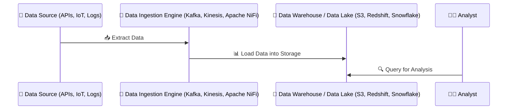
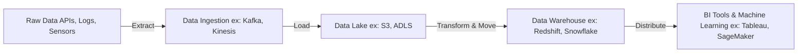
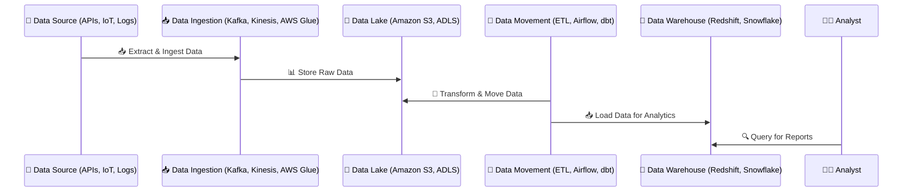

# **🚀 What is Data Ingestion & Movement?**

## **🔍 Introduction**

In any **data pipeline**, **data ingestion** and **data movement** play key roles in **bringing data from different sources into storage systems (databases, data lakes, or warehouses).**

| **Term**           | **Definition**                                                                                                           |
| ------------------ | ------------------------------------------------------------------------------------------------------------------------ |
| **Data Ingestion** | The process of **collecting and importing raw data** from various sources into a storage system.                         |
| **Data Movement**  | The process of **transferring, transforming, and distributing data** between storage, processing, and analytics systems. |

---

## **1️⃣ What is Data Ingestion? 📥**

### **📌 How It Works (Step-by-Step)**

1️⃣ **Identify Data Sources** → Databases, APIs, IoT devices, logs, or files.  
2️⃣ **Extract Data** → Data is collected using batch or streaming methods.  
3️⃣ **Load Data into Storage** → The extracted data is stored in a **data lake, warehouse, or operational database**.

📌 **Example Use Case:**

- A **sensor network** ingests **temperature readings** from IoT devices into **Amazon S3** for real-time monitoring.

---

## **2️⃣ Types of Data Ingestion**

| **Type**                            | **Definition**                                                         | **Example Use Case**                                          |
| ----------------------------------- | ---------------------------------------------------------------------- | ------------------------------------------------------------- |
| **Batch Ingestion**                 | Data is collected in **batches** and processed at scheduled intervals. | A retail store processes **daily sales data** at midnight.    |
| **Real-Time (Streaming) Ingestion** | Data is continuously collected and processed **as it arrives**.        | A stock trading platform tracks **market changes instantly**. |

### **✅ When to Use?**

✔ **Batch Ingestion** → Best for **large-scale periodic updates**.  
✔ **Streaming Ingestion** → Best for **real-time applications** (IoT, fraud detection).

### **📚 References to Learn More**

🔹 **AWS Data Ingestion Services** – [link](https://aws.amazon.com/solutions/data-ingestion/)  
🔹 **Apache Kafka for Real-Time Ingestion** – [link](https://kafka.apache.org/documentation/)

---

## **3️⃣ What is Data Movement? 🔄**

Once data is ingested, it needs to **move efficiently** between different storage and processing systems.

### **📌 How It Works (Step-by-Step)**

1️⃣ **Extract Data from Storage** → Retrieve raw data from a database, data lake, or warehouse.  
2️⃣ **Transform Data for Processing** → Clean, filter, or format the data.  
3️⃣ **Load Data into Target System** → The processed data is stored for analytics, machine learning, or reporting.

📌 **Example Use Case:**

- A **social media platform** moves raw user data from **Amazon S3 to Redshift** for **analytics & AI models**.

---

## **4️⃣ Key Differences: Data Ingestion vs. Data Movement**

| **Feature**       | **Data Ingestion 📥**            | **Data Movement 🔄**                          |
| ----------------- | -------------------------------- | --------------------------------------------- |
| **Purpose**       | Bringing raw data into storage   | Transferring & processing data across systems |
| **Best for**      | Collecting new data from sources | Moving data for transformation & analytics    |
| **Example Tools** | Kafka, Kinesis, Apache NiFi      | AWS Glue, Apache Airflow, dbt                 |

---

## **5️⃣ When to Use Data Ingestion vs. Data Movement?**

| **Scenario**                              | **Use Data Ingestion?** | **Use Data Movement?** |
| ----------------------------------------- | ----------------------- | ---------------------- |
| Collecting logs from multiple sources     | ✅ Yes                  | ❌ No                  |
| Transferring data from **S3 to Redshift** | ❌ No                   | ✅ Yes                 |
| Streaming IoT data from devices           | ✅ Yes                  | ❌ No                  |
| Running ETL pipelines for BI analytics    | ❌ No                   | ✅ Yes                 |

---

## **6️⃣ How Do Data Ingestion & Movement Work Together?**

Most data pipelines **start with ingestion and then move data** for processing.

📌 **How this works:**  
1️⃣ **Data is ingested from APIs, logs, and IoT sensors**.  
2️⃣ **Raw data is stored in a Data Lake** (Amazon S3).  
3️⃣ **ETL moves & transforms data** into a **Data Warehouse** (Amazon Redshift).  
4️⃣ **BI & AI tools query the structured data** for analysis.

---

## **🎯 Summary**

✔ **Data Ingestion** collects raw data **from external sources**.  
✔ **Data Movement** transfers, processes, and distributes data **between systems**.  
✔ **Batch Ingestion** is best for **large-scale scheduled updates**.  
✔ **Streaming Ingestion** is best for **real-time applications** (IoT, fraud detection).  
✔ **Data ingestion happens first**, then **data movement transforms & loads data for analytics**.

🚀 **Next Step:** Would you like to explore **Data Lake vs. Data Warehouse for storage**, or go deeper into **ETL & Data Movement Tools like Apache Airflow & AWS Glue?**
