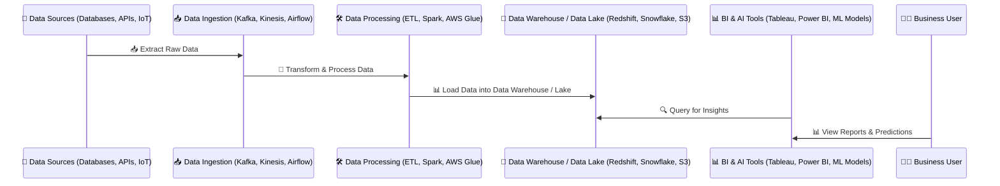
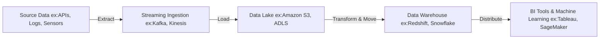

# **🔄 What is a Data Pipeline and Why Do We Need It?**

## **🔍 Introduction**

A **data pipeline** is an automated process that **moves, transforms, and processes data** from multiple sources to a final storage or analytics system. It ensures that data is **collected, cleaned, and delivered** where it's needed—**efficiently and reliably**.

Think of a **data pipeline** like **a water pipeline**:

- Water (data) **flows from multiple sources** (databases, APIs, IoT).
- It **passes through filters & processing units** (ETL, transformation).
- Finally, it **reaches its destination** (data lake, warehouse, dashboard).

---

## **1️⃣ What is a Data Pipeline? 📊**

A **data pipeline** is a set of processes that:  
✔ **Extracts** data from sources (databases, APIs, sensors).  
✔ **Transforms** data (cleans, enriches, formats).  
✔ **Loads & moves** data to a data lake, warehouse, or analytics tool.

### **📌 How a Data Pipeline Works (Step-by-Step)**

1️⃣ **Data Ingestion** → Raw data is collected from sources.  
2️⃣ **Processing & Transformation** → Data is cleaned, filtered, and formatted.  
3️⃣ **Data Storage & Movement** → Processed data is stored in a warehouse or lake.  
4️⃣ **Analytics & AI Integration** → Data is used for reporting, dashboards, and AI models.

📌 **Example Use Case:**

- A **healthcare system** collects **patient data** from hospitals, processes it for **fraud detection**, and loads insights into **a dashboard** for monitoring.

---

## **2️⃣ Why Do We Need a Data Pipeline? 🤔**

### **✅ Key Benefits of Data Pipelines**

✔ **Automation** → No manual data movement, reducing human errors.  
✔ **Efficiency** → Handles large-scale data in real-time or batches.  
✔ **Consistency** → Ensures clean, high-quality data is always available.  
✔ **Scalability** → Works for **small & big data**, adapting to growing business needs.

📌 **Example:**  
A company wants to analyze **customer orders** across different stores.  
Without a data pipeline:  
❌ **Manually collecting & merging spreadsheets** every day.  
With a data pipeline:  
✅ **Automated real-time updates** to a central dashboard.

### **📚 References to Learn More**

🔹 **AWS Data Pipeline Guide** – [link](https://docs.aws.amazon.com/datapipeline/latest/DeveloperGuide/what-is-datapipeline.html)  
🔹 **Apache Airflow for Data Pipelines** – [link](https://airflow.apache.org/)

---

## **3️⃣ Types of Data Pipelines**

| **Pipeline Type**         | **Definition**                                                | **Example Use Case**                   |
| ------------------------- | ------------------------------------------------------------- | -------------------------------------- |
| **Batch Pipeline 🏗️**     | Processes data in scheduled batches                           | Generating daily sales reports         |
| **Real-Time Pipeline ⚡** | Streams data continuously                                     | Detecting fraud in online transactions |
| **ETL Pipeline 🔄**       | Extracts, Transforms, and Loads data into a warehouse         | Cleaning customer data for reporting   |
| **ELT Pipeline 📥**       | Extracts & Loads raw data first, then transforms it on demand | AI & ML training on large datasets     |

---

## **4️⃣ Common Tools for Data Pipelines**

| **Function**               | **Popular Tools**                           |
| -------------------------- | ------------------------------------------- |
| **Ingestion**              | Apache Kafka, AWS Kinesis, Apache NiFi      |
| **Processing**             | Apache Spark, AWS Glue, Google Dataflow     |
| **Storage**                | Amazon S3, Snowflake, Redshift, BigQuery    |
| **Workflow Orchestration** | Apache Airflow, AWS Step Functions, Prefect |
| **BI & Analytics**         | Tableau, Power BI, Amazon QuickSight        |

📌 **Example Tool Combinations**:

- **Batch ETL Pipeline** → AWS Glue + Redshift + Tableau.
- **Real-Time Streaming Pipeline** → Kafka + Spark Streaming + Snowflake.

---

## **5️⃣ How Do Data Pipelines Fit into Modern Data Architecture?**

Most companies use **multiple pipelines** for:

- **Streaming real-time events** into a **data lake**.
- **Batch processing structured data** for a **data warehouse**.

📌 **How this works:**  
1️⃣ **Streaming (Kafka, Kinesis) ingests real-time data** → Used for **live dashboards**.  
2️⃣ **Data is stored in a Data Lake (S3, ADLS)** → Raw data is available for AI & ML.  
3️⃣ **ETL moves structured data to a Warehouse (Redshift, Snowflake)** → Used for BI & Reporting.  
4️⃣ **Analytics & AI tools process data** for insights.

---

## **🎯 Summary**

✔ **A Data Pipeline automates data movement, transformation, and storage**.  
✔ **Batch Pipelines (ETL) work best for scheduled jobs**, while **Real-Time Pipelines (ELT) handle live data**.  
✔ **Data pipelines improve efficiency, scalability, and analytics** in modern systems.  
✔ **Common tools include Kafka, AWS Glue, Apache Airflow, and Snowflake**.  
✔ **Most companies combine batch & streaming pipelines for full-scale analytics & AI.**

🚀 **Next Step:** Would you like to explore **Apache Airflow vs. AWS Step Functions for workflow automation**, or dive deeper into **Real-Time Streaming Pipelines with Kafka & Kinesis?**
