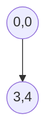

# 🧭 Vectors in Math for AI/ML

> _“The Swiss Army Knife of Machine Learning.”_

---

## 🔍 What is a Vector?

### 📘 **Official Definition**

A **vector** is a **mathematical object** that has both **magnitude** (length) and **direction**. It is commonly represented as an **ordered list of numbers** (called components), which describe a point in space.

### 💡 **Human-Friendly Definition**

Think of a vector as a fancy arrow that tells you how far to go and in which direction. In AI/ML, vectors are how we **represent data**, like a list of features for a house (e.g., number of rooms, size in square meters, price).

---

## 📦 Examples of Vectors

| Description                        | Vector Representation          |
| ---------------------------------- | ------------------------------ |
| A 2D point                         | **v = [3, 4]**                 |
| A 3D position in space             | **v = [1, 2, -5]**             |
| An image with 4 pixels (grayscale) | **v = [255, 0, 128, 64]**      |
| ML features of a car               | **v = [speed, weight, price]** |

---

## 🧠 Why Do Vectors Matter in AI/ML?

### ✅ Used Everywhere

- Representing data (inputs and outputs)
- Defining weights in neural networks
- Encoding word meanings (Word2Vec)
- Computing distances and similarities
- Defining directions for gradient descent

Let’s visualize how vectors fit into a typical machine learning process:

```mermaid
flowchart TD
  A[Raw Data (CSV, Image, Text)] --> B[Convert to Vectors]
  B --> C[Input to Model]
  C --> D[Training with Gradient Descent]
  D --> E[Model Learns Vectors (Weights)]
  E --> F[Predictions as Vectors]
```

---

## 🧭 Vector Terminology Cheat Sheet

| Term            | Meaning                                        |
| --------------- | ---------------------------------------------- |
| **Component**   | An individual number in the vector             |
| **Dimension**   | Number of components (e.g., 3D = 3 components) |
| **Magnitude**   | Length of the vector                           |
| **Direction**   | Where the vector is pointing                   |
| **Unit Vector** | A vector of length 1 (used in normalization)   |
| **Zero Vector** | A vector with all components = 0               |

---

## 📐 How to Visualize a Vector

Let’s take `v = [3, 4]`.  
You can draw this on a graph starting from the origin `(0,0)` and going 3 units right and 4 units up.

It looks like this:



✅ Its **magnitude (length)** is calculated using the **Pythagorean theorem**:
\[
\|v\| = \sqrt{3^2 + 4^2} = \sqrt{9 + 16} = \sqrt{25} = 5
\]

---

## 🛠️ Vector Operations (with Examples)

### ➕ **Addition**

```text
[2, 3] + [4, 1] = [6, 4]
```

Like moving two arrows one after the other.

### ➖ **Subtraction**

```text
[5, 7] - [2, 3] = [3, 4]
```

Arrow pointing from one point to another.

### ✖️ **Scalar Multiplication**

```text
2 * [3, 4] = [6, 8]
```

Just stretches or shrinks the vector.

### 📏 **Dot Product**

```text
[1, 2] · [3, 4] = 1×3 + 2×4 = 3 + 8 = 11
```

This tells you how much one vector goes in the direction of another.

### 📐 **Angle Between Vectors**

\[
\cos(\theta) = \frac{v \cdot w}{\|v\|\|w\|}
\]

---

## 🤹 Real-Life Analogy

Imagine vectors are people walking in a park:

- Scalar multiplication: one person takes double-length steps
- Addition: two friends walk one after the other
- Dot product: how much one person is walking _in the same direction_ as another

---

## 🧪 Tiny Challenge (Just for You 😉)

Given:

```text
a = [1, 2, 3]
b = [4, 5, 6]
```

1. What’s `a + b`?
2. What’s `2 * a`?
3. What’s `a · b`?

I'll wait here while you try 😁 (and we’ll review together later).

---

## 🧠 TL;DR - Vector Superpowers

| Skill               | What It Lets You Do          |
| ------------------- | ---------------------------- |
| **Vector Addition** | Combine features             |
| **Dot Product**     | Measure similarity           |
| **Normalization**   | Scale data                   |
| **Magnitude**       | Know feature strength        |
| **Direction**       | Understand movement or trend |
