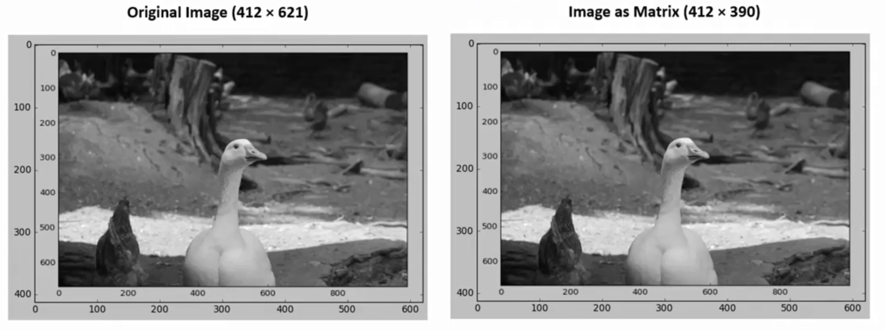

# 🧠 Recap: **Pixels, Image Resolution, and PPI**

---

## 🔹 1. **What Is a Pixel?**

- A **pixel** (picture element) is the **smallest unit of a digital image**.
- It holds a **single color** (like 🟥 or 🟦).
- A whole image is made of **many pixels arranged in a grid**.
- **Pixels are packed edge-to-edge** with **no space in between**.

---

## 🔹 2. **What Is Image Resolution?**

- Resolution = **Width × Height in pixels**
- Example: `1920 × 1080` → 1920 pixels wide, 1080 tall → **2,073,600 pixels total**
- More pixels = **more detail** ✅
- Fewer pixels = **less detail** ❌

---

## 🔹 3. **What Is PPI (Pixels Per Inch)?**

- **PPI** tells how many **pixels are packed into 1 inch** on a screen.
- It’s about **pixel density**, not total count.

### 🧮 Formula

\[
\text{PPI} = \frac{\sqrt{(width^2 + height^2)}}{\text{screen diagonal in inches}}
\]

---

## 🔹 4. **Real PPI Examples (Your Screens)**

| Screen              | Resolution | Size  | Approx. PPI |
| ------------------- | ---------- | ----- | ----------- |
| Laptop (15.6")      | 1920×1080  | 15.6" | ~141 PPI    |
| Second screen (27") | 3370×2070  | 27"   | ~146 PPI    |

> Both are similar in sharpness because their PPI is close.

---

## 🔹 5. **How PPI Affects Display**

| PPI          | Pixels per inch  | Looks Like            | Sharpness      |
| ------------ | ---------------- | --------------------- | -------------- |
| **1 PPI**    | 1 big pixel      | One giant color block | 😵 Very blurry |
| **72 PPI**   | Low density      | Web standard          | 🟡 Okay        |
| **141 PPI**  | Moderate density | Your laptop screen    | ✅ Good        |
| **300+ PPI** | High density     | Retina / Print        | 🔥 Super sharp |

---

## 🔹 6. **What Happens If You Show a 300×300 Image?**

| Screen            | PPI | Image Physical Size (approx) | Sharpness        |
| ----------------- | --- | ---------------------------- | ---------------- |
| Laptop            | 141 | ~2.13 inches wide            | Good             |
| 27" Monitor       | 146 | ~2.05 inches wide            | Slightly sharper |
| 1 PPI (simulated) | 1   | 300 inches wide 🤯           | Very blocky      |

---

## 🔹 7. **PPI vs. DPI**

| Term    | Means                    | Used In  |
| ------- | ------------------------ | -------- |
| **PPI** | Pixels per inch (screen) | Screens  |
| **DPI** | Dots per inch (printer)  | Printing |

> **PPI ≠ Resolution**  
> PPI = How dense the pixels are  
> Resolution = How many pixels total

---

## 🔹 8. 🧪 How You Can See It

- A **1 PPI image** is like a giant tile per inch — **huge pixels**
- You can **print** or simulate it using image software
- We even generated an example image to **visualize 1 PPI** 🖼️

---

## 🧠 Why Does It Matter in AI/ML?

In machine learning, especially in **computer vision**, image resolution is crucial:

- 📉 **Lower resolution** → Faster training, less accuracy
- 📈 **Higher resolution** → More detail, but more processing power and memory needed

➡️ ML models usually **resize** images to a standard size (like `224×224`) before feeding them into neural networks.

---

## 🧠 Final Analogy

> Pixels are like LEGO blocks:
>
> - **More blocks per inch (higher PPI)** = More detail, smoother look
> - **Fewer blocks per inch (low PPI)** = Blocky, rough image

---
