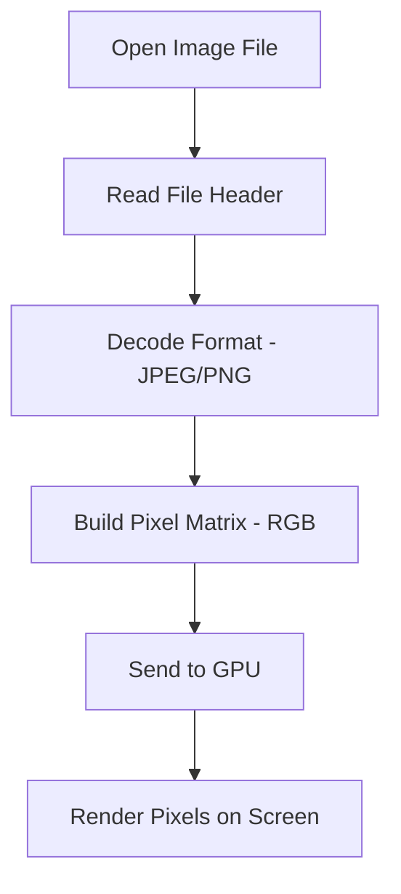

# 🖥️ How Computers Read Images

_The full journey from file to pixels on screen!_

---

## 🧠 What You’ll Learn

1. 🔍 What’s inside an image file?
2. 🧾 How is it stored (file formats)?
3. 🎨 How do pixels and colors work?
4. 🧮 How does the computer read it?
5. 🔧 What happens during decoding?
6. 💻 How is it rendered on screen?

---

## 📦 1. What’s in an Image File?

An image file is **not just a picture** — it's structured binary data with:

| Section        | Description                             |
| -------------- | --------------------------------------- |
| **Header**     | Metadata (size, format, color type)     |
| **Pixel data** | Matrix of colors (RGB, Grayscale, etc.) |
| **Optional**   | Compression or transparency info        |

✅ Examples: `.jpg`, `.png`, `.bmp`, `.gif`, `.tiff`

---

## 🎨 2. Image = Grid of Pixels

Every image is a **2D matrix of pixels**.

### Example: 100×100 pixel image =

- **100 rows**, **100 columns**
- **10,000 pixels total**
- Each pixel = color info (usually RGB)

```text
[ (255,0,0) (0,255,0) (0,0,255) ... ] ← Row 1
[ (255,255,0) (0,255,255) (255,0,255) ... ] ← Row 2
```

> A pixel is just **3 numbers** = Red, Green, Blue (8-bit each = 0–255)

---

## 🧾 3. File Formats & Compression

| Format   | Type     | Notes                                    |
| -------- | -------- | ---------------------------------------- |
| **BMP**  | Raw      | Uncompressed, big file size              |
| **PNG**  | Lossless | Transparent backgrounds, no quality loss |
| **JPEG** | Lossy    | Smaller size, some quality lost          |
| **GIF**  | Lossless | Supports animation, 256 colors only      |
| **TIFF** | Lossless | Used in printing & scanning              |

📦 Compression shrinks file size by reducing repeated patterns or approximating values (JPEG).

---

## 🧮 4. How Computers Read Images (Behind the Scenes)

### 🔄 Step-by-Step

1. **You open the image** file.
2. **OS or software** loads it (like a browser, image viewer).
3. It uses a **decoder** based on the file type (JPEG, PNG, etc.)
4. Decoder converts binary data → **pixel matrix** (e.g. 1920×1080 RGB array).
5. This matrix is handed to the **GPU/display system**.
6. The **screen lights up** pixels to match the color values!

---

### 🖼️ Real Example in Python

```python
from PIL import Image

img = Image.open("photo.jpg")
width, height = img.size
pixel_data = img.load()

# Access color at x=10, y=20
r, g, b = pixel_data[10, 20]
print(f"Pixel at (10,20) → R:{r} G:{g} B:{b}")
```

✅ This is exactly how your code or apps access image data under the hood.

---

## 🎛️ 5. Color Models

### Most common = **RGB**

| Channel | Range | Meaning                |
| ------- | ----- | ---------------------- |
| Red     | 0–255 | Amount of red in pixel |
| Green   | 0–255 | Amount of green        |
| Blue    | 0–255 | Amount of blue         |

💡 Example: `(255, 0, 0)` = Red  
💡 Example: `(255, 255, 255)` = White  
💡 Example: `(0, 0, 0)` = Black

---

## 🧪 6. Optional Alpha Channel (Transparency)

Some formats (like PNG) add a 4th value: **Alpha** = transparency

```text
(255, 0, 0, 128) → 50% transparent red
```

---

## 💻 7. Rendering the Image to Screen

Once pixel data is decoded, it gets sent to:

| Component   | Role                       |
| ----------- | -------------------------- |
| **CPU**     | Loads and decodes the file |
| **RAM**     | Stores pixel matrix        |
| **GPU**     | Renders pixels to screen   |
| **Monitor** | Lights up physical pixels  |

✅ Each **screen pixel lights up** according to its RGB value from the image matrix.

---

## 🧠 Bonus: Image Size vs. Display Size

- **Image resolution** = total pixels (e.g., 1000×1000)
- **Display size** depends on **PPI** of your screen
- A 1000px image on a 100 PPI screen = **10 inches wide**
- The **same image looks smaller on high PPI screens**

---

## 📊 TL;DR Table

| Concept           | Meaning                                           |
| ----------------- | ------------------------------------------------- |
| Pixel             | Smallest color unit of an image                   |
| Image resolution  | Width × Height in pixels                          |
| PPI               | How many pixels fit into one inch                 |
| Color model       | RGB, RGBA, Grayscale                              |
| File formats      | JPEG (lossy), PNG (lossless), BMP (raw), etc.     |
| How it’s stored   | Binary: metadata + compressed or raw pixel values |
| How it's rendered | Pixel matrix → GPU → monitor lights up pixels     |

---

## 🔁 Full Image Read Lifecycle (Mermaid Diagram)


