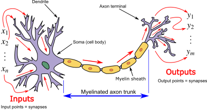
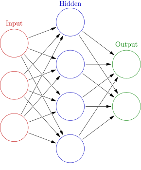
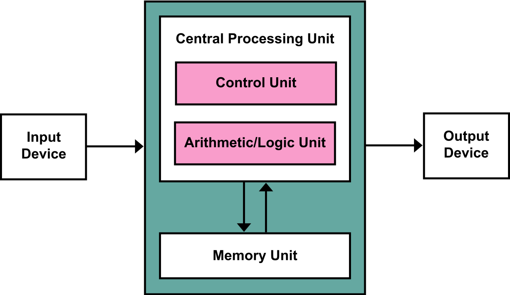

# 🧠 Topic: **Overview of Neural Networks**

## 📌 Objective

To gain a **conceptual overview** of neural networks—what they are, how they function, and why they are central to modern AI systems like Azure Cognitive Services, OpenAI models, and other deep learning-based applications. This lesson does **not dive into neural network theory**, mathematics, or implementation but prepares you for upcoming usage scenarios.

---

## 🧠 What Is a Neural Network?

A **Neural Network (NN)**, or more formally an **Artificial Neural Network (ANN)**, is a **computational architecture** inspired by the **structure and function of the human brain**. It’s designed to solve problems that involve **patterns, learning, and generalization** — areas where traditional rule-based logic fails.

<div style="text-align: center;">
  
</div>

---

### 🔬 Structure Overview

> **Neurons/Nodes**: Fundamental units that receive, process, and transmit information.

---

<div style="text-align: center;">
  
</div>

---

📌 **Layers**:

- **Input Layer** – Receives raw input features (e.g., pixel values, audio signals).
- **Hidden Layers** – Perform complex transformations; networks may contain **many layers** (deep learning).
- **Output Layer** – Produces the final prediction, classification, or probability.

### 📉 Connections

- **Weights**: Real-number multipliers that adjust the importance of inputs.
- **Biases**: Shift the activation threshold.
- **Activation Functions**: Introduce non-linearity (e.g., Sigmoid, ReLU, Tanh) to help networks learn complex patterns.

---

## ⚙️ How Neural Networks Learn: The Training Process

### 🧪 Training = Learning from Data

- Neural networks learn by adjusting **weights and biases** using **labeled training data**.
- The process involves:

  1. Forward propagation (compute outputs).
  2. Calculate the **loss** (how wrong the prediction was).
  3. **Backpropagation** (adjust weights based on the error).
  4. Use **Gradient Descent** (optimization) to minimize the **cost/loss function**.

### 🔁 Goal

To correctly **predict the output for unseen (new) input** after learning from previous examples.

---

## ⚡ Example: Network Diagram

```ini
Input → [Hidden Layer(s)] → Output
   ↓          ↓              ↓
features   weighted sums   prediction
```

- A small example may have **3 layers**, while large models like GPT-4 have **dozens to hundreds of layers** and **billions of parameters** (weights + biases).

---

## 📈 Neural Networks vs. Traditional Computing

| Feature      | Traditional Computing (Von Neumann Model) | Neural Network (Connectionist Model)          |
| ------------ | ----------------------------------------- | --------------------------------------------- |
| Architecture | CPU → Memory → IO (linear execution)      | Distributed neurons with weighted connections |
| Behavior     | Deterministic (1 + 1 = 2 always)          | Probabilistic (output with confidence)        |
| Strength     | Arithmetic, logic, deterministic flows    | Pattern recognition, generalization           |
| Flexibility  | Low                                       | High (learns from new data)                   |

### 🔍 Von Neumann Limitation

> Classical architecture (CPU, memory, storage) is **not designed for learning or probabilistic reasoning**.  
> Neural networks provide a **new computing paradigm**: one that mimics biological information processing systems.

---

<div style="text-align: center;">
  
</div>

---

## 🧠 Neural Networks in Azure AI Services

Azure’s powerful AI services (such as those covered in AI-102) internally use neural networks:

- **Azure OpenAI**: Transformer-based deep neural networks (LLMs).
- **Computer Vision**: Convolutional Neural Networks (CNNs).
- **Speech & NLP**: Recurrent Networks (RNNs), Transformers.
- **Document Intelligence**: Hybrid models involving layout and semantic embeddings.

---

## 🧠 Key Concepts You’ll Encounter (Later in Training)

| Concept                               | Description                                                 |
| ------------------------------------- | ----------------------------------------------------------- |
| **Parameter**                         | Learnable value (weight/bias); modern models have billions. |
| **Loss Function**                     | Measures prediction error (e.g., MSE, Cross-Entropy).       |
| **Backpropagation**                   | Learning algorithm using gradients to adjust weights.       |
| **Supervised Learning**               | Labeled data is used for training.                          |
| **Unsupervised Learning**             | Patterns are found without labeled outputs.                 |
| **Stochastic Gradient Descent (SGD)** | Optimization method used in training.                       |

---

## 🔌 Computational Requirements

Training large neural networks is **extremely compute-intensive**:

- Most modern models rely on **GPUs** for high-speed matrix multiplications and parallel processing.
- This is why **AI training infrastructure** (like Azure Machine Learning) uses GPU clusters.

---

## ⚠️ Neural Networks Have Uncertainty

Unlike traditional computing where:

```ini
1 + 1 = 2 (always)
```

Neural networks output:

```ini
"This image is a cat" → 94.6% confidence
```

They are **probabilistic models** and can make errors — but **learn to reduce error over time**.

---

## ✅ Summary

| Term                    | Description                                      |
| ----------------------- | ------------------------------------------------ |
| **Neural Network (NN)** | Inspired by the brain, learns patterns from data |
| **Layers**              | Input, hidden, output                            |
| **Weights/Biases**      | Parameters adjusted during training              |
| **Training**            | Process of minimizing error on known data        |
| **Von Neumann Model**   | Traditional, sequential computing model          |
| **Backpropagation**     | Method to update weights based on error          |
| **GPU**                 | Used for efficient, parallel training            |

---

## 🚀 What’s Next?

You won’t need to build neural networks from scratch in this training. Instead, you’ll be using **pre-built models** provided by **Azure AI services** (e.g., Vision, OpenAI, Speech), all of which are **powered internally by these neural architectures**.

The next lessons will demonstrate **how to use these models in real scenarios** — without needing deep expertise in neural network theory.
