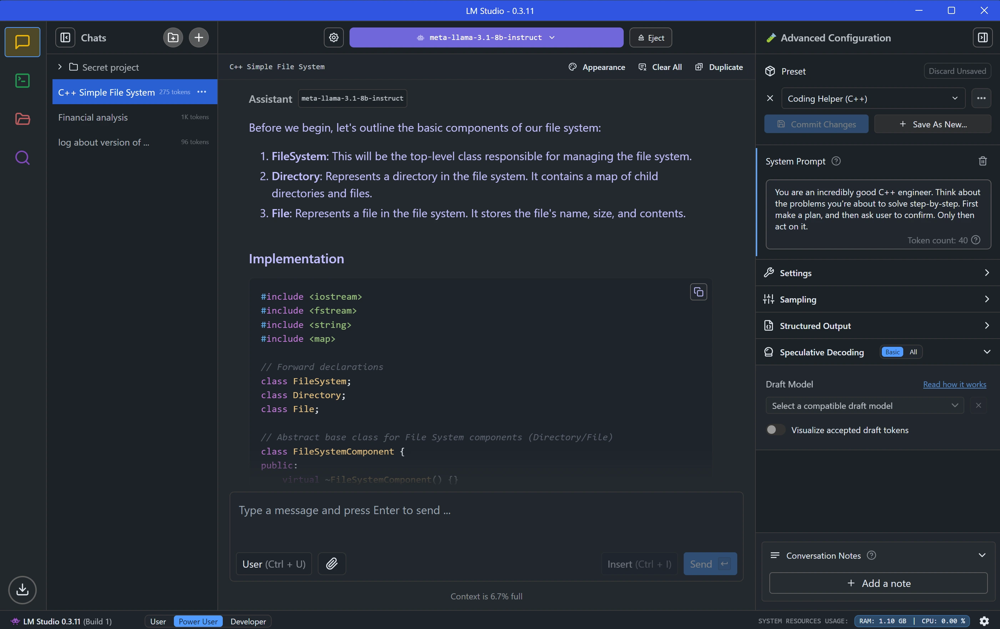

# 🧠 Topic: **Language Model Studio (LM Studio) – Local Inference with Pretrained Models**

## 📌 Objective

Learn how to **run large language models (LLMs)** locally on your machine using **LM Studio**, a lightweight tool for **downloading, loading, and interacting** with open-source AI models (like Phi-3, LLaMA-3) from Hugging Face. Understand key terms such as **model**, **parameters**, **inference**, and how **GPU acceleration** enables local execution of generative AI.

---

<div style="text-align: center;">
  
</div>

---

## 🧠 Core Concepts & Terminologies

### 🔷 Model

- In AI, a **model** is the brain of the system.
- It includes:

  - **Neural network architecture**
  - **Trained weights and biases**
  - **Training data reference**

- In practice, a model is a **set of files** (e.g., `.bin`, `.gguf`) containing **tens of millions to billions of parameters**.

### 🔷 Parameters

- These are the **weights and biases** learned during training.
- Modern LLMs are described by their parameter count:

  - e.g., **7B**, **13B**, **70B** parameters.

- Parameters determine the model's **generalization, accuracy, and memory needs**.
- Important: More parameters ≠ better performance if the data or architecture is not optimized.

### 🔷 Inference

- The act of **feeding input into a trained model** and **receiving an output** (e.g., generated text, predictions).
- Inference uses the model in **read-only mode**—no learning happens.

---

## 🧰 Tools Used

### 🛠 Hugging Face

- Public platform for **sharing and downloading pre-trained models**.
- Think of it as **GitHub for AI models**.

### 🛠 LM Studio

- A GUI-based application to:

  - Download LLMs from Hugging Face
  - Run inference locally
  - View GPU/VRAM usage
  - Host models as REST endpoints (covered later)

---

## 🖥️ Hardware Requirements for Local Inference

| Component   | Recommended                                               |
| ----------- | --------------------------------------------------------- |
| **GPU**     | ✅ Required for speed (e.g., NVIDIA RTX 4090, 3050, etc.) |
| **VRAM**    | ≥ 8GB (models like Phi-3 Mini need \~4–6GB minimum)       |
| **RAM**     | ≥ 16GB preferred                                          |
| **Storage** | 100GB+ free space for models (each model ≈ 4–20GB)        |

> ⚠️ Without a proper GPU, inference is **extremely slow**—can take minutes or hours.

---

## ⚙️ LM Studio Demo Flow

### 🧩 Step-by-Step

1. **Download LM Studio** from [lmstudio.ai](https://lmstudio.ai).
2. **Search and download models** from Hugging Face via the interface.

   - Example: `Phi-3 Mini 128K Instruct` (Microsoft)

3. **Load model into GPU memory (VRAM)**.
4. **Interact with the model** through a chat-style interface.

   - Ask prompts: _"Tell me a poem about sunset"_ or _"What is a black hole?"_

5. Observe:

   - GPU usage: \~100%
   - RAM/VRAM load: depends on model size
   - Local-only responses (no internet access required)

---

## 🔎 File System & Model Storage

- Models are stored locally in paths like:

  ```ini
  G:\Cache\LLM\phi-3-gguf-128k.bin
  ```

- Example: A **14GB `.bin` or `.gguf` file** contains the **entire neural architecture + parameters**.
- Once loaded into **VRAM**, matrix multiplication is performed during inference.

---

## 📊 Key Performance Metrics Observed

| Metric              | Value                                    |
| ------------------- | ---------------------------------------- |
| **GPU Utilization** | \~100% during inference                  |
| **VRAM Used**       | Up to 24GB (depending on context length) |
| **CPU Load**        | Minimal (inference is GPU-driven)        |
| **Latency**         | A few seconds (with sufficient VRAM)     |

---

## 🧪 Real-World Example Prompts (Offline Testing)

| Prompt                         | Observed Output                          |
| ------------------------------ | ---------------------------------------- |
| "Tell me a poem about sunset"  | Full, coherent, stylistic poem generated |
| "What is a black hole?"        | Accurate astrophysics explanation        |
| "Most famous Malayalam movie?" | Niche knowledge tested successfully      |

> All results were generated **offline** (no internet), confirming the model was self-contained.

---

## ✅ Summary

| Term                   | Description                                      |
| ---------------------- | ------------------------------------------------ |
| **Model**              | Pre-trained neural network used for inference    |
| **Parameters**         | Tunable weights and biases (\~1B to 70B+)        |
| **Inference**          | Prediction based on given input (prompt)         |
| **LM Studio**          | GUI tool to run LLMs locally                     |
| **VRAM**               | Required to hold the model during runtime        |
| **Offline Capability** | Models can function without internet once loaded |

---

## 💡 Pro Tips

- Use **smaller models** like Phi-3 Mini for laptops with ≤8GB VRAM.
- LM Studio allows **REST API exposure**, which will be covered in a future session.
- Performance scales with VRAM—models too large will crash or throttle.
- Always disconnect internet if you want to verify **true offline inference**.

---

## 🚀 What’s Next?

In the next session, you will learn how to **expose LM Studio models as REST APIs**, enabling programmatic access from applications and integration with Azure or local workflows.
