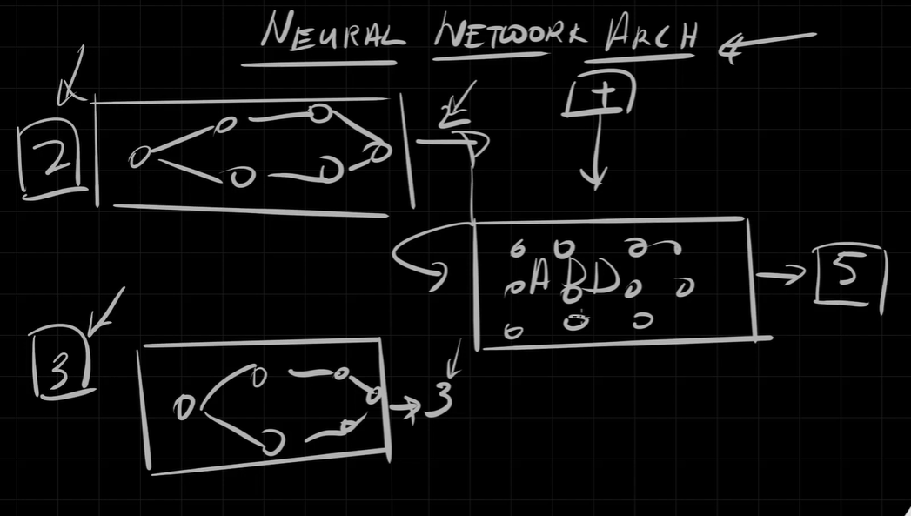

# 🧠 Topic: **Training Resources, Hallucination, and Neural Network Foundations**

## 📌 Objective

Gain a high-level understanding of:

- How AI models are **trained**
- What **hallucination** is and why it occurs in AI systems
- The role of **data, compute, algorithms, and architecture**
- Suggested resources for **deep-diving into neural networks and ML theory**

This will enhance your foundational understanding before moving into Azure’s AI services, which use **pre-trained models**.

---

## 🤖 Part 1: Understanding AI Hallucination

### ❓ What is Hallucination in AI?

AI hallucination refers to when a language model (LLM) produces **fabricated but plausible-sounding output** that is **factually incorrect**.

#### 🔍 Real-world Example

- Prompt: “Most famous Malayalam movie?”
- Model response: Gave an answer with **fictional movie name**, actor, and director.
- Even native speakers were **deceived by its realism**.

### ⚠️ Why It Happens

- AI does not “know” facts; it predicts the next word based on training data.
- If training data lacks context or grounding, it **fills gaps with probability**.
- This is a **limitation of generative AI**, especially without retrieval-augmented generation (RAG) or external fact-checking.

---

## 🏗️ Part 2: What is Model Training?

### 📦 Definition

Training is the process of **creating the AI model file** (e.g., `.gguf`, `.bin`, `.pt`) by **teaching the model from data**.

### 🔢 Training = Learning from Examples

- You provide the AI a large set of **input-output pairs** (called **labeled data**).
- The model learns how to map **X inputs** to **Y outputs** by adjusting internal **parameters**.

### 🧠 Human Analogy

Just like students practice math problems using solved examples, AI practices from known labeled examples.

---

## 🔍 Components Involved in Training

| Component                         | Description                                                         |
| --------------------------------- | ------------------------------------------------------------------- |
| **Data**                          | Labeled examples (`X → Y`) used to teach the model                  |
| **Cost Function / Loss Function** | Measures how wrong the model is                                     |
| **Backpropagation**               | Adjusts weights based on error using calculus (chain rule)          |
| **Gradient Descent**              | Optimization algorithm that reduces the error                       |
| **Activation Function**           | Determines when a neuron should activate (e.g., ReLU, Sigmoid)      |
| **GPU / Compute**                 | High-performance hardware used to run matrix operations efficiently |

---

## 💻 Why Training is Hard

- **Compute-intensive**:

  - Requires expensive GPUs (e.g., NVIDIA A100, H100 – up to \$40K+ each).

- **Data-intensive**:

  - Requires **massive, high-quality labeled datasets** (e.g., Common Crawl, BooksCorpus).

- **Complex to optimize**:

  - Training is about **minimizing error** across millions/billions of samples.
  - Even a small model like `Phi-3 Mini` may have **billions of parameters**.

---

## 🧠 Neural Network Architecture

### 🧩 What Is It?

The **architecture** refers to the **arrangement and interaction of neurons and layers**.

#### ✍🏻 Example

1. Input image 1 → First neural network → Outputs a number → 2
2. Input image 2 → Second neural network → Outputs a number → 3
3. Another neural network → Takes that numbers + operation → Computes a result → 5

---

  

---

### 🏗 Common Architectures

| Type                                   | Use Case                                       |
| -------------------------------------- | ---------------------------------------------- |
| **Feedforward Neural Network**         | Basic pattern recognition                      |
| **Convolutional Neural Network (CNN)** | Image processing                               |
| **Recurrent Neural Network (RNN)**     | Time-series, speech                            |
| **Transformer**                        | NLP, LLMs (e.g., GPT, BERT)                    |
| **Mixture of Experts**                 | Specialized subnetworks for better performance |

> Neural networks can be **chained, combined, or modularized** to solve complex tasks.

---

## 📚 Part 3: Recommended Learning Resources

### ✅ 1. **3Blue1Brown (YouTube)**

- Series: [Neural Networks – Deep Learning](https://www.youtube.com/playlist?list=PLZHQObOWTQDMsr9K-rj53DwVRMYO3t5Yr)
- **Highly visual**, beginner-friendly explanation of:

  - Gradient descent
  - Backpropagation
  - Cost functions

### ✅ 2. **Andrej Karpathy**

- Channel: [Andrej Karpathy on YouTube](https://www.youtube.com/@AndrejKarpathy)
- Codebase: [Micrograd](https://github.com/karpathy/micrograd)
- Also check out: [makemore](https://github.com/karpathy/makemore)
- **Ideal for developers** who want to understand and implement neural networks from scratch in PyTorch or plain Python.

> 🔁 Combine both for best results:
> Start with **3Blue1Brown** for theory → move to **Karpathy** for practical coding.

---

## 🎓 Key Jargon Recap

| Term                    | Meaning                                                  |
| ----------------------- | -------------------------------------------------------- |
| **Training**            | Teaching a model using labeled data                      |
| **Hallucination**       | Model gives believable but false output                  |
| **Backpropagation**     | Algorithm that updates weights in a neural network       |
| **Gradient Descent**    | Optimization method to reduce prediction error           |
| **Activation Function** | Controls neuron firing (e.g., ReLU)                      |
| **Architecture**        | Arrangement and combination of neural network components |
| **GPU**                 | Required for parallel processing during training         |
| **Labeled Data**        | Input-output pairs used for supervised learning          |

---

## ✅ Summary

- AI models **hallucinate**—you must verify critical outputs.
- **Training** involves massive compute and data to generate the model files.
- **Neural network architecture** defines how different components (neurons, layers) are structured.
- You don’t need to train your own models for AI-102—but understanding these concepts helps you choose, tune, and evaluate Azure AI services more effectively.
- Explore **3Blue1Brown** for theory and **Andrej Karpathy** for code-based deep dives.

---

## 🚀 What's Next?

You will now move from theoretical understanding to practical integration by learning how to **host AI models using REST APIs** and interact with them programmatically—just like Azure Cognitive Services does internally.
