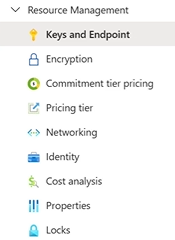
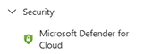
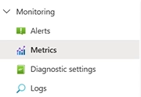
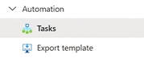

# 🛡️ Manage, Monitor, and Secure an Azure AI Service

This topic is **critical** for AI-102 certification and real-world operations. It applies across **all Azure AI services**, such as:

- Azure Computer Vision
- Language Services
- Azure OpenAI
- Translator
- Document Intelligence
  ...and more.

We’ll break it down by management categories based on the Azure portal side menu.

---

## 🔑 **1. Resource Management**

<div style="text-align: center;">
    
</div>

---

### 🎯 1.1. Keys and Endpoint

- Azure AI services use **two admin keys** (Primary and Secondary).
- This allows **zero-downtime key rotation**:

  1. Regenerate the **unused key**
  2. Update the app to use it
  3. Regenerate the **compromised or old key**

- The **endpoint URL** is public by default, accessible from anywhere **if you have the key**.

---

### 🔐 1.2. Encryption

- By default, Azure uses **Microsoft-managed keys (MMK)** to encrypt data at rest.
- You can choose **Customer-managed keys (CMK)** for extra control/compliance (e.g., in healthcare or banking).

---

### 💰 1.3. Commitment Tier Pricing & Pricing Tier

- You can save costs by reserving commitment tiers.
- Vision, Language, and other services often offer **Free** and **Standard** tiers.
- Choose based on call volume and feature access.

---

### 🌐 **1.4. Networking**

By default, Azure AI endpoints are **public**. That’s a potential risk if keys are leaked.

**⚙️ You have three options:**

1. **Allow All Networks** (default – least secure)
2. **Restrict by IP Ranges** (e.g., only 1.2.3.4 allowed)
3. **Use Private Endpoints** (most secure):

   - Maps the AI service to a **private IP** within your **VNet**
   - Prevents **any public access**
   - Great for enterprise, regulated, and production-grade systems

📌 Private endpoints are often called:

- Private Link (Azure)
- VPC Endpoint (AWS)

---

### 👤 **1.5. Identity**

Azure AI services can **authenticate** with other Azure services (like Blob Storage) using **Managed Identities**.

**🔑 Two types:**

- **System-assigned:**
  Created automatically with the resource, deleted when the resource is deleted.
- **User-assigned:**
  Created separately, can be reused across multiple resources.

🎯 Example:

- Computer Vision service accesses Blob Storage using **System-assigned identity**.
- You can grant **RBAC roles** to that identity for access (e.g., `Reader`, `Storage Blob Data Contributor`).

---

### 💰 **1.6. Cost Analysis**

- View usage trends, API call counts, and pricing impact.

---

### ⚙️ **1.7. Properties**

- Basic resource metadata (region, resource ID, type, etc.)

---

### 🔒 **1.8. Locks**

- Prevent accidental **deletion** or **modification**.
- Two lock types:

  - `Read-only`
  - `Delete protection`

💡 Locks are useful for **production AI services**.

---

## 🛡️ **2. Security**

<div style="text-align: center;">
  
</div>

---

### 🛡️ **2.1. Microsoft Defender for Cloud:**

- Provides **threat detection**, **compliance posture**, and **security alerts**.
- Can alert you to:

  - Over-permissive access
  - Key abuse
  - Unusual endpoint traffic

Note: It requires a **paid plan** for full features.

---

## 📈 **3. Monitoring**

<div style="text-align: center;">
    
</div>

---

### 🚨 **3.1. Alerts**

- Alerts notify you about conditions like:

  - Error rate exceeds threshold
  - Latency spikes
  - Unauthorized access attempt

👨‍💻 You can:

- Send email/SMS/Teams messages
- Trigger Logic Apps or Azure Functions

🧠 **Example:**
You set an alert when the total calls to your AI service exceed 10,000/day — a possible abuse pattern or cost risk.

---

### 🔍 **3.2. Metrics**

- Track things like:

  - Total API calls
  - Latency
  - Success/failure rate
  - Quota usage

👀 You can zoom in, visualize, and set **Alerts** (e.g., if errors spike or latency increases).

---

### 🔧 **3.3. Diagnostic Settings**

- Forward logs to:

  - Log Analytics (KQL search)
  - Storage account (for archiving)
  - Event Hub (for stream processing)

---

### 📜 **3.4. Logs**

- Logs show:

  - Who called the service
  - What was called
  - When it failed (and why)

- You can view these in **Activity Logs** and **Log Analytics (KQL)**

```kql
AzureDiagnostics
| where ResourceType == "COMPUTERVISION"
| summarize Count = count() by bin(TimeGenerated, 1h)
```

---

## ⚙️ **4. Automation**

<div style="text-align: center;">
    
</div>

---

### 🔄 **4.1. Tasks**

- Schedule auto-actions like:

  - Regenerate keys
  - Send alerts
  - Restart or scale services

### 🧾 **4.2. Export Template**

- Export the entire resource config as **ARM template (Infrastructure as Code)**.
- Useful for **versioning, redeployments, CI/CD pipelines**.

---

## 🧠 Summary Table

| Feature Category   | What It Does                 | Where to Find           |
| ------------------ | ---------------------------- | ----------------------- |
| 🔑 Keys & Endpoint | Secure API access            | Resource Management     |
| 🔐 Encryption      | Protect data at rest         | Resource Management     |
| 🌐 Networking      | Secure endpoint access       | Networking              |
| 👤 Identity        | Manage inter-service access  | Identity                |
| 💰 Cost & Locks    | Budget & prevent deletion    | Cost Analysis / Locks   |
| 🛡️ Defender        | AI resource threat detection | Microsoft Defender      |
| 📈 Monitoring      | Watch usage & alerts         | Metrics / Logs          |
| 🔁 Automation      | Schedule + deploy via IaC    | Tasks / Export Template |

---

## ✅ Best Practices for Securing & Managing Azure AI Services

| Action                          | Why                                  |
| ------------------------------- | ------------------------------------ |
| Rotate keys every 30–90 days    | Avoid long-term key exposure         |
| Use **Private Endpoints**       | Eliminate public attack surface      |
| Enable **Microsoft Defender**   | Detect threats and misconfigurations |
| Use **Managed Identity + RBAC** | Avoid hardcoding secrets             |
| Pipe logs to **Log Analytics**  | Centralize observability             |
| Export as template              | Automate deployments consistently    |
