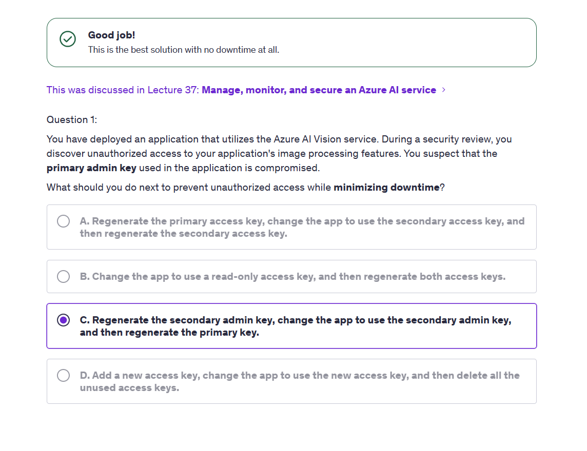

# Question - manage-monitor-secure-az-ai-services

## Question 1

    

---

### 📌 **Scenario Summary**

- You're using **Azure AI Vision**.
- Your **primary admin key** is **compromised**.
- You want to **prevent unauthorized access** 🔒
- AND you want to do this with **zero downtime** ⚡

---

### ✅ Correct Answer:

> **C. Regenerate the secondary admin key, change the app to use the secondary admin key, and then regenerate the primary key.**

---

### 🤔 Why **C is Correct** and **A is Not Ideal**

#### ❌ Option A:

> _Regenerate the primary access key, change the app to use the secondary access key, then regenerate the secondary._

⚠️ **Problem:**

- The app is currently **using the compromised primary key**.
- If you regenerate that key **first**, but the app is still using it at that moment — you **risk temporary failure or downtime**.
- You’re rotating keys **while the app is using them**, which can cause **errors or disruptions** if not timed perfectly.

---

#### ✅ Option C:

> _Regenerate the secondary key (safe), switch the app to use it, then regenerate the primary key (the compromised one)._

🔒 **Why it's safer and downtime-free:**

1. 🔁 Regenerate the **secondary** key first (it's not in use = safe).
2. 🔄 Update the app to use this new secondary key.
3. 🔐 Now **safely regenerate the compromised primary key**, because the app has already switched to the new secondary.

💡 This is the **standard Azure key rotation strategy**:

> **Use the unused key slot first, switch usage, then rotate the compromised key.**
