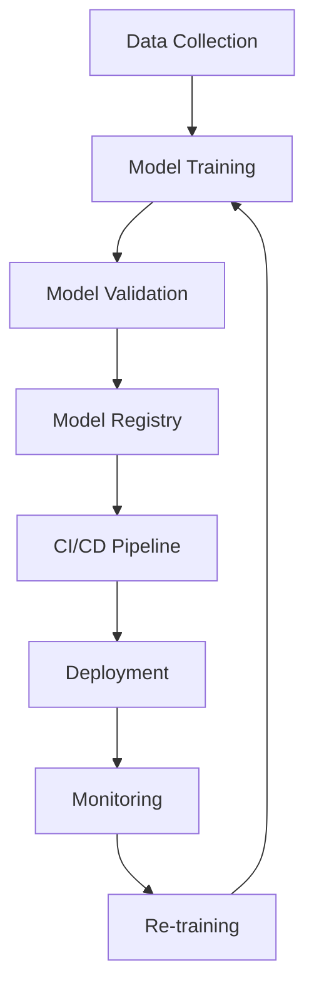

# 🤖📦 What is MLOps?

## ✅ Official Definition:

> **MLOps** (Machine Learning Operations) is a set of practices that **automate and manage the lifecycle of machine learning models** — from **development to deployment**, just like **DevOps** does for apps.

---

## 🔁 Why MLOps?

In traditional ML:

- You train a model on your laptop
- Test it with a notebook (Jupyter)
- Copy-paste the code into production 😨

That's like building a car in your garage and **hoping** it runs on highways!

MLOps makes ML production **safe, repeatable, testable, and automated** — just like software development.

---

## 🧱 Core Components of MLOps

### 🧪 1. **Model Development**

- Train your ML model (e.g., scikit-learn, PyTorch, Azure AutoML)
- Track versions, parameters, datasets

📦 Tools:

- **Azure Machine Learning**
- **MLflow**
- **Weights & Biases**

---

### 🧪 2. **Model Validation & Testing**

- Test the model with unseen data
- Measure accuracy, precision, recall
- Detect **data drift** and **model bias**

💡 Example:
If your model recognizes cars but stops working in rainy weather — validation helps catch that.

---

### ⚙️ 3. **CI/CD for ML (Continuous Integration & Delivery)**

Automate the ML pipeline:

- Trigger training when new data arrives
- Validate and deploy model automatically

💻 Tools:

- **GitHub Actions**, **Azure DevOps Pipelines**, **Kubeflow**, **ML Pipelines**

---

### 🚀 4. **Model Deployment**

Deploy model into:

- 🖥️ Web apps
- 📱 Mobile apps
- 🧠 Edge devices
- ☁️ Azure Functions, AKS, or REST APIs

You get:

- Real-time predictions via API
- Scaling with cloud infrastructure

---

### 🔍 5. **Monitoring & Logging**

- Track how the model performs in real life
- Watch for **data drift** or **inaccurate predictions**
- Re-train model if accuracy drops

📈 Azure: Use **Application Insights**, **Azure Monitor**, or **Model Metrics** dashboard.

---

## 🗺️ MLOps Lifecycle Diagram (Mermaid)

---

## 📦 MLOps vs DevOps (Simple Table)

| 🔍 Feature | 💻 DevOps                | 🤖 MLOps                                |
| ---------- | ------------------------ | --------------------------------------- |
| Artifact   | App code (.NET, Angular) | Trained ML model (.pkl, .onnx)          |
| Testing    | Unit/Integration Tests   | Accuracy, F1, Precision, Bias, Drift    |
| Deployment | App to servers (CI/CD)   | Model to APIs / containers / devices    |
| Monitoring | App uptime, logs         | Model accuracy, prediction distribution |
| Updates    | Code changes             | New data, retrain, re-deploy            |

---

## 🧠 Real-World Example: Taxi Demand Prediction

| Step               | What Happens                                         |
| ------------------ | ---------------------------------------------------- |
| 📊 Data Collection | Collect hourly bookings from Dubai taxis             |
| 🔧 Model Training  | Train model to predict future demand                 |
| ✅ Validation      | Check accuracy for different times/locations         |
| 📦 CI/CD           | Automatically retrain when new booking data is added |
| 🚀 Deployment      | Expose model via Azure Function or API               |
| 📉 Monitoring      | See if predictions are accurate during holidays      |
| 🔄 Re-train        | Model learns seasonal or traffic changes             |

---

## 🧰 Tools for MLOps in Azure

| Area           | Azure Service                         |
| -------------- | ------------------------------------- |
| Model Training | Azure Machine Learning Studio         |
| Pipelines      | Azure ML Pipelines / DevOps Pipelines |
| Model Registry | Azure ML Model Registry               |
| Deployment     | Azure Kubernetes Service (AKS), ACI   |
| Monitoring     | Azure Monitor, App Insights           |

---

## 🎓 Summary

**MLOps** = Applying DevOps principles to **machine learning**.
It helps teams:

- ✅ Deliver models faster
- ✅ Reduce human errors
- ✅ Monitor & fix models automatically
- ✅ Scale ML to production safely
