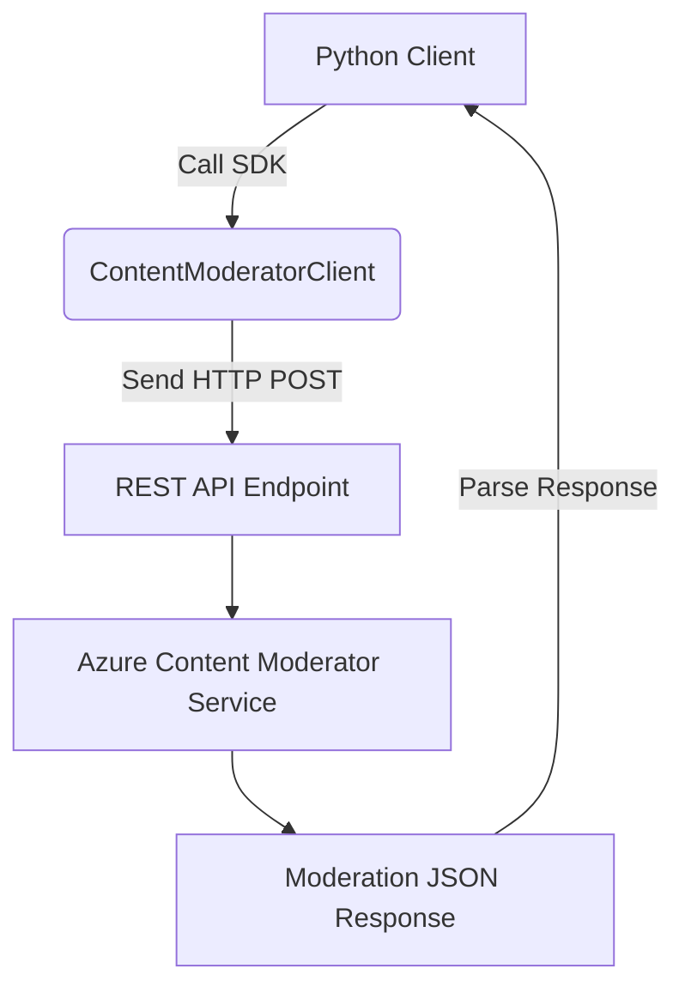

# 🧠 **Azure Content Moderator – Text Moderation**

## 📘 Overview

Azure Content Moderator is a powerful AI service offered through Azure Cognitive Services that enables developers to filter and detect offensive, unwanted, or sensitive content in text, images, and videos. In this topic, we focus on the **Text Moderation** capability.

> ⚠️ **Note**: As of 2025, Microsoft has deprecated or is in the process of deprecating some Content Moderator APIs in favor of unified Azure AI Content Safety services. However, the conceptual foundations are crucial for understanding responsible AI integration.

---

## 🎯 Learning Objectives

By the end of this topic, you will be able to:

- Understand the purpose and key use cases of the Azure Content Moderator for text.
- Create and configure the Content Moderator resource on Azure.
- Use the Python SDK to interact with the Text Moderation REST API.
- Detect profanity, personally identifiable information (PII), and autocorrect misspelled text.
- Interpret JSON responses from the moderation engine.
- Discuss limitations and comparison with general-purpose models like GPT.

---

## 🔍 1. **What is Text Content Moderation?**

Text content moderation involves analyzing user-generated or system-generated text to detect:

| 🔎 Feature                                    | ✅ Purpose                                             |
| --------------------------------------------- | ------------------------------------------------------ |
| **Profanity**                                 | Detects offensive, vulgar, or inappropriate words.     |
| **PII (Personally Identifiable Information)** | Detects phone numbers, email addresses, IPs, and SSNs. |
| **Autocorrection**                            | Corrects spelling and grammar mistakes.                |
| **Language Detection**                        | Determines the language of the text input.             |

---

## 🧱 2. **Architectural Components**

The text content moderation service follows a classic cloud REST API architecture.

<div align="center">



</div>

---

## 🔐 3. **Azure Setup & Resource Creation**

### 🛠 Step 1: Create Azure Account

- Go to [Azure Free Account](https://azure.microsoft.com/en-us/free/)
- Sign up using a credit/debit card (no initial charge)
- Get \$200–\$300 in free credits valid for 30 days

### 🛠 Step 2: Create Content Moderator Resource

- Go to Azure Portal → “AI + Machine Learning” → “Content Moderator”
- Choose:

  - Resource Group
  - Region
  - Pricing Tier: Free (F0) for limited usage

- After creation, note:

  - **Endpoint URL**
  - **Subscription Keys (Key1 and Key2)**

---

## 🧪 4. **Implementing the Text Moderator in Python**

### 📦 Prerequisites

```bash
pip install azure-core
pip install azure-cognitiveservices-vision-contentmoderator
pip install msrest
```

### 🧾 Sample Python Code

```python
from azure.cognitiveservices.vision.contentmoderator import ContentModeratorClient
from msrest.authentication import CognitiveServicesCredentials
from pprint import pprint
import os

# Azure credentials
CONTENT_MODERATOR_ENDPOINT = "https://<your-resource>.cognitiveservices.azure.com/"
subscription_key = "<your-subscription-key>"

# Instantiate client
client = ContentModeratorClient(
    endpoint=CONTENT_MODERATOR_ENDPOINT,
    credentials=CognitiveServicesCredentials(subscription_key)
)

# Provide the text file path
TEXT_FOLDER = "text_files"
file_path = os.path.join(TEXT_FOLDER, "ContentModerator.txt")

# Open and screen the file
with open(file_path, "rb") as text_fd:
    response = client.text_moderation.screen_text(
        text_content_type="text/plain",
        text_content=text_fd,
        language="eng",
        autocorrect=True,
        pii=True
    )
    pprint(response.as_dict())
```

---

## 📤 5. **Expected Output (JSON Structure)**

```json
{
  "language": "eng",
  "autocorrectedText": "My residential address is ...",
  "pii": {
    "email": [...],
    "phone": [...],
    ...
  },
  "terms": [
    {
      "term": "damn",
      "index": 42,
      "listId": 0
    }
  ]
}
```

### Key Fields

- `autocorrectedText`: Replaces incorrect spelling.
- `pii`: Contains structured info (email, phone, IPs).
- `terms`: Detected profane or flagged terms.

---

## 🧠 6. **Behind the Scenes: How It Works**

| 💡 Element          | Description                                               |
| ------------------- | --------------------------------------------------------- |
| **SDK Abstraction** | Wraps HTTP REST API calls                                 |
| **REST Endpoint**   | `POST /contentmoderator/moderate/v1.0/ProcessText/Screen` |
| **Data Exchange**   | Uses JSON over HTTPS                                      |
| **Error Handling**  | API may return 400 or 401 for bad inputs or keys          |

---

## 🚀 7. **Use Cases in Real World**

- Moderating forums and comment sections
- Real-time chat systems
- User profile validation
- Feedback forms for profanity and data leakage

---

## ⚖️ 8. **Content Moderator vs. ChatGPT / LLMs**

| Feature           | Azure Content Moderator | ChatGPT / LLM           |
| ----------------- | ----------------------- | ----------------------- |
| **Purpose**       | Specialized filtering   | General-purpose         |
| **Speed**         | Fast (microseconds)     | Slower                  |
| **Accuracy**      | High for known labels   | May hallucinate         |
| **Cost**          | Per API call            | Higher usage-based cost |
| **Customization** | Minimal                 | Flexible prompts        |

> ✅ Best practice: Use LLMs when contextual understanding is needed; use Content Moderator for rule-based fast filtering.

---

## 🔐 9. **Security & Privacy**

- Input text is not stored by Azure
- HTTPS-secured API
- Can restrict endpoint access via VNET or firewall rules
- Usage complies with GDPR and ISO 27001

---

## 📉 10. **Limitations**

| ❌ Constraint        | ⚠️ Note                                    |
| -------------------- | ------------------------------------------ |
| Obsolescence         | May be replaced by Azure AI Content Safety |
| No custom dictionary | Cannot add domain-specific rules           |
| Language Support     | Limited to popular languages               |
| API Quota            | Free tier has rate limits                  |

---

## 📚 11. **Microsoft Documentation Links**

- [Text Moderation Overview](https://learn.microsoft.com/en-us/azure/ai-services/content-moderator/)
- [Python SDK Docs](https://learn.microsoft.com/en-us/python/api/overview/azure/cognitiveservices-vision-contentmoderator-readme)

---

## ✅ Summary

| Topic           | Key Takeaway                                |
| --------------- | ------------------------------------------- |
| Purpose         | Detect profanity, PII, and autocorrect text |
| Tool            | Azure AI → Content Moderator (Text)         |
| Interface       | REST API + Python SDK                       |
| Output          | JSON with categorized feedback              |
| Future-Proofing | Migrate to Azure AI Content Safety          |
