# 🖼️ **Azure Content Moderator – Image Moderation**

## 📘 Overview

Azure Content Moderator also supports moderation of **images** by analyzing content for:

- Adult content (e.g., pornography)
- Racy content (e.g., suggestive poses, revealing clothing)
- Detecting **text inside images**
- Detecting **human faces** (and returning bounding box coordinates)

> ⚠️ **Important**: Microsoft is phasing out this service and transitioning towards **Azure AI Content Safety**. Still, understanding this topic is vital to grasp image moderation concepts in responsible AI.

---

## 🎯 Learning Objectives

By the end of this topic, you will:

- Understand how image moderation works in Azure
- Detect adult/racy content using `evaluate_url_input()`
- Extract text from images using OCR
- Detect faces and their coordinates
- Interpret JSON results programmatically

---

## 🧱 1. **Architecture of Image Moderation Workflow**

```mermaid
graph TD
    A[Python Client] -->|SDK Call| B[ContentModeratorClient]
    B -->|Send URL| C[REST API Endpoint]
    C --> D[Azure Content Moderator Service]
    D --> E{Tasks}
    E --> F[Adult/Racy Detection]
    E --> G[OCR – Text Extraction]
    E --> H[Face Detection]
    F & G & H --> I[JSON Results]
    I --> A
```

<div align="center">



</div>

---

## 🖼️ 2. **Supported Input Formats**

- **Image as URL**: Must be publicly accessible (HTTP/HTTPS)
- **Data Representation**: `"URL"` or `"Inline"` for binary content (file upload)
- Supported formats: `.jpg`, `.png`, `.gif`, `.bmp`

---

## 🧪 3. **Implementation Using Python**

### 📦 Required Libraries

```bash
pip install azure-cognitiveservices-vision-contentmoderator
pip install msrest
```

### 🧾 Sample Code

```python
from azure.cognitiveservices.vision.contentmoderator import ContentModeratorClient
from msrest.authentication import CognitiveServicesCredentials
from pprint import pprint

# Endpoint and key
endpoint = "https://<your-resource>.cognitiveservices.azure.com/"
key = "<your-subscription-key>"

client = ContentModeratorClient(endpoint, CognitiveServicesCredentials(key))

IMAGE_LIST = [
    "https://content.api.news/v3/images/bin/756692568a236c94619b202e9b68687a?width=650",
    "https://mockuptree.com/wp-content/uploads/edd/2022/01/minecraft-text-effect-psd.jpg",
    "https://media.istockphoto.com/id/1550540247/photo/decision-thinking-and-asian-man-in-studio.jpg"
]

for image_url in IMAGE_LIST:
    print(f"\n--- Processing Image ---\n{image_url}")

    # Adult / Racy content
    evaluation = client.image_moderation.evaluate_url_input(
        content_type="application/json",
        cache_image=True,
        data_representation="URL",
        value=image_url
    )
    pprint(evaluation.as_dict())

    # Text extraction
    ocr_result = client.image_moderation.ocr_url_input(
        language="eng",
        content_type="application/json",
        data_representation="URL",
        value=image_url,
        cache_image=True
    )
    pprint(ocr_result.as_dict())

    # Face detection
    faces = client.image_moderation.find_faces_url_input(
        content_type="application/json",
        cache_image=True,
        data_representation="URL",
        value=image_url
    )
    pprint(faces.as_dict())
```

---

## 📤 4. **Expected Output (JSON)**

**Adult / Racy Classification Example:**

```json
{
  "isImageAdultClassified": false,
  "isImageRacyClassified": true,
  "adultClassificationScore": 0.07,
  "racyClassificationScore": 0.72
}
```

**OCR (Text Extraction) Example:**

```json
{
  "text": [
    {
      "text": "Realistic Image of Joe Biden"
    }
  ]
}
```

**Face Detection Example:**

```json
{
  "faces": [
    {
      "faceRectangle": {
        "left": 230,
        "top": 110,
        "width": 85,
        "height": 85
      }
    }
  ]
}
```

---

## 🧠 5. **Deep Dive: What Each Function Does**

| 🧩 Function              | 🔍 What It Does                                    |
| ------------------------ | -------------------------------------------------- |
| `evaluate_url_input()`   | Checks image for **adult and racy content**        |
| `ocr_url_input()`        | Extracts visible **printed text** in the image     |
| `find_faces_url_input()` | Detects **human faces** and returns bounding boxes |

These are thin wrappers over the underlying REST APIs.

---

## 🛡️ 6. **Security and Governance**

- Uses HTTPS for API communication
- No storage of content on Azure (unless explicitly enabled)
- You can restrict API usage by IP, firewall, or VNET
- PII is not extracted from image, only visible metadata like email in text (via OCR)

---

## 📈 7. **Real-world Applications**

| Use Case                              | Benefit                                          |
| ------------------------------------- | ------------------------------------------------ |
| **Social media apps**                 | Filter out explicit images in uploads            |
| **User-generated content moderation** | Block inappropriate content before it is public  |
| **eCommerce platforms**               | Avoid NSFW product listings                      |
| **OCR pre-processing**                | Extract printed text for indexing or translation |
| **Surveillance / Security**           | Detect faces for facial verification pipelines   |

---

## 🆚 8. **Content Moderator vs General LLMs (e.g., GPT)**

| Feature        | Azure Content Moderator  | GPT / LLM                            |
| -------------- | ------------------------ | ------------------------------------ |
| Speed          | Fast, real-time          | Slower                               |
| Cost           | Low                      | Higher inference cost                |
| Specialization | Explicit image detection | General vision + reasoning           |
| Accuracy       | Tuned for classification | Might hallucinate                    |
| API Simplicity | Easy REST interface      | Requires prompt design + fine-tuning |

---

### 📉 9. **Limitations**

| ❌ Limitation                          | ⚠️ Impact                               |
| -------------------------------------- | --------------------------------------- |
| May miss nuanced cases                 | False negatives (e.g., blurred nudity)  |
| Text detection limited to clear fonts  | Doesn’t handle cursive/handwriting well |
| Face detection ≠ identity verification | Returns coordinates, not who it is      |
| Service is being deprecated            | Migrate to **Azure AI Content Safety**  |

---

## 📚 10. **Microsoft Documentation Links**

- [Azure Content Moderator – Image](https://learn.microsoft.com/en-us/azure/ai-services/content-moderator/image-moderation-api)
- [Python SDK](https://learn.microsoft.com/en-us/python/api/overview/azure/cognitiveservices-vision-contentmoderator-readme)

---

## ✅ Summary

| Area        | Details                                     |
| ----------- | ------------------------------------------- |
| Moderates   | Adult/Racy content, visible text, and faces |
| Interfaces  | Python SDK → Azure REST APIs                |
| Inputs      | Image URLs                                  |
| Output      | JSON describing moderation flags            |
| Deprecation | Will be replaced by Azure AI Content Safety |
