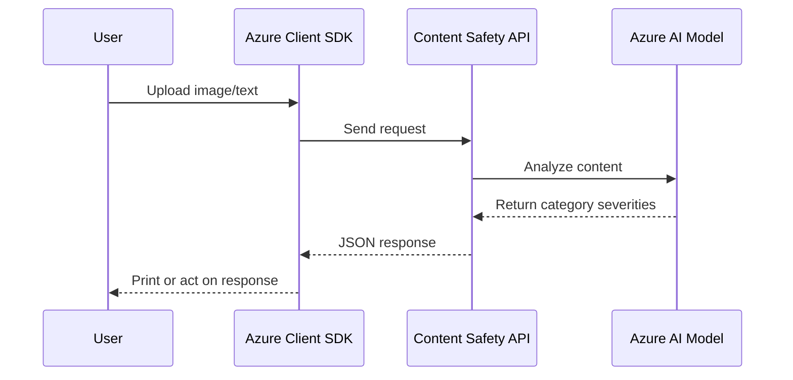

# 🛡️ Azure AI Content Safety – Text & Image Moderation

## 🚀 Overview

**Azure AI Content Safety** is the upgraded and modernized version of the older "Content Moderator" service. It detects harmful, offensive, or unsafe content in **text** and **images** — with precision, AI flair, and some seriously powerful ML under the hood.

> ⚠️ **Important:** The older `Content Moderator` service is deprecated. Use `Azure AI Content Safety` for all **moderation** needs across image & text content.

---

## 📚 Official Definition

> Azure AI Content Safety helps organizations detect **harmful content** in both **text** and **images**. It categorizes content into **hate**, **self-harm**, **sexual**, and **violence**, providing severity scores for each.

---

## 🧠 Categories Detected

Content is analyzed for four critical **safety categories**, each returning a `severity` score from **0 (Safe)** to **6 (Extremely Unsafe)**.

| Category         | Description                                 |
| ---------------- | ------------------------------------------- |
| 🧨 **Hate**      | Hateful speech, slurs, racism, bigotry.     |
| ⚔️ **Violence**  | Threats, physical aggression, gory content. |
| 🩸 **Self-harm** | Mentions of suicide, self-injury.           |
| 🍑 **Sexual**    | Nudity, explicit content, sexual language.  |

---

## 🔍 Use Cases

| Scenario                   | Why It Matters 📢                                             |
| -------------------------- | ------------------------------------------------------------- |
| 🌐 User-generated content  | Filter offensive memes or abusive messages before going live. |
| 📸 Image uploads           | Flag NSFW or violent images on your platform.                 |
| 💬 Chat applications       | Detect and act on harmful language in real time.              |
| 📰 News or media pipelines | Moderate images and captions automatically.                   |

---

## 🛠️ Setup Steps

1. **Go to Azure Portal**
2. Navigate to: **Azure AI Services → Content Safety**
3. Click `Create`, fill in:

   - Resource Group
   - Name
   - Region
   - Pricing Tier (start with Free ☕)

4. After deployment, copy:

   - ✅ `Endpoint`
   - ✅ `API Key`

---

## 🖼️ Image Moderation Example (Python)

```bash
pip install azure-ai-contentsafety
```

```python
from azure.ai.contentsafety import ContentSafetyClient
from azure.core.credentials import AzureKeyCredential
from azure.ai.contentsafety.models import (
    AnalyzeImageOptions, ImageData, ImageCategory
)

client = ContentSafetyClient(endpoint="YOUR_ENDPOINT", credential=AzureKeyCredential("YOUR_KEY"))

with open("sample.jpg", "rb") as img:
    request = AnalyzeImageOptions(image=ImageData(content=img.read()))

response = client.analyze_image(request)

for item in response.categories_analysis:
    print(f"{item.category}: Severity {item.severity}")
```

🔎 **Sample Output**

```ini
HATE: Severity 0
SELF_HARM: Severity 0
SEXUAL: Severity 2
VIOLENCE: Severity 0
```

---

## 📄 Text Moderation Example (Python)

```python
from azure.ai.contentsafety.models import AnalyzeTextOptions, TextCategory

request = AnalyzeTextOptions(text="I will kill you.")

response = client.analyze_text(request)

for item in response.categories_analysis:
    print(f"{item.category}: Severity {item.severity}")
```

🧠 **Insight**: It doesn’t look just for keywords like "kill" — it **contextually understands** the sentence’s meaning. Amazing, right?

---

## 📊 Response Structure

Each call returns a structured response:

```json
{
  "categories_analysis": [
    {
      "category": "HATE",
      "severity": 0
    },
    {
      "category": "SEXUAL",
      "severity": 2
    }
  ]
}
```

- No complex probability scores.
- Just **category** + **severity**. Simple & fast.

---

## 📈 Sequence Flow (Mermaid Style)

<div align="center">



</div>

---

## 🧪 Testing Ideas

Try the following examples:

**Text Examples:**

- "I hate you" → Should trigger `HATE`
- "I will jump from the bridge" → `SELF_HARM`
- "Explicit content description" → `SEXUAL`
- "Let’s start a riot and burn things!" → `VIOLENCE`

**Image Examples:**

- Upload peaceful landscape = Severity 0s
- Upload disturbing news image = High `VIOLENCE`
- Upload image of politician with text = Depends on content

⚠️ You won't see a score for "probability"—just a **severity level**.

---

## 🤖 LLM vs Content Safety?

> Can’t we use ChatGPT for moderation?

Yes, **LLMs can be prompted** for moderation, but…

| Content Safety AI           | ChatGPT with Prompts         |
| --------------------------- | ---------------------------- |
| ✅ Trained for moderation   | 🧠 General purpose           |
| ✅ Consistent output        | ❌ May hallucinate           |
| ✅ Real-time safety scoring | ⚠️ Can be biased or verbose  |
| ✅ Scalable & cheap         | 💸 Higher cost per inference |

🗣️ Think of this as the **"master of one" vs "jack of all"** tradeoff.

---

## 📌 Notes

- SDK: [`azure-ai-contentsafety`](https://pypi.org/project/azure-ai-contentsafety/)
- Docs: [Azure AI Content Safety Docs](https://learn.microsoft.com/en-us/azure/ai-services/content-safety/overview)
- Full API reference: [Text API](https://learn.microsoft.com/en-us/azure/ai-services/content-safety/how-to/text-moderation), [Image API](https://learn.microsoft.com/en-us/azure/ai-services/content-safety/how-to/image-moderation)
- Free tier includes limited usage—good for testing 🧪

---

## 🎯 Summary

- ✅ Azure AI Content Safety is your go-to service for **moderating image and text** using AI.
- ✅ Detects 4 categories with severity from 0 to 6.
- ✅ Python SDK is clean and production-ready.
- ✅ Ideal for web apps, community platforms, chat services, and more.

> 💡 Pro tip: Use specific moderation models for consistency; fallback to LLMs if necessary, but never rely on them alone for compliance or risk-sensitive use cases.
