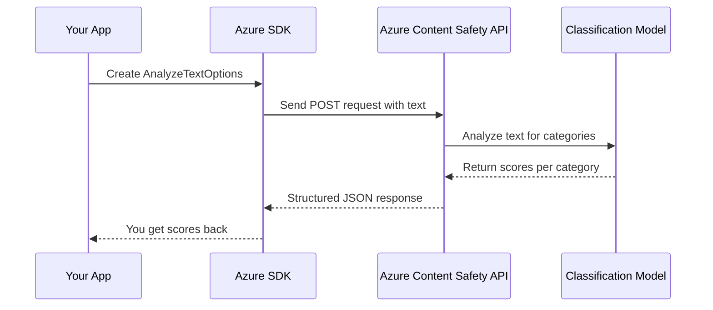

# 💬 Azure AI Content Safety – Text Analysis with Python

## 🧨 Why Text Moderation Is a Must

Whether it’s trolls, toxicity, or just plain terrible DMs, **text content** is where the internet gets spicy… and not always in a good way 🌶️. If you're building a chat app, a comment system, or user feedback platform, **you need protection** against:

- Hate speech 🧨
- Suicide or self-harm mentions 🩸
- Sexual content 🍑
- Violent threats ⚔️

That’s where **Azure AI Content Safety** steps in — your AI-powered content bouncer 🧠👮.

---

## 🧾 Official Overview

> **Azure AI Content Safety** helps detect and classify harmful user-generated text across **4 categories**, returning severity scores (0 to 6). It’s built for **real-time moderation**, **policy enforcement**, and **keeping your platform safe**.

### Categories it detects

| Category     | Description                                 |
| ------------ | ------------------------------------------- |
| 🧨 Hate      | Racist, discriminatory, or abusive language |
| 🩸 Self-Harm | Mentions of suicide, self-injury            |
| 🍑 Sexual    | Inappropriate, adult, or suggestive content |
| ⚔️ Violence  | Threats, gore, violent expressions          |

---

## 🧰 Prerequisites

1. 🧠 Azure Subscription
2. ☁️ Provision **Azure AI Content Safety** resource
3. 🔑 Get `endpoint` and `key` from Azure Portal
4. 🛠️ Install SDK

```bash
pip install azure-ai-contentsafety
```

---

## 🧪 Full Code Example: Analyzing Text for Bad Vibes

Here’s a full working example using the official `azure-ai-contentsafety` SDK — fully explained below.

### 🧾 Python Script

```python
# Azure AI ContentSafety Text Analysis Example
# pip install azure-ai-contentsafety

import os
from azure.ai.contentsafety import ContentSafetyClient
from azure.ai.contentsafety.models import TextCategory, AnalyzeTextOptions
from azure.core.credentials import AzureKeyCredential
from azure.core.exceptions import HttpResponseError

# 👮 Replace with your real keys
key = "f7324ffadc7e4da0b5b253230a44a849"
endpoint = "https://azure-content-safety-demo-345.cognitiveservices.azure.com/"

# 🔧 Initialize the Content Safety client
client = ContentSafetyClient(endpoint, AzureKeyCredential(key))

# 🗯️ Suspicious text to analyze
request = AnalyzeTextOptions(text="You are an idiot. I will kill you.")

# 🧠 Call the API to analyze text
try:
    response = client.analyze_text(request)
except HttpResponseError as e:
    print("Analyze text failed.")
    if e.error:
        print(f"Error code: {e.error.code}")
        print(f"Error message: {e.error.message}")
    raise

# 📊 Extract and display results
hate_result = next(
    item for item in response.categories_analysis
    if item.category == TextCategory.HATE
)
self_harm_result = next(
    item for item in response.categories_analysis
    if item.category == TextCategory.SELF_HARM
)
sexual_result = next(
    item for item in response.categories_analysis
    if item.category == TextCategory.SEXUAL
)
violence_result = next(
    item for item in response.categories_analysis
    if item.category == TextCategory.VIOLENCE
)

# 🖨️ Print results
if hate_result:
    print(f"🧨 Hate severity: {hate_result.severity}")
if self_harm_result:
    print(f"🩸 SelfHarm severity: {self_harm_result.severity}")
if sexual_result:
    print(f"🍑 Sexual severity: {sexual_result.severity}")
if violence_result:
    print(f"⚔️ Violence severity: {violence_result.severity}")

# [END analyze_text]

if __name__ == "__main__":
    analyze_text()
```

---

## 🔍 Output Example

Let’s say we run this on our nasty sentence:

```plaintext
🧨 Hate severity: 3
🩸 SelfHarm severity: 0
🍑 Sexual severity: 0
⚔️ Violence severity: 5
```

This means:

- Mild hate speech (probably the “idiot”)
- Severe violent threat (“I will kill you”)
- No adult content
- No suicidal indication

> You can use severity logic like:
>
> - **0–1**: Allow ✅
> - **2–4**: Flag for review ⚠️
> - **5–6**: Block or report 🚨

---

## 📽️ Line-by-Line Breakdown

| Line Range | What’s Happening                           | Emoji |
| ---------- | ------------------------------------------ | ----- |
| 1–6        | SDK and model imports                      | 📦    |
| 9–10       | Replace with your **own credentials**      | 🔑    |
| 13         | Initialize SDK client using your key       | 🧠    |
| 16         | Define text input to be analyzed           | 💬    |
| 19–27      | Execute analysis and handle any exceptions | 🚨    |
| 30–45      | Pull severity values for each category     | 📊    |
| 48–53      | Print categorized severity scores          | 🖨️    |

---

## 📈 What Happens Behind the Scenes?



---

## 📎 Tips for Real-World Use

- 🛑 **Never block on keyword only** – always use severity scores.
- 🧠 Train your moderation rules based on historical data + category relevance.
- 👀 Log and review flagged texts periodically to improve moderation accuracy.
- 🧪 Test with **real samples from your users**, not just crafted cases.
- 🔐 Protect keys using Azure Key Vault or environment variables.

---

## 🔄 Comparing with LLMs?

| Feature        | LLMs (e.g. GPT-4)         | Azure Content Safety     |
| -------------- | ------------------------- | ------------------------ |
| Scope          | General-purpose reasoning | Purpose-built moderation |
| Speed          | Slower                    | ⚡ Fast (specialized)    |
| Cost           | 💸 Higher                 | 💰 Lower                 |
| Consistency    | Varies                    | 🔒 Predictable           |
| Text-Only?     | ✅                        | ✅                       |
| Explainability | High                      | Medium                   |

> LLMs are awesome 🧠, but for **high-volume, low-latency moderation**, specialized tools like Content Safety are 🔥.

---

## ✅ Summary Table

| Feature             | Value                             |
| ------------------- | --------------------------------- |
| SDK Package         | `azure-ai-contentsafety`          |
| API Endpoint        | `/analyzeText`                    |
| Response Format     | Severity (0–6) per category       |
| Categories Analyzed | Hate, Self-Harm, Sexual, Violence |
| Integration Style   | SDK, REST, or Azure Logic Apps    |
| Cost                | Pay-per-call (with free tier!) 💵 |

---

## 📚 Further Resources

- [📄 Official Docs – Text Analysis](https://learn.microsoft.com/en-us/azure/ai-services/content-safety/how-to/text-moderation)
- [🧠 Responsible AI Practices](https://learn.microsoft.com/en-us/azure/responsible-ai/overview)
- [🧪 Try the REST API](https://learn.microsoft.com/en-us/rest/api/cognitiveservices/content-safety/analyze-text)
- [🧰 SDK on PyPI](https://pypi.org/project/azure-ai-contentsafety/)
