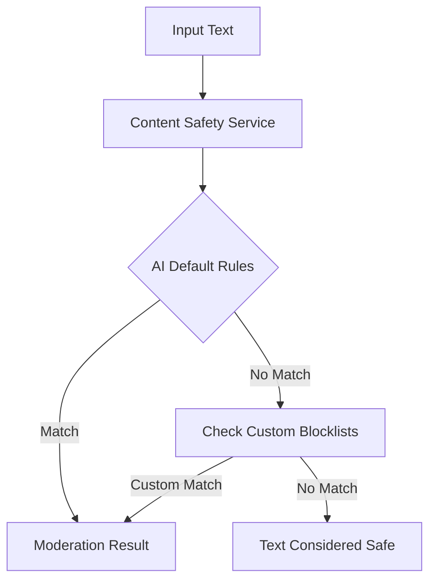

# 🧱 Azure AI Content Safety - Blocklist Magic ✨

Welcome to the dark side of moderation—**where you don't just detect unsafe text but teach the model what's offensive for your context.** In this topic, we explore how to customize moderation with **Text Blocklists** using Azure AI Content Safety. Let's dive deep into what blocklists are, why they exist, and how to master them with Python. Ready? Let’s do this!

---

## 📖 Official Definition

**Blocklists in Azure AI Content Safety** let you define custom words or phrases that should be flagged as inappropriate or harmful—even if the AI model doesn’t consider them bad by default.

> "A blocklist is a user-defined list of words that Azure AI Content Safety will treat as sensitive or unsafe during text analysis."

This is crucial when you're working with **domain-specific jargon**, slang, or internal terms that you'd like to monitor or suppress.

---

## 🤔 Why Blocklists Matter

By default, the Azure Content Safety model flags hate speech, sexual content, violence, and self-harm. But it may miss your team's inside jokes or secret company codenames that are actually **seriously offensive** in context.

So instead of retraining the model (hard and expensive), **you extend it with a blocklist**. 🎯

---

## 🧠 High-Level Flow

<div align="center">



</div>

---

## 🛠️ Core Use Cases (CRUD Style)

| Operation   | Description                                 |
| ----------- | ------------------------------------------- |
| **Create**  | Make a new named blocklist                  |
| **Read**    | List or get details of blocklists           |
| **Update**  | Add/update items in a blocklist             |
| **Delete**  | Remove items or delete entire blocklist     |
| **Analyze** | Use your blocklist in real content scanning |

---

## 💡 Example Scenario

Let’s say your app allows users to chat. While Azure flags default profanity, it doesn't know your team's code words like:

- `k*ll` (with a star for obfuscation)
- `h*te` (slang used in your app)

You want to **catch and moderate those**, even when users try to sneak around filters. Blocklists to the rescue!

---

## 🧪 Let’s Code – Full CRUD Demo

Here's a full Python implementation that does:

✅ Create blocklist
✅ Add offensive items
✅ Analyze input text
✅ List and get items
✅ Remove item
✅ Delete blocklist

🧠 **Pro Tip:** Only \~10–15 lines actually do the work. The rest is just setup and error handling.

### 🧬 Setup

Install the SDK:

```bash
pip install azure-ai-contentsafety
```

Then copy this Python code:

```python
# Azure AI ContentSafety Text BlockList CRUD
KEY = "f7324ffadc7e4da0b5b253230a44a849"
ENDPOINT = "https://azure-content-safety-demo-345.cognitiveservices.azure.com/"
```

---

### 🧱 1. Create or Update a Blocklist

```python
from azure.ai.contentsafety import BlocklistClient
from azure.ai.contentsafety.models import TextBlocklist
from azure.core.credentials import AzureKeyCredential

client = BlocklistClient(ENDPOINT, AzureKeyCredential(KEY))

blocklist = client.create_or_update_text_blocklist(
    blocklist_name="TestBlocklist",
    options=TextBlocklist(
        blocklist_name="TestBlocklist",
        description="Test blocklist management."
    )
)
print(f"✅ Created Blocklist: {blocklist.blocklist_name}")
```

---

### ➕ 2. Add Block Items

```python
from azure.ai.contentsafety.models import TextBlocklistItem, AddOrUpdateTextBlocklistItemsOptions

items = [
    TextBlocklistItem(text="k*ll"),
    TextBlocklistItem(text="h*te"),
]

result = client.add_or_update_blocklist_items(
    blocklist_name="TestBlocklist",
    options=AddOrUpdateTextBlocklistItemsOptions(blocklist_items=items),
)

for item in result.blocklist_items:
    print(f"🧩 Added Block Item: {item.text} (ID: {item.blocklist_item_id})")
```

---

### 🔍 3. Analyze Text Using Blocklist

```python
from azure.ai.contentsafety import ContentSafetyClient
from azure.ai.contentsafety.models import AnalyzeTextOptions

safety_client = ContentSafetyClient(ENDPOINT, AzureKeyCredential(KEY))

analysis_result = safety_client.analyze_text(
    AnalyzeTextOptions(
        text="I h*te you and I want to k*ll you.",
        blocklist_names=["TestBlocklist"],
        halt_on_blocklist_hit=False
    )
)

for match in analysis_result.blocklists_match:
    print(f"🚨 Match! Word: {match.blocklist_item_text} in {match.blocklist_name}")
```

🧠 **Smart Tip**: The AI understands word variations—even obfuscated ones like `k*ll`. It's not doing a plain `grep`, it actually _thinks_. 🤯

---

### 📜 4. List Blocklists and Items

```python
# List all blocklists
for bl in client.list_text_blocklists():
    print(f"📚 Blocklist: {bl.blocklist_name} - {bl.description}")

# List items in a blocklist
for item in client.list_text_blocklist_items(blocklist_name="TestBlocklist"):
    print(f"🧱 Block Item: {item.text}")
```

---

### 🔍 5. Get Blocklist or Item by ID

```python
# Get blocklist
bl = client.get_text_blocklist(blocklist_name="TestBlocklist")
print(f"🎯 Retrieved Blocklist: {bl.blocklist_name}")

# Get a block item (you need the ID)
item_id = result.blocklist_items[0].blocklist_item_id
item = client.get_text_blocklist_item("TestBlocklist", blocklist_item_id=item_id)
print(f"🔎 Block Item Detail: {item.text} - ID: {item.blocklist_item_id}")
```

---

### ❌ 6. Remove an Item

```python
from azure.ai.contentsafety.models import RemoveTextBlocklistItemsOptions

client.remove_blocklist_items(
    blocklist_name="TestBlocklist",
    options=RemoveTextBlocklistItemsOptions(blocklist_item_ids=[item_id])
)
print(f"🗑️ Removed item ID: {item_id}")
```

---

### 💥 7. Delete the Blocklist

```python
client.delete_text_blocklist(blocklist_name="TestBlocklist")
print("🧹 Blocklist deleted!")
```

---

## 🧠 What You Just Learned

- 🧱 How to create and manage text blocklists
- ✍️ How to insert custom unsafe words
- 🚨 How Azure detects both default and custom content
- 🧰 CRUD operations on blocklists and their items
- 🧠 Bonus: It's smarter than `grep`, using real ML reasoning!

---

## 🧭 When to Use Blocklists

- You have **domain-specific terms** you want to moderate.
- You're dealing with **non-English dialects or slang**.
- You want to **enforce stricter standards** than what Azure provides out of the box.
- You need **auditable and maintainable custom word filters**.

---

## 🚀 Pro Debugging Tip

Set breakpoints only on the real action lines (e.g. `analyze_text`, `add_or_update_blocklist_items`). Ignore 80% of the boilerplate—because **only a few lines do the magic**.

---

## 📌 Final Thoughts

This feature brings power to **customize Azure AI’s safety brain**. You don’t need to retrain the model—you just _whisper your own red flags into its ear_.

👉 Test it. Break it. Customize it. It’s your personal **AI gatekeeper** for content.

---

## 📚 Docs

[Use blocklist](https://learn.microsoft.com/en-us/azure/ai-services/content-safety/how-to/use-blocklist?tabs=windows%2Ccsharp)
