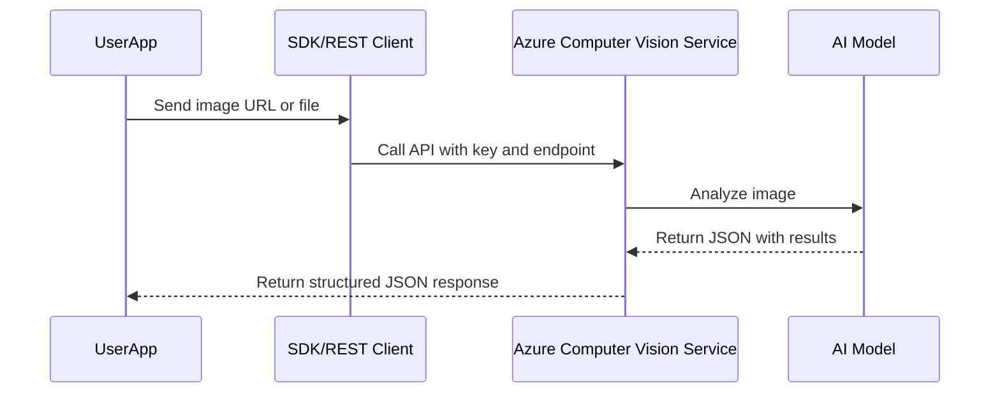

# 👁️ Azure Computer Vision – Mastering Sight for AI-102

## 📜 Official Definition

> **Azure Computer Vision** is a cloud-based service that provides powerful pre-trained AI algorithms to process images and return information. It can analyze visual content in different ways, depending on the chosen features.

---

## 🧠 What Can It Do? (Capabilities)

Here’s a rundown of **Computer Vision 3.x & 4.x** core capabilities:

| Feature                | What It Does                                 | Exam-Ready Hint               |
| ---------------------- | -------------------------------------------- | ----------------------------- |
| 🖼️ Image Analysis      | Detects objects, tags, captions, and more    | Most popular feature          |
| 🏛️ Landmark Detection  | Identifies well-known landmarks              | Domain-specific model         |
| 🧢 Brand Detection     | Recognizes logos in images                   | Needs high-quality logos      |
| 🧠 Image Captioning    | Generates smart, descriptive captions        | Like: "A dog on a beach"      |
| 🏷️ Tagging             | Returns list of tags based on visual content | Ex: `beach`, `dog`, `outdoor` |
| 🔍 OCR (Read API)      | Extracts printed and handwritten text        | Better than older OCR         |
| 👤 Celebrity Detection | Recognizes famous faces                      | Gated—needs special access    |
| ✂️ Smart Cropping      | Suggests focus areas for thumbnails          | Useful in media galleries     |

---

## ☁️ How Does It Work? (Architecture)

<div align="center">



</div>

---

## 🔑 Setup in Azure Portal (Quick Summary)

1. Go to Azure Portal → Create a **Computer Vision** resource
2. Choose your region, pricing tier (F0 = Free), and resource group
3. After creation, note:

   - **Endpoint URL**
   - **Key (API key)**

💡 Optional: Use **Vision Studio** (no code) to try features visually before coding.

---

## 📸 Exam-Important Feature Walkthroughs

### 🖼️ 1. Image Analysis

- Identifies: objects, people, text, smart crop zones, colors, and image types.
- Returns a full **JSON** with:

  - Tags
  - Captions (with confidence score)
  - Object locations
  - Smart crop bounding boxes

- API versions: 4.0 (new), 3.2 (older)

⛳ **Exam Hint:** This is the “everything-in-one” API!

---

### 🧢 2. Brand Detection

- Detects **brand logos** (e.g., Apple, Nike) in an image
- Works with local image or URL
- High confidence = accurate brand match
- Good for **retail** and **marketing** use cases

🧠 Example Return:

```json
{
  "brand": "Apple",
  "confidence": 0.91,
  "rectangle": { "x": 50, "y": 50, "w": 150, "h": 50 }
}
```

🛑 **Gated?** No, but accuracy depends on logo clarity

---

### 🏛️ 3. Landmark Detection

- Recognizes **famous places** (Taj Mahal, Eiffel Tower, etc.)
- Uses `analyzeImageByDomain(domain="landmarks")`
- Needs proper **angle and quality** for success

⚠️ Example failure: London Bridge may not be detected from poor angles

⛳ **Exam Hint:** Works only for **pre-trained landmarks**; limited coverage.

---

### 👩‍🎤 4. Celebrity Detection

- Identifies celebrities using `domain="celebrities"`
- API is **gated** due to privacy/security concerns
- You’ll get a 403 or "access denied" error unless approved

⛳ **Exam Hint:** Mentioned in **ethics and responsible AI** questions.

---

### 🏷️ 5. Tags and Captions

- Tags are keywords (e.g., `person`, `dog`, `road`)
- Captions are generated descriptions
- Output includes **confidence scores**

🧠 Captions look like:

> `"A man riding a bike down the street." (0.85 confidence)`

⛳ **Exam Hint:** Captions are **language-sensitive** and customizable.

---

### 📖 6. OCR & Read API

🧾 **Read API** (v3.2) is the latest, better than legacy OCR.

- Works with printed and handwritten text
- Asynchronous API:

  1. Call `read()`
  2. Get `operation-location`
  3. Poll to `get_read_result(operationId)`

- Supports:

  - Languages
  - Layout detection
  - Handwriting

⛳ **Exam Hint:** Most accurate for text in noisy/complex images.

---

### ✂️ 7. Smart Cropping

- Helps find the **focus area** of an image
- Great for generating **thumbnails**
- Returns a bounding box for crop suggestion

🧠 Example: For Taj Mahal photo, it suggests cropping around the domes.

⛳ **Exam Hint:** Related to media and UX/image gallery optimization.

---

## 💬 SDK vs REST: Which To Use?

| Option        | Use When                                          | SDK Available |
| ------------- | ------------------------------------------------- | ------------- |
| 🔌 REST API   | You need full control or use rare language        | Yes           |
| 🐍 Python SDK | You want to prototype or automate fast            | Yes           |
| 🧰 C# SDK     | You’re building with .NET (e.g., Azure Functions) | Yes           |

👉 For **exam prep**, using the **Python SDK** or **Vision Studio** is fastest for practice.

---

## ⚠️ Gated Features & Rate Limits

Some features like **celebrity detection** and **captcha resolution** may be **gated** or restricted due to:

- Ethical concerns
- Legal compliance
- Abuse prevention (e.g., bypassing captchas)

🛑 Microsoft requires **request justification** for access to gated features.

---

## 📚 Final Exam Tips

✅ Know the difference between:

- `ImageAnalysisClient` (v4.0) vs `ComputerVisionClient` (v3.x)
- `analyze_image()`, `read()`, and `describe_image()`

✅ Focus on:

- How different features map to real-world scenarios
- Understanding **confidence scores** and **bounding boxes**
- Responsible AI constraints (e.g., gating, hallucination, ethics)

✅ Don’t memorize SDKs—understand **capabilities, limitations, and outputs**.
