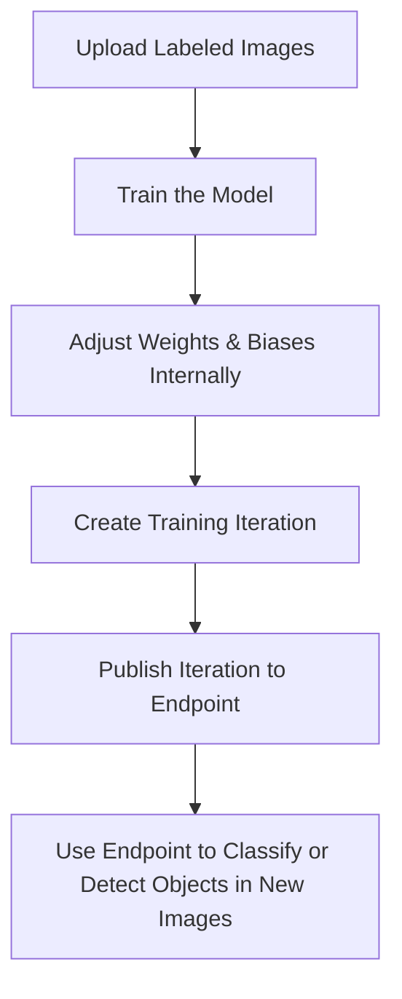
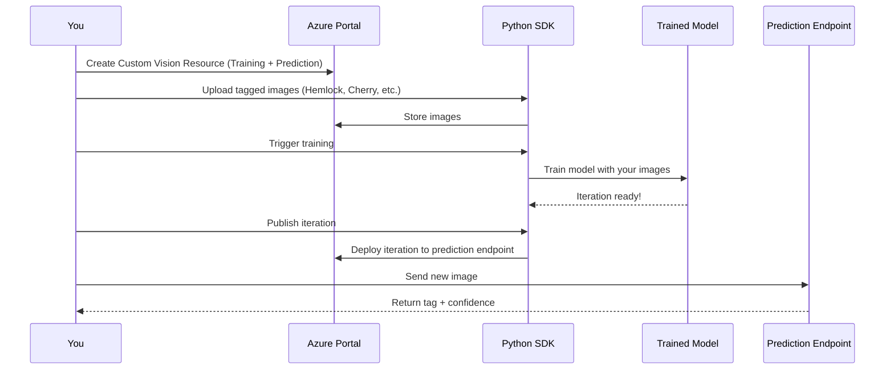

# 🧠 Azure Custom Vision Service – Image Classification & Object Detection

## 📘 Official Definition

**Azure Custom Vision** is part of Azure Cognitive Services that allows you to build, deploy, and improve image classifiers using your own custom data. Unlike pre-trained models, you train it with your own labeled images to classify specific objects (Image Classification) or identify multiple objects within a single image (Object Detection).

---

## 🎯 What You Can Do with Custom Vision

| Feature                  | Purpose                                                                             |
| ------------------------ | ----------------------------------------------------------------------------------- |
| **Image Classification** | Tag an image as belonging to one or more categories (e.g., "Hemlock" vs "Cherry").  |
| **Object Detection**     | Detect multiple objects within a single image and locate them using bounding boxes. |

---

## 🧬 How Custom Vision Works (Conceptually)

- 🧠 A **model** is made of **weights and biases** connecting neurons.
- 🔁 Training updates those weights using algorithms like **backpropagation** to minimize **cost functions**.
- 🏷️ Each image must be **tagged accurately**. Bad tagging = corrupt model = AI hallucinations.
- 🧼 Clean + accurate + sufficient data is 🔑.

---

## 🛠️ Custom Vision Workflow – Step-by-Step

---

## 🖼️ Hands-on Example – Image Classification

🪴 Tags used: `Hemlock`, `Japanese Cherry`  
📁 Data: 10 images per tag

📌 Key endpoints:

- **Training endpoint**: Used to create and train models
- **Prediction endpoint**: Used to make predictions with trained models

### Example Use Case

> Upload multiple images of Hemlock and Japanese Cherry, train a model, and then classify a new image as either tag.

### Model Precision Metrics

| Metric        | Meaning                                                             |
| ------------- | ------------------------------------------------------------------- |
| **Precision** | How often a predicted tag is correct                                |
| **Recall**    | Out of all correct tags, how many were predicted correctly          |
| **AP**        | Average Precision – combo of precision and recall across thresholds |

Example output after training:

- `Hemlock` → 99.99% confidence
- `Cherry` → 0.000003% confidence (basically none)

🧠 Fun Fact: AI never guarantees 100% certainty. It’s always **"inference"**, not prediction, and neural networks inherently allow some margin of error.

---

## 🔍 Object Detection (🗂️ Tags + 📦 Bounding Boxes)

📌 Use case: Detect **multiple objects in one image**, like both a `fork` and a `scissor`.

### Key Difference from Classification

- You must define **regions of interest** (bounding boxes) for each object inside the image.
- Images and corresponding box coordinates are used for training.

### Output Example

- 📷 New image with a fork
- Output → “Fork” detected with 81% confidence, bounding box shown

---

## 💻 SDK Behavior Summary

| Component                            | Role                                                         |
| ------------------------------------ | ------------------------------------------------------------ |
| `CustomVisionTrainingClient`         | Creates projects, tags, uploads images, starts training      |
| `CustomVisionPredictionClient`       | Calls the prediction endpoint with a new image               |
| `trainer.create_project()`           | Initializes a project to host image classification/detection |
| `trainer.create_tag()`               | Labels/tag for your object                                   |
| `trainer.create_images_from_files()` | Uploads images along with tags to train                      |
| `trainer.train_project()`            | Starts training                                              |
| `trainer.publish_iteration()`        | Publishes model to endpoint                                  |
| `predictor.classify_image()`         | Runs the model on new image (classification)                 |
| `predictor.detect_image()`           | Detects multiple objects in one image                        |

---

## 🧑‍💻 Python Tips & LLM Limitation

⚙️ Debugging SDK? Use the `function` variable in IDE to explore available methods if docs are unclear.

❗ At the time of writing:

> LLMs (even ChatGPT, GitHub Copilot) were **unable to generate working code for advanced Custom Vision SDK flows**. Manual exploration + documentation was still necessary.

---

## 🧪 Studio vs Code

| Feature              | Azure Vision Studio         | Python SDK                       |
| -------------------- | --------------------------- | -------------------------------- |
| Upload images        | Drag & drop UI              | Programmatically                 |
| Create tags/projects | GUI                         | SDK                              |
| See metrics          | Graphs for precision/recall | Must be handled manually/logging |
| Predict new images   | Upload and click            | Predict via code or API call     |
| Annotate objects     | Draw bounding boxes on UI   | Provide coordinates via code     |

---

## 🧼 Best Practices

- ✅ **Use clean, correctly tagged data**
- ✅ **Use similar images for better training**
- ✅ **Avoid ambiguous or mislabeled samples**
- ✅ **Tag each image with multiple relevant tags if needed**
- ✅ **Use Azure Vision Studio for visual inspection & debugging**

---

## 🧠 Summary

| Concept              | Description                                       |
| -------------------- | ------------------------------------------------- |
| Model                | A set of weights & biases that recognize patterns |
| Training             | Updates the model with your new data              |
| Inference            | AI’s prediction when shown new data               |
| Image Classification | One or more tags per image                        |
| Object Detection     | Locate multiple objects in an image               |
| Vision Studio        | GUI for uploading, training, and analyzing models |
