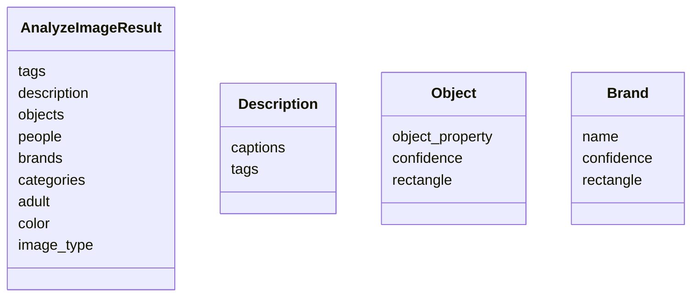

# 🧠 Azure AI Vision vs. Computer Vision – What’s Going On?

Before we talk about **image analysis** or **brand detection**, let's clarify something that confuses almost everyone early on:

## 🤖 What’s the difference between “Azure AI Vision” and “Azure Computer Vision”?

| Term                      | What It Really Means                                                                                                                                                            |
| ------------------------- | ------------------------------------------------------------------------------------------------------------------------------------------------------------------------------- |
| **Azure AI Vision**       | The **umbrella** branding term used for all computer vision capabilities in Azure AI. It includes services like OCR, image analysis, face detection, brand detection, and more. |
| **Azure Computer Vision** | A **specific service inside Azure AI Vision** that exposes REST APIs and SDKs for image analysis, OCR, tagging, descriptions, object detection, etc.                            |

💡 Think of **Azure AI Vision** as the department, and **Computer Vision** as one of its key employees.

---

## 🧪 Azure Computer Vision SDK – Image Analysis (Visual Feature Extraction)

Now let's explore one of the **most powerful and foundational capabilities**: analyzing images using Azure's `ComputerVisionClient` SDK to extract captions, tags, objects, smart crops, and more.

---

## 🎯 Goal

Given an image (via URL or file), use Azure AI Vision to extract:

- Caption
- Tags
- Objects with bounding boxes
- People count
- Smart crop area
- Readable text
- And optionally detect brands, landmarks, or celebrities

---

## 🧰 Setup: Install Required SDKs

```bash
pip install azure-cognitiveservices-vision-computervision
pip install msrest
```

---

## ⚙️ Creating the Vision Resource in Azure

1. Go to Azure Portal → Create a **Computer Vision** resource under “Azure AI Services”.
2. Grab:

   - **Endpoint** (e.g., `https://your-cv-instance.cognitiveservices.azure.com/`)
   - **Key** (you get 2 keys per resource)

3. Use Free Tier (`F0`) if you’re just testing.

---

## 🧪 Sample Code – Image Analysis (Using Image URL)

```python
from azure.cognitiveservices.vision.computervision import ComputerVisionClient
from azure.cognitiveservices.vision.computervision.models import VisualFeatureTypes
from msrest.authentication import CognitiveServicesCredentials
import os

# Your Azure credentials
endpoint = "https://<your-region>.api.cognitive.microsoft.com/"
key = "<your-key>"

# Authenticate the client
client = ComputerVisionClient(endpoint, CognitiveServicesCredentials(key))

# Image to analyze
image_url = "https://upload.wikimedia.org/wikipedia/commons/6/6e/Taj_Mahal_2012.jpg"

# Visual features you want to extract
features = [
    VisualFeatureTypes.tags,
    VisualFeatureTypes.description,
    VisualFeatureTypes.objects,
    VisualFeatureTypes.people,
    VisualFeatureTypes.adult,
    VisualFeatureTypes.brands,
    VisualFeatureTypes.categories,
    VisualFeatureTypes.color,
    VisualFeatureTypes.image_type,
    VisualFeatureTypes.read
]

# Analyze the image
result = client.analyze_image(image_url, visual_features=features)

# 🔍 Print the results

# Captions
for caption in result.description.captions:
    print(f"Caption: '{caption.text}' (Confidence: {caption.confidence:.2f})")

# Tags
print("\nTags:")
for tag in result.tags:
    print(f"- {tag.name} (confidence: {tag.confidence:.2f})")

# Objects
print("\nObjects:")
for obj in result.objects:
    print(f"- {obj.object_property} at location {obj.rectangle}")

# People
print(f"\nPeople detected: {len(result.people)}")

# Brands
if result.brands:
    print("\nBrands:")
    for brand in result.brands:
        print(f"- {brand.name} (confidence: {brand.confidence:.2f})")

# Colors
print("\nDominant colors:", result.color.dominant_colors)
```

---

## 📦 SDK Object Model: What’s Inside?



---

## 🖼️ Supported VisualFeatureTypes Enum

These control what the API returns. You can request one or many.

```python
VisualFeatureTypes.tags             # Keyword tags (e.g., 'sky', 'building')
VisualFeatureTypes.description      # Caption and detailed descriptions
VisualFeatureTypes.objects          # Objects + bounding boxes
VisualFeatureTypes.people           # Faces & people with bounding boxes
VisualFeatureTypes.adult            # Adult/Racy content scores
VisualFeatureTypes.brands           # Logos like Nike, Apple
VisualFeatureTypes.categories       # General category like "outdoor_mountain"
VisualFeatureTypes.color            # Dominant foreground/background
VisualFeatureTypes.image_type       # Clipart/line drawing detection
VisualFeatureTypes.read             # Text detection (OCR)
```

---

## 🧠 Fun Fact: How Does "Smart Cropping" Work?

When you pass `smart_cropping=True`, the model analyzes:

- Saliency (what's important?)
- Faces
- Objects
- Regions of interest (ROI)

And it tells you:

> “Here’s the bounding box you should use if you need to crop this image for a thumbnail or mobile view.”

---

## 📉 When Things Fail (Like Celebrity / Landmark Detection)

Some features are **gated** (aka 🔒 require Microsoft approval), such as:

- Celebrity detection
- Adult content filtering in strict mode
- Some advanced handwriting recognition

If a gated feature is called without access, you’ll get:

```json
{
  "code": "InvalidRequest",
  "message": "Feature is not supported. Please apply for access."
}
```

---

## 💡 Real-World Use Cases

| Use Case             | How It Helps                                          |
| -------------------- | ----------------------------------------------------- |
| Image galleries      | Use smart cropping to show key content in thumbnails. |
| E-commerce           | Tag objects and detect logos (e.g., Nike, Adidas).    |
| Content moderation   | Flag adult or racy content automatically.             |
| Accessibility        | Auto-generate captions for blind users.               |
| Marketing dashboards | Classify photos uploaded by users.                    |

---

## 🤹 Python vs. C# vs. REST – Which to Use for AI-102?

| Criteria                        | Python              | C#        | REST API                  |
| ------------------------------- | ------------------- | --------- | ------------------------- |
| Fast prototyping & AI notebooks | ✅ Best             | ❌ Clunky | ✅ OK                     |
| Web app integration             | ✅ Good             | ✅ Good   | ✅ Excellent              |
| SDK support & examples          | ✅ Lots             | ✅ Lots   | ✅ Always up-to-date      |
| AI-102 exam prep                | ✅ Python preferred | ✅ Good   | ✅ Must understand basics |

🎓 **Recommendation for AI-102**: Stick with **Python SDK + REST understanding**. Know how to switch between them. You will get questions referencing both.

---

## 🧪 Tips for Practice

1. Create the resource in Azure and note the key + endpoint.
2. Pick 5–10 images from:

   - Landmarks
   - Logos (Apple, Nike)
   - People
   - Captchas or handwritten notes

3. Use `client.analyze_image()` and explore the results.
4. Use `Vision Studio` to compare what you get in code vs. UI.
5. Write unit tests to inspect `confidence` levels and understand when results become unreliable.

---

## 🧠 Summary

- **Azure Computer Vision** is part of **Azure AI Vision**.
- It lets you analyze images and extract a wide range of visual features.
- SDK returns structured objects like `tags`, `description`, `brands`, `objects`, etc.
- Some advanced features (celebrity, handwriting) may be gated.
- Always inspect `confidence` levels before using predictions.
- Use **Python** for AI-102 prep, but **know the REST APIs**.

---

Next up, would you like to go into:

1. 📌 Landmark Detection
2. 🏷️ Tagging & Captions
3. 📖 OCR (Printed + Handwritten)
4. 📸 Brand Detection (Local Files)
5. 🔍 Smart Cropping
