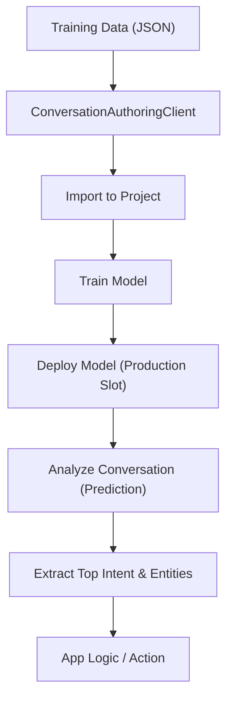

# 🧠 Azure Conversation Language Understanding (CLU) – Custom Intents & Entity Extraction

## 🎯 What is CLU?

**Conversation Language Understanding (CLU)** is a powerful capability under Azure’s AI Language Service. It helps your application interpret user utterances in natural language and extract:

- **Top Intent**: What the user is trying to do (e.g., "Get time").
- **Entities**: Important parameters or values from the user's input (e.g., city names like "New York").

This is perfect for building smart chatbots, voice assistants, or even command parsers — and this topic is essential for **AI-102**.

---

## 🧩 Architecture Overview

<div align="center">



</div>

---

## 🧪 Use Case: Get Time & Send Invite

We built a CLU project to:

1. **Recognize two intents**:

   - `GetTime` – like “What time is it in Tokyo?”
   - `Send` – like “Send Adam a calendar invite.”

2. **Extract entities** from utterances:

   - `Location` (e.g., “Tokyo”, “London”) — Prebuilt: `Geography.Location`
   - `Contact` (e.g., “Adam”, “Charlie”) — Prebuilt: `Person.Name`

---

## 🏗️ Data Structure (Training JSON)

Here’s what the **project data** looks like (simplified):

```json
{
  "intents": [{ "category": "GetTime" }, { "category": "Send" }],
  "entities": [
    {
      "category": "Location",
      "prebuilts": [{ "category": "Geography.Location" }]
    },
    {
      "category": "Contact",
      "prebuilts": [{ "category": "Person.Name" }]
    }
  ],
  "utterances": [
    {
      "text": "What time is in Tokyo?",
      "intent": "GetTime",
      "entities": [{ "category": "Location", "offset": 16, "length": 5 }]
    },
    {
      "text": "Send Adam a calendar invite",
      "intent": "Send",
      "entities": [{ "category": "Contact", "offset": 5, "length": 4 }]
    }
  ]
}
```

This is called **labeled data**. Bad labeling = garbage model. Good labeling = happy model.

---

## 🧠 Step-by-Step Breakdown

### 🛠️ 1. Authoring (Training)

**Tool Used:** `ConversationAuthoringClient`

```python
from azure.ai.language.conversations.authoring import ConversationAuthoringClient

# Step 1: Create the client
client = ConversationAuthoringClient(endpoint, AzureKeyCredential(key))

# Step 2: Import training data
client.begin_import_project(project_name, import_data)

# Step 3: Train the model
client.begin_train(project_name, training_config)

# Step 4: Deploy it to 'production'
client.begin_deploy_project(project_name, "production", deploy_data)
```

🔥 **What happens?**

- The utterances and labeled data are validated.
- The model learns to associate phrases with intents + extract entities.

---

### 🧪 2. Inference (Prediction)

**Tool Used:** `ConversationAnalysisClient`

```python
from azure.ai.language.conversations import ConversationAnalysisClient

client = ConversationAnalysisClient(endpoint, AzureKeyCredential(key))

result = client.analyze_conversation(
    task={
        "kind": "Conversation",
        "analysisInput": {
            "conversationItem": {
                "participantId": "1",
                "id": "1",
                "modality": "text",
                "language": "en",
                "text": user_input
            },
            "isLoggingEnabled": False
        },
        "parameters": {
            "projectName": "GetimeAndSend",
            "deploymentName": "production",
            "verbose": True
        }
    }
)
```

---

### 🧠 What You Get in the Response

```json
{
  "prediction": {
    "topIntent": "GetTime",
    "intents": [
      {
        "category": "GetTime",
        "confidenceScore": 0.92
      }
    ],
    "entities": [
      {
        "category": "Location",
        "text": "Tokyo",
        "confidenceScore": 0.94
      }
    ]
  }
}
```

You extract intent and use it in app logic:

```python
if top_intent == 'GetTime':
    location = entity["text"]
    print(GetTime(location))
```

---

## 🧮 Model Evaluation Metrics (via Studio)

Just like image models, conversation models use:

- **Precision**: How many predicted labels were correct?
- **Recall**: How many actual labels did we detect?
- **F1 Score**: Balance between precision and recall.

In studio, you’ll also see a **Confusion Matrix**:

```txt
              Predicted
            | GetTime | Send |
    Actual  |---------|------|
    GetTime |   15    |  0   |
    Send    |   0     |  13  |
```

A perfect matrix = perfect understanding.

---

## 🧪 Testing in Studio vs Code

### 👨‍💻 Studio

- Easy GUI
- Auto-labeling and quick fixes
- Confidence scores + metrics

### 🧑‍💻 Code

- Real-world integration
- Version-controlled training JSON
- Logs and debugging

---

## ⚙️ Action Handlers (Optional)

You can extend the response with logic:

```python
def GetTime(location):
    time = datetime.utcnow() + timedelta(hours=city_offset[location])
    return f"Time in {location} is {time.hour}:{time.minute:02d}"
```

This is not part of the AI — this is your app logic acting on intent + entity.

---

## 🧪 Quick Recap Table

| Concept        | Value                                 |
| -------------- | ------------------------------------- |
| Intent         | `GetTime`, `Send`                     |
| Entities       | `Location`, `Contact` (Prebuilt)      |
| Model Service  | Language Service > Conversation (CLU) |
| Authoring SDK  | `ConversationAuthoringClient`         |
| Prediction SDK | `ConversationAnalysisClient`          |
| Deployment     | Named slot (e.g., `production`)       |
| Output         | Intent, Entities, Confidence Scores   |

---

## 🧠 AI-102 Exam Notes

✅ Know how to:

- Define a CLU project (via JSON)
- Import, train, and deploy via SDK
- Call the prediction endpoint and extract intent/entity
- Understand performance metrics (precision, recall, F1)
- Use Language Studio vs SDKs

🧠 Tip: Custom Conversation models ≠ QnA models. CLU is intent+entity, not answer-based.

---

## 🧠 Final Thoughts

Your chatbot will only be as smart as:

- ✅ The **intents** you define
- ✅ The **utterances** you train it on
- ✅ The **clean labeling** of your data
- ✅ The **logic** you write around the AI response
