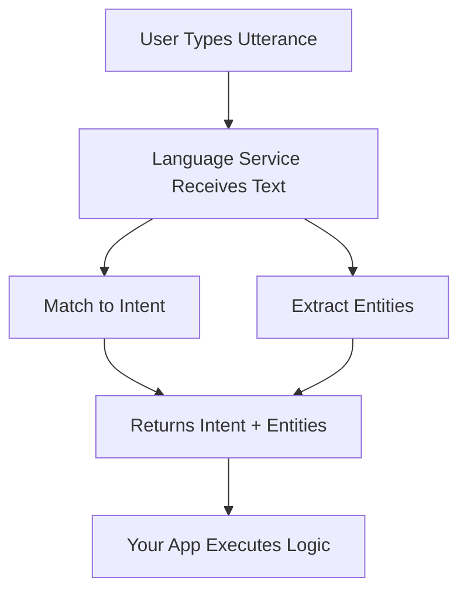

# 🧠 Azure AI Language Service – Conversation Analysis

## 🗂️ Official Definition

> **Azure AI Language** is a cloud-based service that provides natural language processing capabilities such as sentiment analysis, language detection, key phrase extraction, conversation analysis, entity recognition, and more—using pre-trained or custom models.

Conversation analysis is a **purpose-built NLP model** designed to identify **intents**, **entities**, and **utterances** in natural language—like a chatbot without the LLM heaviness.

---

## 🧩 Where It Fits in AI-102?

You’ll encounter it in **"Natural Language Processing (NLP)"** skills area:

- Build conversational AI applications.
- Extract structured info from conversations.
- Use Azure Language Studio to build, train, and publish language understanding models.

---

## 💬 Key Concepts

### 🗣️ Utterance

> “A single input phrase provided by the user.”

- Example: `"Book a flight to New York on December 25th."`
- This is the actual **sentence** the user speaks or types.

---

### 🎯 Intent

> “The action the user wants to perform.”

- Example: `"BookFlight"`
- Think of it as the **function name** in code.
- There can be multiple utterances per intent.

---

### 🧩 Entity

> “A piece of information from the utterance needed to fulfill the intent.”

- Example: `"Destination: New York", "Date: Dec 25"`
- Like **parameters** to the intent (function).

---

### 📦 Project Anatomy

Imagine this as your training structure:

```json
{
  "intents": ["BookFlight", "CancelFlight"],
  "entities": ["Location", "Date", "Time"],
  "utterances": ["Book a flight to {Location} on {Date}", "Can you get me a ticket to {Location} for {Date}?"]
}
```

---

## 🛠️ Use Cases

- Virtual assistants
- Customer support bots
- Voice-command systems (non-voice use too!)
- FAQ bots with structured knowledge

---

## 🔄 How It Works (Step-by-Step)



---

## 🧪 Training vs. Prediction Phase

| Phase      | Purpose                           | Tools Used                  |
| ---------- | --------------------------------- | --------------------------- |
| Training   | Feed labeled utterances/intents   | Azure Language Studio / SDK |
| Prediction | Give new input, get intent/entity | REST API / SDK              |

---

## 🧰 Developer Experience

You can use:

- 🖥️ **Azure Language Studio** (no code)
- 🧑‍💻 **Python / C# / Node.js SDKs**
- 🌐 **REST APIs** (universal fallback)

---

## 💡 Conversation Analysis ≠ ChatGPT

Let’s clarify!

| ChatGPT / LLMs                   | Conversation Analysis             |
| -------------------------------- | --------------------------------- |
| Huge models (billions of params) | Small, task-specific models       |
| Flexible but heavy & costly      | Purpose-built and lightweight     |
| Needs RAG/Prompt Engineering     | Needs only training utterances    |
| Overkill for small bots          | Ideal for small apps, low latency |

---

## 🧪 Example Use Case

🛫 Utterance:

> `"I want to fly from London to Dubai on 1st July at 10 AM"`

🔍 Language service extracts:

- **Intent:** `BookFlight`
- **Entities:**

  - `Source: London`
  - `Destination: Dubai`
  - `Date: July 1`
  - `Time: 10 AM`

🎯 And then your bot logic takes over: sends it to a booking API, or asks more questions.

---

## 🎨 Azure Language Studio Demo

You can build this entirely without writing a line of code:

1. Go to [Azure AI Language Studio](https://language.azure.com/)
2. Create a new "Conversational Language Understanding" project
3. Define intents (like BookFlight)
4. Add utterances per intent
5. Label entities within utterances
6. Train ➝ Test ➝ Publish
7. Get endpoint and use in your app!

---

## 📌 Tips for the Exam

✅ Focus on these key areas:

- Intent vs Entity vs Utterance
- Difference between Conversation Analysis & LLMs
- When to use prebuilt vs custom models
- Language Studio steps: train → test → publish
- REST API vs SDKs (basic idea, not deep code)

---

## 🤔 Pro Tips

- Train your model with **as many diverse utterances** as possible.
- Use **low code options first**, then scale to SDK if needed.
- Remember: This is NOT ChatGPT. It won’t generate text. It **extracts structured meaning from it.**
- If you need both structured response and generative capabilities, combine Language service with OpenAI.
