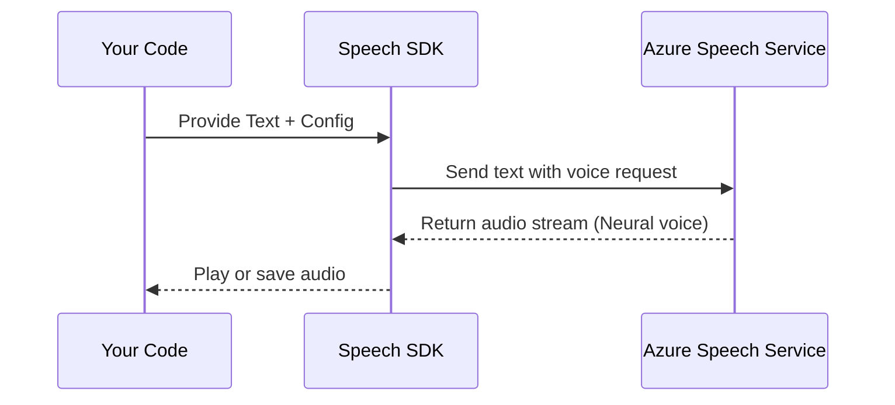

# 🗣️ Azure AI Speech SDK Demos: Synthesis, Recognition & Translation

_Mastering SpeechSynthesizer, SpeechRecognizer & TranslationRecognizer in Python for AI-102!_

---

## 🧩 What’s This About?

The Azure AI Speech SDK is your magic wand for:

- 🗣️ Text to Speech (TTS)
- 🧏 Speech to Text (STT)
- 🌍 Real-time Speech Translation (multi-lingual!)

We’ll look at **three SDKs** in **Python**:

1. 🎤 `SpeechSynthesizer` – Convert text into speech
2. 🧠 `SpeechRecognizer` – Convert voice into text
3. 🌐 `TranslationRecognizer` – Live translate your voice from one language to another

Let’s explore each with full working demos, explanations, real insights, and diagrams.

---

## 1️⃣ 🎤 SpeechSynthesizer – Text-to-Speech (TTS)

### 💡 Official Definition

> The `SpeechSynthesizer` API enables you to generate human-like speech audio from plain text. It supports multiple languages, emotional tones, and natural-sounding voices using Neural TTS models.

### 🧪 Use Case

- 📰 Read news aloud
- 🧠 Narrate a book or lesson
- 🗣️ Voice assistant responses

### 🔧 Setup

You need:

- ✅ Azure Speech Resource (Key + Region)
- ✅ Installed Python SDK:

  ```ini
  pip install azure-cognitiveservices-speech
  ```

### 🧠 How It Works – Sequence Diagram (in Mermaid)



### 🧪 Python Example – Human-Like Malayalam Voice!

```python
import azure.cognitiveservices.speech as speechsdk

speech_key = "YOUR_SPEECH_KEY"
speech_region = "YOUR_REGION"

speech_config = speechsdk.SpeechConfig(subscription=speech_key, region=speech_region)
speech_config.speech_synthesis_voice_name = "ml-IN-MidhunNeural"  # Malayalam male neural voice

audio_config = speechsdk.audio.AudioOutputConfig(use_default_speaker=True)

synthesizer = speechsdk.SpeechSynthesizer(speech_config, audio_config)

text = "കേരളത്തിൽ മലയാളം സംസാരിക്കുന്ന ഭാഷയാണ്."
synthesizer.speak_text_async(text).get()
```

### ✅ Output

- Crystal-clear Malayalam spoken out loud!
- You can replace the voice with `"en-US-GuyNeural"` or others.

---

## 2️⃣ 🧠 SpeechRecognizer – Speech-to-Text (STT)

### 💡 Official Definition

> The `SpeechRecognizer` API enables real-time speech transcription from your microphone or audio file into text.

### 🧪 Use Case

- 📝 Dictate notes
- 🎬 Auto-caption videos
- 🤖 Build voice bots

### 🔥 Code – Recognize Speech from Microphone

```python
speech_config = speechsdk.SpeechConfig(subscription=speech_key, region=speech_region)
speech_config.speech_recognition_language = "en-US"

audio_config = speechsdk.audio.AudioConfig(use_default_microphone=True)
recognizer = speechsdk.SpeechRecognizer(speech_config, audio_config)

print("🎤 Speak into the mic...")
result = recognizer.recognize_once_async().get()

if result.reason == speechsdk.ResultReason.RecognizedSpeech:
    print("✅ You said:", result.text)
```

### ✅ Output

> 🎙️ "Elon Musk is an alien from Mars."
> ✅ You said: **Elon Musk is an alien from Mars.**

---

## 3️⃣ 🌐 TranslationRecognizer – Real-Time Speech Translation

### 💡 Official Definition

> `TranslationRecognizer` lets you speak in one language and receive a translated transcription in another language—instantly.

### 🧪 Use Case

- 🧳 Travel interpreter
- 🌐 Multi-lingual meetings
- 🤖 AI-powered translators

### 🌐 Supported Languages?

Azure Speech Translation supports 70+ languages!
Find the codes [language-support](https://learn.microsoft.com/en-us/azure/ai-services/speech-service/language-support).

| Language     | Code    |
| ------------ | ------- |
| English (US) | `en-US` |
| Hindi        | `hi`    |
| Malayalam    | `ml`    |
| Spanish      | `es`    |
| Mandarin     | `zh-CN` |

### 🧠 How It Works – Flowchart

```mermaid
flowchart TD
    A[Microphone Input] --> B[SpeechRecognizer]
    B --> C[SpeechTranslationConfig (src: en-US, tgt: ml)]
    C --> D[Azure Speech Service]
    D --> E[Recognized Text (English)]
    D --> F[Translated Text (Malayalam)]
```

### 🔥 Code – Speak in English, Translate to Malayalam

```python
config = speechsdk.translation.SpeechTranslationConfig(
    subscription=speech_key, region=speech_region
)
config.speech_recognition_language = "en-US"
config.add_target_language("ml")

audio_config = speechsdk.audio.AudioConfig(use_default_microphone=True)
recognizer = speechsdk.translation.TranslationRecognizer(config, audio_config)

print("🎙️ Speak in English...")
result = recognizer.recognize_once_async().get()

print("✅ You said:", result.text)
print("🌍 Malayalam:", result.translations["ml"])
```

### ✅ Output

> 🎙️ "Elon Musk is building a rocket."
> 🌍 Malayalam: **എലോൺ മസ്ക് റോക്കറ്റ് നിർമ്മിക്കുന്നു.**

---

## 🧪 Testing Tips for AI-102

- 🧠 **Voice name customization** matters – pick the right one.
- 🧪 Test with **your own voice/accent** to evaluate reliability.
- 🗣️ Try **non-English languages** – it supports many!
- 🧾 Understand fallback handling (e.g. `ResultReason.Canceled`).
- 🛡️ Secure your key and region using `dotenv`.

---

## 🧠 Summary

| Feature            | Class Name              | Key Method               | Input           | Output                     |
| ------------------ | ----------------------- | ------------------------ | --------------- | -------------------------- |
| Text to Speech     | `SpeechSynthesizer`     | `speak_text_async()`     | Text            | Spoken audio               |
| Speech to Text     | `SpeechRecognizer`      | `recognize_once_async()` | Mic audio       | Transcribed text           |
| Speech Translation | `TranslationRecognizer` | `recognize_once_async()` | Mic + languages | Original + translated text |

---

## 💡 Bonus: Next You Should Try...

- 🎭 SSML (Speech Synthesis Markup Language) – add emotion, pitch, pauses.
- 📄 Upload `.wav` or `.mp3` files instead of live mic.
- 🎛️ Stream audio for real-time transcription/translation.
