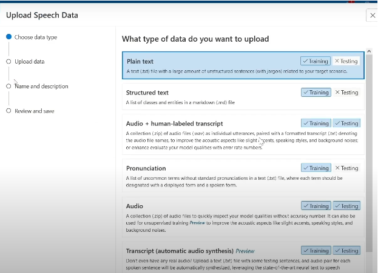
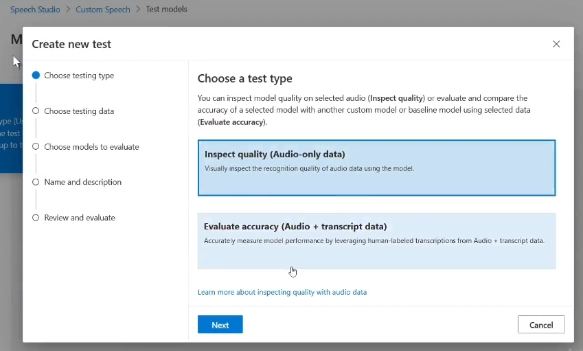
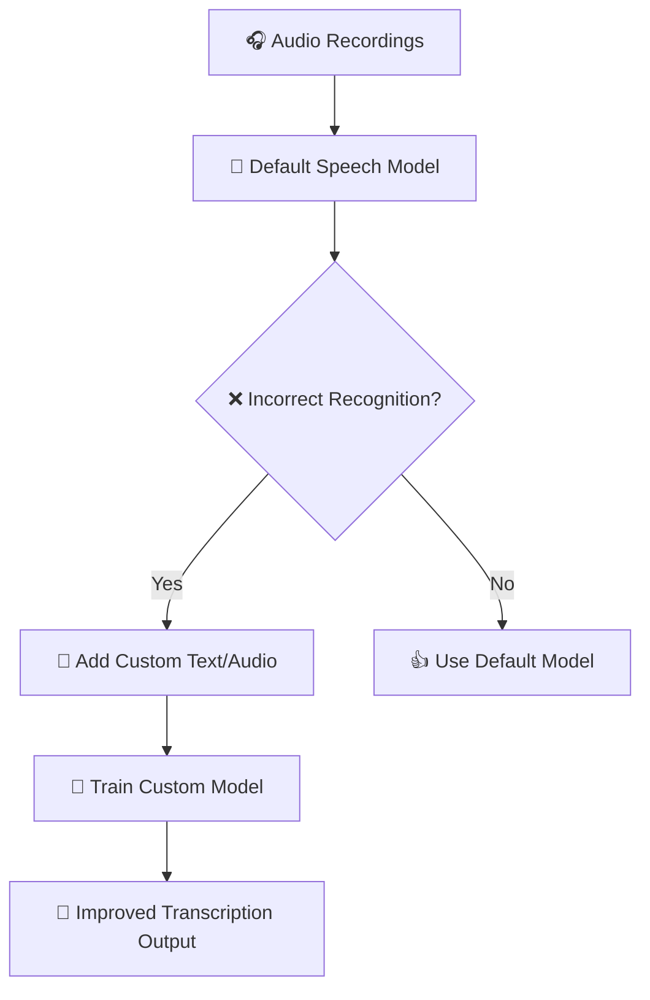

# 🗣️ Azure AI Speech – Custom Speech Models

> ✅ **Official Definition**:
> Azure **Custom Speech** lets you improve Microsoft’s speech-to-text accuracy for your specific vocabulary, noise conditions, or speaking styles — by training a custom version of the speech recognition model using your **own audio + text data**.

---

## 🎯 Why Use Custom Speech?

Azure's **default speech-to-text** model is already excellent. But sometimes, it might **mishear names**, **company brands**, or **domain-specific terms**. Example?

🧠 Default model might hear:

> "Wasaap is popular in U.A.E"

And transcribe as:

> ❌ “Was up is popular in U.A.E”

Because it doesn't know you meant **WhatsApp**.

With **Custom Speech**, you train the model using **examples of how people speak in your app, company, or language style**, so the model gets smarter about your content!

---

## 🧪 Real-Life Scenario

Imagine your company in **Dubai** builds a ride-hailing app called **“GoDrive”**. You notice Azure’s default model often mishears that as:

- “Go drive”
- “Good drive”
- “Go dry”

To fix this, you train a custom model so that:

🗣️ When someone says:

> “Open GoDrive app”
> The model always outputs:
> ✅ “Open GoDrive app”

🎯 Goal: make the model recognize **your important terms**, **the way your users speak them**.

---

## 📦 Sample File Structure

```ini
├── custom_speech_project/
│   ├── test/
│   │   ├── dinosaur.wav
│   │   ├── dinosaur_transcript.txt
│   ├── training/
│   │   ├── dinosaur_words.txt
│   │   ├── pronunciation_map.txt
```

---

## 🧰 What You Need to Train a Custom Speech Model

<div style="text-align: center;">
    
</div>

---

| 📁 Option                            | ✅ Use For...                                                               | 🧠 Simple Example                                                            |
| ------------------------------------ | --------------------------------------------------------------------------- | ---------------------------------------------------------------------------- |
| **Plain Text**                       | Teach the model which **important words** or **brand names** to recognize   | 📄 A text file with words like `GoDrive`, `Sharjah`, `MetroCard`, `WhatsApp` |
| **Structured Text**                  | Give the model a **list of classes/entities** using a `.cmd` format         | 🧾 Define entities like `Locations`, `Products`, `Person Names`              |
| **Audio + Human-Labeled Transcript** | Improve model by pairing **real audio** with **correct written transcript** | 🎤 Audio of “Welcome to GoDrive” + ✍️ text: “Welcome to GoDrive”             |
| **Pronunciation**                    | Help the model recognize words with **unique pronunciation**                | 🗣️ People say “Wasap”, but want output to show: `WhatsApp`                   |
| **Audio (Only)**                     | Just test audio quality, no transcript required                             | 🎧 Upload noisy or clear `.wav` files for model to practice                  |
| **Transcript (Auto Synthesized)**    | For Preview/testing only – upload text, let Azure synthesize the audio      | 💬 “Hello from Dubai” – Azure generates a voice automatically                |

---

## 🧪 What You Need to Test the Speech Model

<div style="text-align: center;">
    
</div>

---

| 🔍 Test Type                               | ✅ Use It For...                                                            | 🧠 Example                                                                                                                           |
| ------------------------------------------ | --------------------------------------------------------------------------- | ------------------------------------------------------------------------------------------------------------------------------------ |
| **Inspect Quality (Audio Only)**           | Play back audio and **visually check how accurate** the transcription is    | 🎧 You say “GoDrive” → model outputs “Go dry”? You hear it's wrong.                                                                  |
| **Evaluate Accuracy (Audio + Transcript)** | Upload both audio and **correct transcript** to **measure word error rate** | 🎧 Audio: “I’m at Sharjah Metro” + 📝 Transcript: “I’m at Sharjah Metro” <br> → Azure compares both and tells you % errors (like 5%) |

---

## 🏗️ How It Works (Flow Diagram)

<div align="center">



</div>

---

## 📦 Step-by-Step Breakdown

### 1️⃣ Prepare Your Data

You’ll need:

- ✅ Some **short WAV audio clips**
- ✅ Matching **text transcripts** (what the audio should say)
- ✅ (Optional) Word lists or pronunciation mappings

🎓 Easy example:

- Audio: someone saying "Book ride to JLT"
- Transcript: "Book ride to JLT"
- Plain text list: `GoDrive`, `JLT`, `Burj Khalifa`, `MetroPass`

---

### 2️⃣ Upload Your Data to Speech Studio

1. Go to: [https://speech.microsoft.com](https://speech.microsoft.com)
2. Choose your **Azure subscription + region**
3. Click **“Custom Speech”**
4. Create a new **Project**
5. Upload your:

   - 🎧 Audio + transcript files
   - 📃 Word list
   - 🔤 Pronunciation mappings (if any)

---

### 3️⃣ Evaluate the Base Model

Azure lets you test how well the **default model** does before training.

✅ Upload a test audio and see:

- 🤖 “What the model thinks the user said”
- 🔍 “Where the model makes mistakes”

📊 This gives you a **baseline word error rate (WER)**.
Example: 10% of words misheard.

---

### 4️⃣ Train the Custom Model

Now give Azure:

- Your correct data (text + audio)
- Name your model
- Click **Train**

⏱️ Training can take 30–60 minutes.

💰 It does cost money — budget **\$50–\$100 USD** for full runs. Try on free tier first if possible.

---

### 5️⃣ Test the Trained Model

Once training is done:

- Test again using the same audio
- See if error rate has improved
- Example: From 10% → down to 2% error

👂 You can even see **which words are now recognized correctly** (like “GoDrive” instead of “go dry”).

---

### 6️⃣ Deploy & Use in Code

When you're happy with results:

- Deploy the model (it gives you a custom endpoint)
- In your code (Python, C#, REST API), point to **your trained model**, not the default one

📘 Python SDK:

```python
speech_config = speechsdk.SpeechConfig(
    subscription=SPEECH_KEY,
    region=SPEECH_REGION
)
speech_config.endpoint_id = "your_custom_model_endpoint_id"
```

---

## 🧠 Evaluation Metrics

| Metric                   | Meaning                                           |
| ------------------------ | ------------------------------------------------- |
| ❌ Word Error Rate (WER) | How many words were wrong (in %, lower is better) |
| 🧩 Substitution          | Model said wrong word instead of correct one      |
| ➖ Deletion              | Model missed a word                               |
| ➕ Insertion             | Model added a word that wasn’t there              |

---

## 💬 Common Use Cases

| Industry        | Example                                            |
| --------------- | -------------------------------------------------- |
| 🚖 Ride Hailing | Custom words like “GoDrive”, “Sharjah”, “Salik”    |
| 🏥 Healthcare   | Drug names, hospital terms like “Ibuprofen”, “MRI” |
| 📦 Logistics    | Terms like “Dock #7”, “Waybill”, “Loadsheet”       |
| 🏫 Education    | Course names like “Math 101”, “IELTS”, “TOEFL”     |

---

## 🤖 Pro Tip: Custom ≠ Always Needed

> If your base model has 99%+ accuracy — _don’t bother training._

But if you're:

- In a niche domain 🎯
- Have domain-specific terminology 🧬
- Need high precision in transcripts 📜

Then go **Custom Speech all the way** 💪

---

## 🧪 Practice Tip for AI-102

> 💡 Don’t memorize dinosaur names.
> Create a **simple use case**, upload **3–5 short audio clips**, and **evaluate improvements** using Speech Studio.
> Then try to deploy your model and test via code.

---

## 📚 Resources

- 🔗 [Azure Custom Speech Docs](https://learn.microsoft.com/en-us/azure/ai-services/speech-service/custom-speech-overview)
- 🔗 [Speech Studio](https://speech.microsoft.com/)
- 💾 Dataset example:

  - `audio1.wav` → "Order lunch from FoodDash"
  - Transcript: `Order lunch from FoodDash`
  - Plain Text List: `FoodDash`, `Delivery`, `Downtown`, `JLT`, `Dubai`
