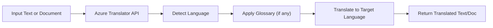

# 🌍 Azure AI Translator Service: Real-Time Language Translation Made Easy!

Ever wished your app could speak **100+ languages**? Azure AI Translator is like your personal multilingual assistant — ready to translate text, documents, or even full conversations in real time using Microsoft's industry-grade language models.

Let’s explore this awesome service step-by-step! 💡

---

## 📖 What Is Azure AI Translator?

**Azure AI Translator** is a cloud-based **machine translation service** that can translate:

- Text between **100+ languages**
- Documents (DOCX, PDF, PPTX, etc.)
- Conversations in real time
- With support for custom translation models and glossaries

### ✅ Key Features:

| Feature                  | Description                                               |
| ------------------------ | --------------------------------------------------------- |
| 🌐 Text Translation      | Translate text between languages (e.g., English → French) |
| 🗂 Document Translation   | Upload and translate files like Word, PDF, PPTX           |
| 🗣️ Real-time Speech/Chat | Translate live speech or typed chat in apps               |
| 📚 Custom Glossaries     | Control how specific terms or brand names are translated  |
| 🧠 Language Detection    | Automatically detects the language of input text          |

---

## 🔧 How Does It Work?

Here’s a simple flow of how the Translator works:

<div align="center">



</div>

---

## 🚀 Use Cases

- 🧳 **Travel apps** that need to translate messages or phrases
- 🛒 **E-commerce sites** with multilingual catalogs
- 🧾 **Legal/medical businesses** with translation needs
- 🧠 **AI chatbots** that respond in multiple languages
- 🗣️ **Cross-language communication** tools (real-time messaging)

---

## 🧪 Example 1: Simple Text Translation (REST API)

Translate “Hello, world” from English to Spanish using REST API.

### 🔐 Endpoint

```ini
POST https://api.cognitive.microsofttranslator.com/translate?api-version=3.0&to=es
```

### 📨 Request Header

```http
Ocp-Apim-Subscription-Key: <your-key>
Content-Type: application/json
```

### 📦 Request Body

```json
[{ "Text": "Hello, world" }]
```

### ✅ Response

```json
[
  {
    "translations": [{ "text": "Hola, mundo", "to": "es" }]
  }
]
```

---

## 🧪 Example 2: Language Detection

Let’s say you’re not sure what language the user typed. You can use:

```http
POST https://api.cognitive.microsofttranslator.com/detect?api-version=3.0
```

```json
[{ "Text": "Bonjour tout le monde" }]
```

👉 Returns:

```json
[{ "language": "fr", "score": 1.0 }]
```

---

## 🗂️ Example 3: Document Translation (Word/PDF)

Upload `.docx` or `.pdf` to Azure Blob Storage, and Translator will:

1. Read the file
2. Translate it in the background
3. Save the translated version back to Blob Storage

This uses the [Document Translation SDK](https://learn.microsoft.com/en-us/azure/ai-services/translator/document-translation/overview).

---

## 🧠 Customize with Glossary (Optional)

Want to make sure "GoDrive" always stays as "GoDrive" and not "IrConducir" in Spanish?

🧾 Use a **custom glossary** (TSV format):

| Source    | Target                 |
| --------- | ---------------------- |
| GoDrive   | GoDrive                |
| App Store | Tienda de Aplicaciones |

You can upload it and link it to your translations to preserve terminology!

---

## 📦 SDKs & Tools You Can Use

| Language | Library                                            |
| -------- | -------------------------------------------------- |
| Python   | `azure-ai-translation-text`                        |
| C#       | `Microsoft.Azure.CognitiveServices.TranslatorText` |
| Java     | `com.azure.ai.translation.text`                    |
| REST API | ✅ Fully Supported                                 |
| CLI      | ❌ Not supported directly                          |

---

## 💡 Python Example Using SDK

```python
from azure.core.credentials import AzureKeyCredential
from azure.ai.translation.text import TextTranslationClient

endpoint = "https://<your-region>.api.cognitive.microsofttranslator.com"
key = "<your-translator-key>"

client = TextTranslationClient(endpoint, AzureKeyCredential(key))

response = client.translate(content=["Good morning!"], to=["fr"])

for translation in response:
    print(translation.translations[0].text)  # Output: Bonjour!
```

---

## 💸 Pricing (Quick Overview)

| Tier                 | Feature             | Notes                         |
| -------------------- | ------------------- | ----------------------------- |
| Free Tier            | 2M characters/month | Good for dev/testing          |
| Standard             | Pay-per-character   | Supports production workloads |
| Document Translation | Pay-per-page        | Pricing varies by file type   |

👉 [Azure Pricing Calculator](https://azure.microsoft.com/en-us/pricing/calculator/)

---

## 🔐 Security and Compliance

- ISO, HIPAA, SOC, GDPR compliant
- Offers **private endpoint support**
- All traffic encrypted in transit & at rest

---

## 🧠 AI Concepts Behind the Scenes

Azure Translator uses:

- Neural Machine Translation (NMT)
- Pre-trained models optimized for accuracy & fluency
- Continual updates across supported languages

No need to build your own ML pipeline — just call the API!

---

## 🧪 Testing It in Azure Portal

1. Go to [Azure Portal](https://portal.azure.com)
2. Create **Azure AI Translator Resource**
3. Get the `KEY` and `ENDPOINT`
4. Use Postman, Python, or SDK to test it

---

## 🔚 TL;DR

- ✅ Azure AI Translator is a **powerful, production-ready** multilingual service
- ✅ You can **translate text, documents, and speech**
- ✅ Supports **custom glossaries and language detection**
- ✅ Fully automated, scalable, and secure
- ✅ Integrates easily with **apps, bots, websites, and more**
