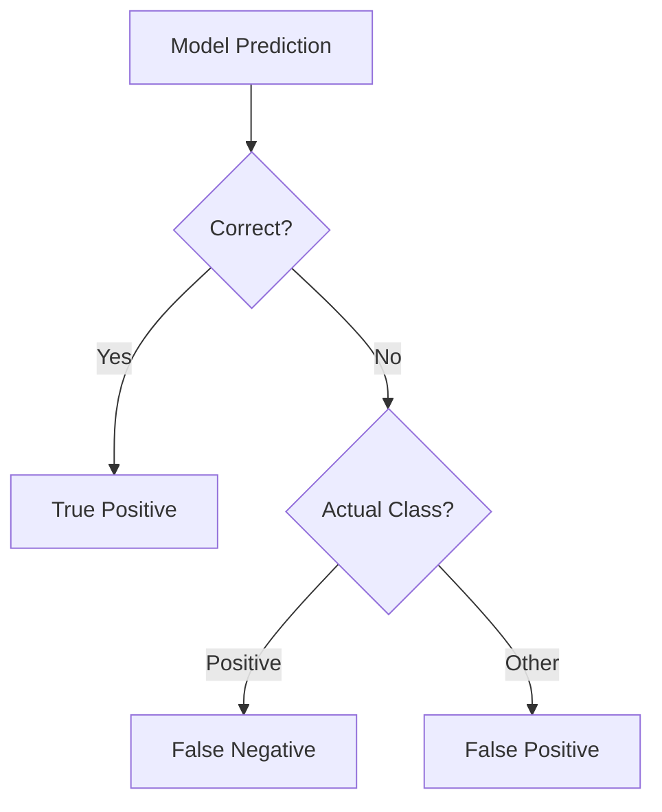

# 🧪 Image Classification Evaluation Metrics – Masterclass 🎯

Whether you're classifying **cats vs dogs**, or **pineapple vs pizza 🍕**, you need to know _how well_ your classifier performs.

> These metrics tell you **how often your AI is right**, how often it messes up, and **what kind of mistakes it makes**.

Let’s go from **the basics ➡️ all the way to advanced mAP and multi-class logic**, without fluff.

---

## 🧠 What Are We Measuring?

Your model predicts:

- “This is a cat”
- “This is a hotdog”
- “This is _not_ a hotdog”

But… was it _correct_? Let’s see how we score it 🔢

---

## ⚖️ Key Metrics (And What They Mean)

| Metric               | Definition                                                             |
| -------------------- | ---------------------------------------------------------------------- |
| **Accuracy**         | % of total predictions that were correct (basic score)                 |
| **Precision**        | Of the items predicted as “class X”, how many were truly class X?      |
| **Recall**           | Of all items that actually are “class X”, how many did the model find? |
| **F1 Score**         | The harmonic mean of Precision and Recall (balance metric)             |
| **Confusion Matrix** | Table that shows **what got confused with what** (super useful)        |
| **mAP (optional)**   | If you enable probability thresholds, you can still compute mAP        |

---

## 🍩 Sweet Analogy: Classifying Donuts

You’re building an AI to detect 🍩 donuts vs 🥯 bagels vs 🥐 croissants.

Your AI says:

- 🍩 → Correct? ✅
- 🥐 → Thought it was a bagel ❌
- 🥯 → Missed it entirely ❌

How do we score it?

---

## ✅ Accuracy

> **"How often is my model correct?"**

```text
Accuracy = (TP + TN) / Total Predictions
```

📌 Problem: Doesn’t tell you which class is doing poorly!

✅ Use **only** when classes are balanced
🚫 Don’t trust it when classes are imbalanced

---

## 🎯 Precision & 🔍 Recall

Let’s say you’re focused on just the 🥐 class:

- **TP (True Positive):** 🥐 correctly predicted
- **FP (False Positive):** Not 🥐, but predicted as 🥐
- **FN (False Negative):** Actually 🥐, but missed it

### 🎯 Precision

```text
Precision = TP / (TP + FP)
```

➡️ _Out of all predicted 🥐, how many were correct?_

### 🔍 Recall

```text
Recall = TP / (TP + FN)
```

➡️ _Out of all real 🥐 in the test set, how many did we find?_

---

### 📏 F1 Score

> One number to rule them all – balances precision vs recall

```text
F1 = 2 * (Precision * Recall) / (Precision + Recall)
```

📌 Great for **imbalanced datasets** (e.g. 90% cats, 10% dogs)

---

## 🤯 Confusion Matrix

Here’s what your model really saw:

| Actual / Predicted | 🍩 Donut | 🥯 Bagel | 🥐 Croissant |
| ------------------ | -------- | -------- | ------------ |
| 🍩 Donut           | **15**   | 2        | 1            |
| 🥯 Bagel           | 1        | **12**   | 3            |
| 🥐 Croissant       | 0        | 2        | **11**       |

🧠 This shows:

- It sometimes thinks **🥐 = 🥯**
- It’s very good at detecting 🍩

Use it to **diagnose weaknesses** in your model.

---

## 🧠 Macro vs Micro vs Weighted Averages

If you’re working with **multi-class classification** (like above), Azure and AI-102 expect you to know this:

| Average Type | What It Means                                                              |
| ------------ | -------------------------------------------------------------------------- |
| **Micro**    | Global precision/recall across all classes (treats all equally)            |
| **Macro**    | Average of metrics per class (treats all classes equally)                  |
| **Weighted** | Average per class, _weighted by class size_ (accounts for class imbalance) |

---

## 📦 Azure Custom Vision: How It Shows Metrics

After training a model:

- You'll see **per-tag Precision, Recall, and AP**
- Also a **macro-averaged F1 score**
- If you export the model performance, you get a CSV with:

  - **TagName**
  - **Precision**
  - **Recall**
  - **True Positives, False Positives, False Negatives**

📌 For **multiclass mode**, only **one tag is predicted per image**
📌 For **multilabel mode**, **multiple tags** can be assigned per image

---

## 🧪 Visual Summary



---

## 🧠 When to Use What?

| Goal                             | Use This Metric          |
| -------------------------------- | ------------------------ |
| Want an overall score            | Accuracy                 |
| Want fewer false alarms          | Precision                |
| Want to catch every real example | Recall                   |
| Want a good balance              | F1 Score                 |
| Need per-class insights          | Confusion Matrix         |
| Have multiple labels per image   | Precision/Recall per tag |
| AI-102 exam?                     | **ALL of the above 😄**  |

---

## 📌 AI-102 Exam Tips

- Know the difference between Precision & Recall
- Understand confusion matrix for multiclass
- F1 = 2 \* P \* R / (P + R)
- Azure Custom Vision provides per-tag metrics
- Micro vs Macro averages are **often asked**

---

## 🔁 Example Recap

Let’s say for class “Dog”:

- TP = 40
- FP = 10
- FN = 5

```text
Precision = 40 / (40 + 10) = 0.80
Recall    = 40 / (40 + 5) = 0.89
F1        = 2 * (0.8 * 0.89) / (0.8 + 0.89) ≈ 0.84
```

---

## ✅ Summary Cheat Sheet

| Term             | Formula                  | Measures                  |
| ---------------- | ------------------------ | ------------------------- |
| Accuracy         | (TP + TN) / Total        | Overall correctness       |
| Precision        | TP / (TP + FP)           | How exact the model is    |
| Recall           | TP / (TP + FN)           | How complete the model is |
| F1 Score         | 2PR / (P + R)            | Balanced metric           |
| Confusion Matrix | Table of TP, FP, FN, etc | Class-specific analysis   |
