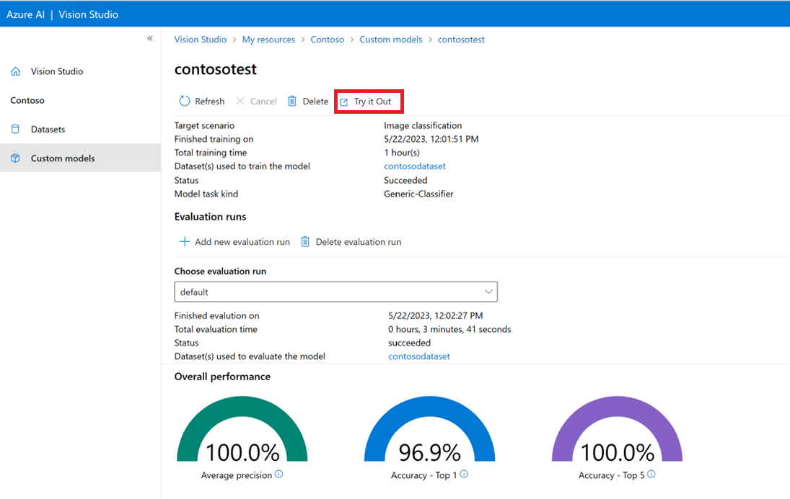

# 🧠 Azure AI Vision Studio – Your GUI Powerhouse for Visual Intelligence 🧰✨

<div style="text-align: center;">
    
</div>

## 🎯 What is Azure AI Vision Studio?

> **Azure AI Vision Studio** is a **no-code**, browser-based interface that lets you explore, test, and build AI-powered solutions with the Azure **Computer Vision**, **Custom Vision**, **Face**, and **Form Recognizer** services.

It’s like the **Photoshop of AI**, but instead of applying filters, you're applying neural magic to extract information, detect objects, and classify images.

---

## 🔍 Why Use Vision Studio?

| Reason                            | Why it Rocks 🤘                            |
| --------------------------------- | ------------------------------------------ |
| **No Code Needed**                | Point, click, and experiment               |
| **Real-time Testing**             | Upload images and get instant results      |
| **Training and Evaluation Tools** | Great for **Custom Vision** workflows      |
| **Prebuilt Services Playground**  | Try OCR, brand detection, spatial analysis |
| **Exam & Career Ready**           | It's used in real-world workflows & AI-102 |

---

## 🧱 Vision Studio Features Overview

Here’s a high-level overview of what you can do inside:

### 🏷️ **Image Classification**

- Upload labeled images
- Train a model
- Test new images
- Export the model (TensorFlow, ONNX, CoreML, etc.)

### 🎯 **Object Detection**

- Draw bounding boxes
- Label multiple objects per image
- Train & evaluate
- Deploy + Test predictions

### 📸 **Image Analysis**

- Use prebuilt models to detect:

  - Tags (e.g., “tree”, “car”, “mountain”)
  - Captions
  - Adult/racy/gore content
  - Celebrities, landmarks
  - OCR (text recognition)

### 📝 **Form Recognizer (Document Intelligence)**

- Upload invoices, receipts, forms
- See key-value pairs extracted
- Train custom extractors

### 👁️ **Face Detection (Limited Access)**

- Detect face landmarks
- Emotion, pose, mask detection

---

## 🧭 Where to Find It?

🔗 **[https://vision.azure.com](https://vision.azure.com)**
You'll need:

- An Azure subscription
- A Cognitive Services resource (with the Computer Vision, Custom Vision, or Form Recognizer pricing tier enabled)

---

## 🚦 Workflow Example: Image Classification in Vision Studio

```mermaid
flowchart TD
    A[Login to Vision Studio] --> B[Create Project]
    B --> C[Choose Classification Type (Multi-class / Multi-label)]
    C --> D[Upload Images + Tags]
    D --> E[Train Model]
    E --> F[Test Images]
    F --> G[Review Metrics (Precision, Recall, mAP)]
    G --> H[Publish or Export Model]
```

---

## 🧪 Evaluation Metrics You Can See

| Metric           | Where You See It 📊   | What It Tells You                         |
| ---------------- | --------------------- | ----------------------------------------- |
| Precision        | Model performance tab | How accurate are predicted tags           |
| Recall           | Same                  | How well the model finds the correct tags |
| Confusion Matrix | Optional preview      | What’s getting misclassified              |
| Per-Tag Stats    | Table of every tag    | Micro/macro averages shown                |

---

## 📦 Model Export Options

After training in Vision Studio, you can export models to:

| Format               | Use Case                            |
| -------------------- | ----------------------------------- |
| **ONNX**             | Universal format for many platforms |
| **TensorFlow**       | Mobile & cloud apps                 |
| **CoreML**           | iOS apps                            |
| **Docker Container** | Easily deploy to servers            |

---

## 🔐 Pricing Note

Vision Studio itself is free, but:

- **Custom Vision projects** consume training & prediction credits
- **Prebuilt models (Image Analysis, OCR)** use API calls billed by tier

Make sure your Cognitive Services resource has **enough quota**.

---

## 🧠 Use Case Highlights

| Scenario                        | Vision Studio Role                     |
| ------------------------------- | -------------------------------------- |
| AI-102 Exam Practice            | Test & visualize AI model capabilities |
| Enterprise Proof of Concept     | Build demos fast, no code needed       |
| Fine-tuning Custom Classifiers  | Visualize, improve dataset quality     |
| Document Extraction Workflow    | Try different layout models            |
| Prebuilt Vision API Exploration | Understand what Azure’s AI sees        |

---

## 📸 Sample Screenshot (Visual Reference)

> _Imagine uploading an image of a dog on a skateboard and Vision Studio tagging it as:_

- Dog 🐶
- Skateboard 🛹
- Outdoor 🌳
- Action 🏃‍♂️

> Then it gives you a **caption**:
> _“A dog riding a skateboard in the park”_ — 👏 Magic.

---

## 📚 AI-102 Exam Tips Related to Vision Studio

✅ Be ready to:

- Choose between **classification vs detection**
- Understand **multi-class vs multi-label**
- Know the difference between **training and prediction**
- Identify supported export formats
- Recognize **mAP**, **precision**, **recall**, and **confusion matrix**
- Understand **the role of Vision Studio vs SDK vs REST API**

---

## ✅ Summary

| Feature               | Description                                        |
| --------------------- | -------------------------------------------------- |
| Vision Studio         | Web-based AI tooling for Computer Vision           |
| Custom Vision Support | Train & deploy classification/detection models     |
| No-Code Playground    | Explore prebuilt models without writing a line     |
| Great for AI-102      | Directly test the capabilities the exam asks about |
