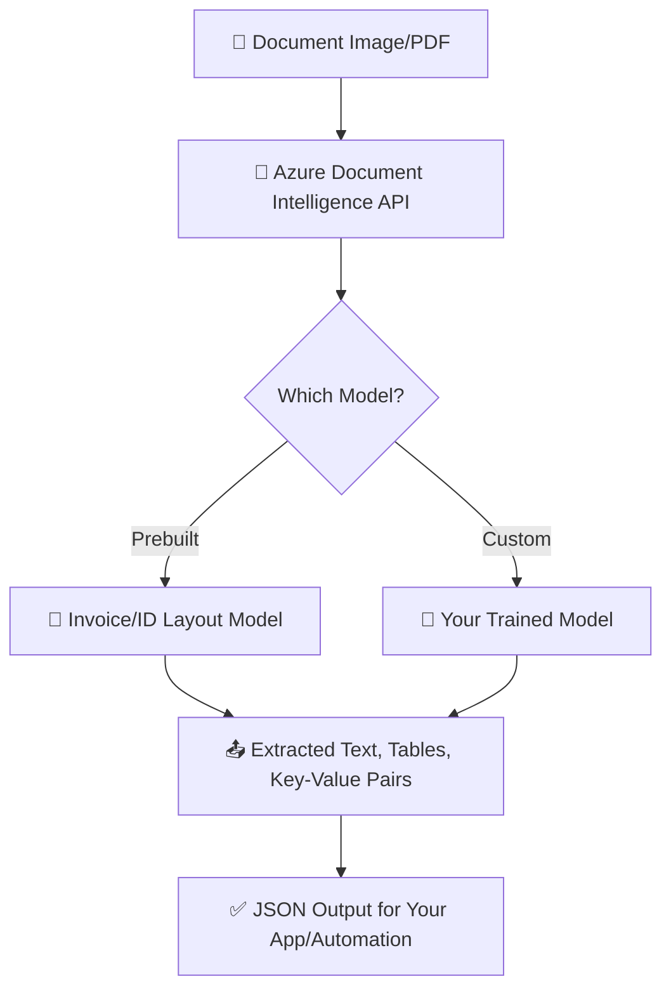
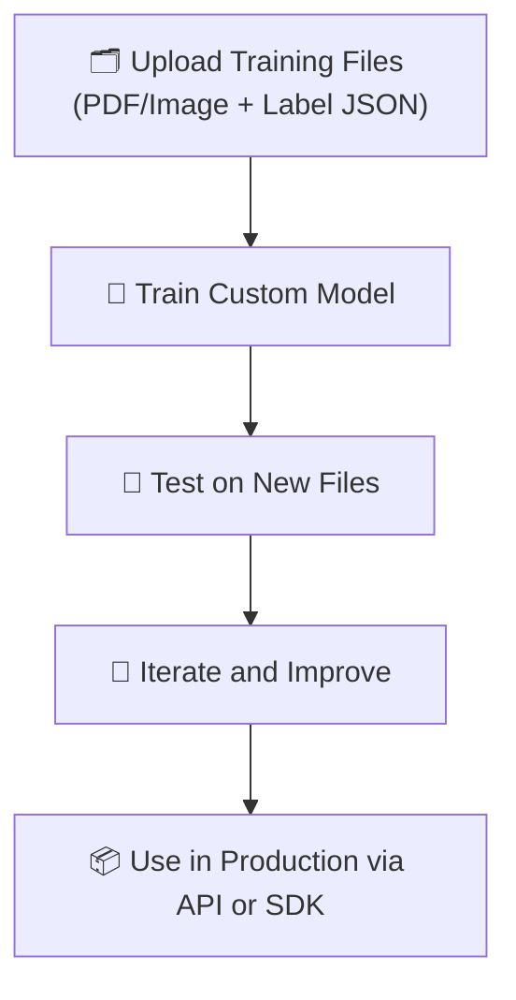

# 🧾 Azure AI Document Intelligence (Form Recognizer 2.1+)

> 🤖 Read, Understand & Digitize Documents Like a Pro — Without Lifting a Pen

---

## 📘 What is Azure AI Document Intelligence?

> **Official Definition:**
> Azure Document Intelligence (formerly **Form Recognizer**) is a cloud-based AI service that uses machine learning to **analyze and extract text, key-value pairs, tables, and structure from documents**, including **PDFs**, **images**, **scanned forms**, and more.

Put simply:
It’s an **AI-powered OCR on steroids** 💪. You give it a scanned invoice or a PDF license form, and it gives you a **structured JSON** like:

```json
{
  "Name": "John Doe",
  "LicenseNumber": "X-123456789",
  "DOB": "1990-04-25",
  "Address": "Dubai, UAE"
}
```

---

## 🔍 How Does It Work?

### 📤 You Upload a Document (PDF/Image)

### 🧠 Azure Analyzes It Using Prebuilt or Custom AI Model

### 📦 You Get Structured Output (JSON/XML) with Confidence Scores

Let’s see it visually:

<div align="center">



</div>

---

## 📦 Types of Models in Document Intelligence

| Model Type             | Description                                      | Example Use Case                               |
| ---------------------- | ------------------------------------------------ | ---------------------------------------------- |
| **📊 Layout Model**    | Extracts raw text, layout, tables                | Scanned docs, blueprints, resumes              |
| **🏗️ Prebuilt Models** | AI models trained by Microsoft for specific docs | `Invoices`, `Receipts`, `US IDs`, `Bank forms` |
| **🎨 Custom Model**    | You train it on your own documents               | Local license form, medical receipts           |
| **🐈🐕 Classifier**    | Classifies which document type you're uploading  | Sort between Passport vs Invoice               |

---

## 📑 Supported Document Formats

| Type  | Formats                         |
| ----- | ------------------------------- |
| Image | `.jpg`, `.png`, `.bmp`, `.tiff` |
| Doc   | `.pdf` (scanned or text)        |

Even if you use `.docx` or `.html`, you can easily convert to PDF and pass to the API.

---

## 🧪 Try It Out in the Portal (No Code!)

### 💻 Document Intelligence Studio

A beautiful, drag-and-drop GUI where you:

1. Upload a sample document
2. Choose a **prebuilt model**
3. Click "Analyze"
4. See JSON result, highlighted fields, table extraction, and **confidence score**

👁️ Example: Upload your UAE driver’s license  
📤 Output: `{"Name": "Ahmed Al Nahyan", "LicenseNumber": "DXB2025", "DOB": "1990-11-30"}`

---

## 🧠 Prebuilt Models Available (Ready to Go!)

| Model Name              | What it Extracts                             |
| ----------------------- | -------------------------------------------- |
| `prebuilt-layout`       | All text, tables, paragraphs, bounding boxes |
| `prebuilt-idDocument`   | Name, DOB, ID number, issuing country        |
| `prebuilt-invoice`      | Invoice date, customer, total, VAT, etc.     |
| `prebuilt-businessCard` | Name, title, phone, company from biz cards   |

🔧 **Tip:** If your document doesn't match one of these, build a **custom model**!

---

## 💡 Key Capabilities

- ✅ **Multi-page support**
- 🔤 **Handwritten text detection**
- 📊 **Table recognition**
- 🧠 **Semantic understanding of key-value pairs**
- 🌍 **Supports 164+ languages**
- 🔐 **Confidence scores for every field**
- 📎 **Form classification (form vs invoice)**

---

## 🧬 Sample JSON Output

Here’s what the **invoice** model might return:

```json
{
  "InvoiceDate": "2024-04-25",
  "CustomerName": "GoDrive LLC",
  "Items": [
    {
      "Description": "Cloud VM Usage",
      "Amount": "$200.00"
    }
  ],
  "Total": "$200.00",
  "Confidence": 0.98
}
```

Notice:

- Every field comes with **value**, **bounding box**, and **confidence score**
- Makes it perfect for downstream automation (store in database, validate against ERP, etc.)

---

## 🧰 SDK & REST API Support

| Language    | SDK Available |
| ----------- | ------------- |
| 🐍 Python   | ✅            |
| 🦈 C#       | ✅            |
| ☕ Java     | ✅            |
| 🌐 REST API | ✅            |

📝 Use the **REST API** if you want raw control. Use **SDK** if you want fast, clean code and error handling.

---

## 📦 How to Use in Python SDK (High-Level Overview)

```python
from azure.ai.formrecognizer import DocumentAnalysisClient
from azure.core.credentials import AzureKeyCredential

endpoint = "<your-endpoint>"
key = "<your-key>"

client = DocumentAnalysisClient(endpoint, AzureKeyCredential(key))

poller = client.begin_analyze_document_from_url("prebuilt-invoice", document_url)
result = poller.result()

for field in result.fields:
    print(f"{field}: {result.fields[field].value} (confidence: {result.fields[field].confidence})")
```

---

## 🧪 Custom Models — Your Forms, Your Rules

If you have:

- Localized forms (e.g. Arabic utility bills 🇦🇪)
- Non-standard layout documents
- Custom fields not available in prebuilt models

Then use:

> **Custom Extraction Model**: Train the AI on your forms
> **Custom Classification Model**: Teach it how to identify form _types_

### Steps:

---

<div align="center">



</div>

---

🧠 You'll need at least 5 labeled documents for training. Use the **Document Intelligence Studio** to drag-drop and label them. Super easy.

---

## 📈 Confidence Scores Matter!

Every field extracted has a **confidence score** (0.0–1.0). This lets you:

- ⚠️ Flag low-confidence values for manual review
- ✅ Accept high-confidence fields for automation
- 🤖 Fine-tune your model to increase reliability

---

## 🎯 Real-World Use Cases

| Industry   | Use Case Example                        |
| ---------- | --------------------------------------- |
| Banking    | Extract data from checks, KYC documents |
| Healthcare | Parse prescriptions, insurance forms    |
| Government | Digitize national IDs, voter forms      |
| Retail     | Process receipts, returns               |
| Logistics  | Read customs forms, waybills            |
| HR/Payroll | Read resumes, pay slips                 |

---

## 🚀 Pro Tips for the AI-102 Exam

💡 Expect questions like:

- ✅ Which model is best for invoices?
- 🧠 What happens if prebuilt model fails on your data?
- 📊 How does Document Intelligence handle tables vs key-value?
- 🔎 What is the confidence score and why is it important?

🔥 Be ready to explain:

- Layout model vs Prebuilt vs Custom
- Use of Document Intelligence Studio
- How SDK wraps REST API
- JSON response structure
- Supported languages and formats

---

## 🧪 Try it Now – Hands-On

Azure Studio → Document Intelligence → Prebuilt Layout
Try uploading:

- A local bill
- A filled application form
- A random ID screenshot

You’ll instantly get visual extraction, confidence scores, and a downloadable JSON output.

---

## 🧠 Summary

- Azure Document Intelligence is like a **smart PDF reader with superpowers** 🦸‍♂️
- Great for **automation**, **digitization**, and **AI-enhanced processing**
- Supports **prebuilt**, **custom**, and **layout** models
- Integrates via **Python SDK**, **C#**, or **REST API**
- Document Intelligence Studio lets you **train and test without code**
