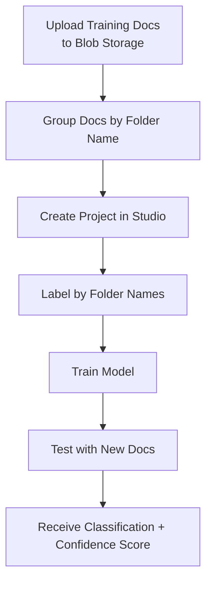
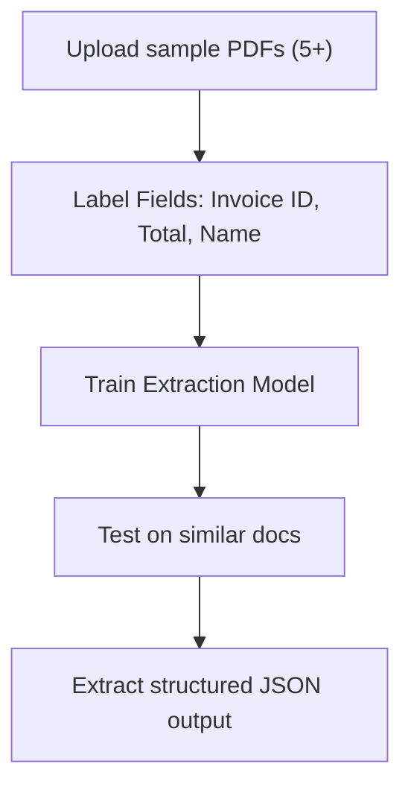

# 🧾 Azure AI Document Intelligence – Custom Models Explained (Classification + Extraction)

Azure's Custom Document Intelligence lets you train your own models to understand specific document types and layouts — ideal when your documents don’t match any prebuilt templates.

---

## 📦 What Are Custom Models?

Custom models allow you to **train AI to understand your unique documents** — whether it’s a weird invoice format, a rare tax certificate, or even handwritten forms.

There are **two flavors** of custom models:

| 🍦 Type               | 🍰 Purpose                                                              |
| --------------------- | ----------------------------------------------------------------------- |
| 🔍 **Classification** | Identify what type of document this is (e.g., Invoice vs. W8 Tax Form)  |
| 🪄 **Extraction**      | Pull specific fields from the document (e.g., Invoice ID, Total Amount) |

---

## 🧠 1. Custom Document Classification Model

### ✅ What It Does

Given a random document, it tells you what "type" it is. It’s like a receptionist sorting your mail into "Invoices", "Tax forms", "Receipts", etc.

### 🔄 Workflow

---

<div align="center">



</div>

---

### 📁 Folder Structure (📂 Pro Tip)

Organize training data by **folder names** representing labels!

```ini
📁 training-data/
├── 📂 invoice/
│   ├── invoice1.pdf
│   └── invoice2.pdf
├── 📂 tax_doc/
│   ├── w8form1.pdf
│   └── w8form2.pdf
```

Azure will ask: _"Use folder names as labels?"_ — Say **YES** 🙌

### 🧪 Test Result Example

| 🧾 Document            | 📌 Predicted Type | 🎯 Confidence |
| ---------------------- | ----------------- | ------------- |
| `invoice_test.jpg`     | Invoice           | 77% ✅        |
| `tax_certificate.pdf`  | Tax Doc           | 84% ✅        |
| `passport_unknown.pdf` | Tax Doc (?)       | 41% ⚠️        |

> 🤖 **Tip:** If confidence < 50%, you can flag it as **"Unknown"** in your app.

---

## 🧠 2. Custom Document Extraction Model

### ✅ What It Does

This model pulls out the **key fields** from documents: names, totals, IDs, addresses, etc.

### 🗺️ Visual Example

---

<div align="center">



</div>

---

### 🧰 Required Training Data

At least **5 documents** with:

- 🧾 Identical structure (e.g., same invoice layout)
- ✍️ Labeled fields like `Invoice ID`, `Total`, `Customer Name`

### 🧪 Output Example

Given a PDF, the model returns this:

```json
{
  "fields": {
    "InvoiceID": {
      "value": "INV-2045",
      "confidence": 0.94
    },
    "CustomerName": {
      "value": "TechBazaar LLC",
      "confidence": 0.91
    }
  }
}
```

### 💡 Real Use Cases

- 🏦 Banks: extract account details from forms
- 🧾 Invoice processing: auto-read totals, due dates
- 🏥 Healthcare: extract fields from lab reports or prescriptions

---

### 🔧 Behind the Scenes: How It Works

Every doc is scanned using OCR (Optical Character Recognition). You help the model by drawing boxes around text and giving them labels (e.g., "Customer Name").

Then Azure learns the pattern of where fields live and what they look like.

You can:

- 🖍️ Use **auto-labeling** (based on known doc formats like invoices)
- ✏️ Or manually draw and label fields (drag & drop regions)

---

### 📤 Storage & Labeling Best Practices

| 🔐 Tip                                           | 📎 Why It Matters                                                |
| ------------------------------------------------ | ---------------------------------------------------------------- |
| Store training docs in **Blob Storage**          | Avoids upload errors and allows versioning                       |
| Use **folder names** for labels (classification) | Azure auto-labels for you                                        |
| Label at least **5 docs** per type               | More is better, but 5 is minimum                                 |
| Don't mix formats in one project                 | Separate PDF, image types, or layouts to reduce model confusion  |
| Upload from BLOB — not Studio                    | Studio uploads for training can fail; always prefer Blob Storage |

---

### 🧪 Testing Phase

Once trained:

1. Upload a **new document** (JPEG, PDF, etc.)
2. Azure tells you:

   - ✅ What type of document it is (classification)
   - 🧾 Which fields it extracted + confidence (extraction)

3. Use that in your app workflow!

---

### 💬 Sample Output: Extraction JSON

```json
{
  "DocumentType": "Invoice",
  "ExtractedFields": {
    "TotalAmount": "$295.40",
    "InvoiceNumber": "INV1020",
    "DueDate": "2024-09-01"
  }
}
```

---

### 🤖 Bonus: Query Fields

If you forgot to train for something (like “VAT Amount”), you can use **Query Fields**:

```python
model.query_fields = ["VAT Amount"]
```

But… 🛑 accuracy is lower than trained fields. Always better to label in training!

---

## 🧠 Summary

| Feature           | Classification          | Extraction                    |
| ----------------- | ----------------------- | ----------------------------- |
| 🎯 Goal           | Identify doc **type**   | Pull fields from a doc        |
| 🧾 Input Docs     | Grouped by folder name  | 5+ with same layout           |
| 📦 Output         | Label + confidence      | JSON with fields + confidence |
| 🧰 Ideal Use Case | Routing, categorization | Invoices, forms, ID cards     |

---

## ✅ Final Tips

- 💡 Use **Blob Storage** for training docs
- 🧹 Keep your training data **clean and consistent**
- 🛡️ Mask any PII before uploading
- 📦 For document pipelines, use it in combo with Form Recognizer prebuilt models
- ⚙️ Use the **Document Intelligence Studio** to label and test visually
