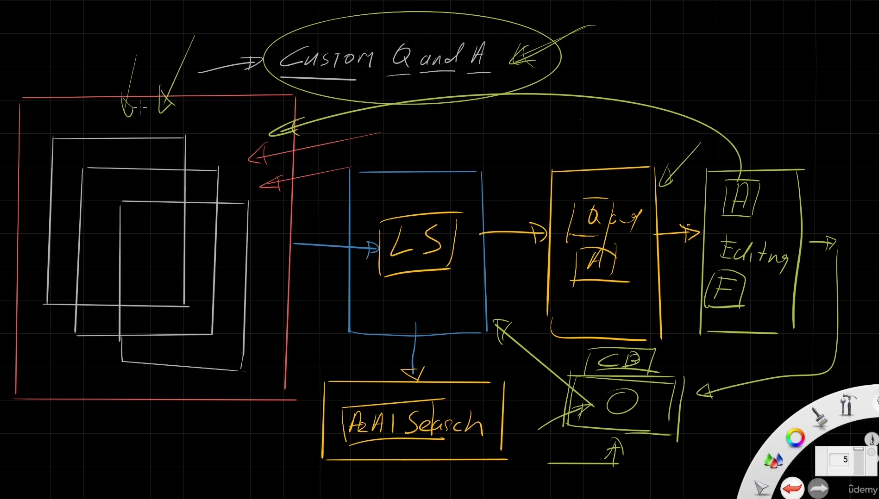
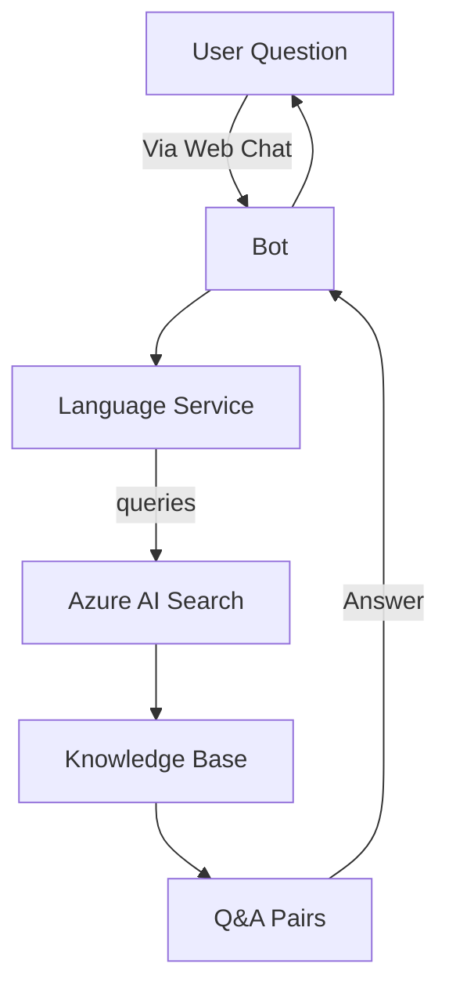
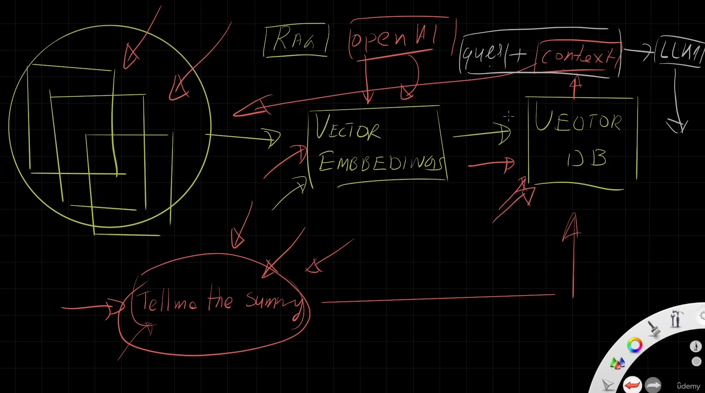

# 🤖 Custom Question Answering in Azure

If you ever thought:

> “I have a bunch of FAQs, PDFs, or manuals — can I build a chatbot out of that without fine-tuning GPT?”

**YES!** Welcome to **Custom QnA** in Azure Language Service.

This is Azure's older—but still officially supported—way to make a **support-style Q\&A chatbot** with documents and **zero code**. Think of it like “ChatGPT-lite with documents” — without RAG or LLM embeddings.

---

<div style="text-align: center;">
    
</div>

---

## 🎯 What Is Custom QnA?

It's a feature inside **Azure AI Language Service**, powered by a simple NLP model + Azure AI Search, to automatically extract Q\&A pairs from your files and serve them through a chatbot.

🛠️ No vector embeddings.
🧠 No fine-tuning.
⚡ No OpenAI.
🏁 But still gets the job done — if your needs are simple!

---

## 🔥 Real-World Use Case

Let’s say you have:

- An **FAQ document** for your e-learning site
- A **policy manual** for employees
- A **product guide** for customers

You want to build a chatbot that answers questions like:

- “How do I enroll in the course?”
- “What’s the refund policy?”
- “What does chapter 4 cover?”

That’s what Custom QnA solves — **quick**, **cheap**, and **low-latency**.

---

## 🧭 High-Level Flow (explaining your diagram)



Your flow looks like:

1. 👨‍💻 User asks via chat
2. 📥 Chat forwards to Language Service
3. 🔍 Language Service queries Azure AI Search
4. 📚 AI Search pulls answer from indexed Q\&A
5. 💬 Bot replies back!

This is **pure NLP + search**, no generative AI involved.

---

## 🧱 Step-by-Step: Build Your Custom QnA Bot

### 🔧 Step 1: Provision Services

You need **two Azure services**:

1. ✅ **Language Service**
2. ✅ **Azure AI Search**

📌 Must be in the **same region** for best results
📌 AI Search must be Standard SKU (Free tier may limit indexing)

---

### 🏗️ Step 2: Create Project in Language Studio

Go to: [https://language.azure.com](https://language.azure.com)

- Select **Custom Question Answering**
- Click “Create new project”
- Name your project, set description
- ⚠️ Set a **default answer** like:
  _“Sorry, I didn’t find that. Please contact support.”_

---

### 🧾 Step 3: Connect to Azure AI Search

This is where all the Q\&A content will be **indexed** and **searched**.

- Select your **Search Service**
- Choose your **Search Index** (auto-created or custom)
- ✅ Make sure the **Language Service and AI Search are in the same region**, or you’ll get warnings

---

### 📂 Step 4: Add Content (Q\&A Docs)

Upload content:

- PDFs
- Word docs
- HTML
- Text files
- ...even **raw FAQ tables**

🤓 In the Udemy demo, they use a **SourceLens FAQ HTML** file.

---

### 🤖 Step 5: Auto Q\&A Extraction

The Language Service reads your doc and:

- Extracts Q\&A pairs using built-in NLP
- Parses structure intelligently (headings, bullet points)
- Creates a draft knowledge base

🎯 Example extracted Q\&A:

- Q: What does this course cover?
- A: This course teaches Azure AI with real-world examples.

---

### ✏️ Step 6: Edit the Knowledge Base

You now get full control to polish things:

#### ➕ Add Alternate Questions

E.g. for:

> “What’s the cost of the course?”

Add alternates like:

- “Is the course free?”
- “Do I need to pay?”
- “What's the price?”

#### 🔁 Add Follow-Up Prompts

Build conversational flows.

E.g. After:

> “How do I enroll?”

Add follow-ups like:

- “Where are the courses located?”
- “Is it self-paced?”

🔁 These show up as clickable follow-up bubbles in the chat UI.

---

## 🧪 Step 7: Test the Bot (Before Deployment)

Click the 🧪 **Test** button in Language Studio:

Try things like:

- Similar wording
- Alternate phrasing
- Misspelled inputs
- Follow-ups

You’ll see your logic in action — it’s like simulating real user experience before going live.

---

## 🚀 Step 8: Deploy Knowledge Base

When you’re happy, click:

> **Deploy**

This wraps up your Q\&A service into a production-ready **Web App Bot**.

### It provisions:

- A Web App
- Azure Bot Service
- Integrations for API/iframe

You now have:
✅ REST endpoint
✅ Web Chat channel
✅ Bot Framework integration

---

## 🌐 Step 9: Embed It Anywhere (Website, Intranet, Helpdesk)

Go to **Azure Bot Service → Channels → Webchat**

Copy the **iframe snippet**, e.g.:

```html
<iframe src="https://webchat.botframework.com/embed/your-bot-id?..." />
```

Paste it into:

- Your HTML website
- SharePoint
- Internal admin portals
- Customer support portal

🖼️ Done. You now have a chatbot powered by your own docs!

---

## 💵 Cost Warning: What Gets Billed?

| Resource         | Charged Even If Idle? |
| ---------------- | --------------------- |
| Azure AI Search  | ✅ Yes                |
| Bot Web App      | ✅ Yes                |
| Language Service | ❌ Only when called   |

🧽 **CLEAN UP after your demo**, or it will drain your wallet quietly!
If you’re not using the **Free tier**, you’ll be charged **per hour**.

---

## 🔍 Real Limitation: Not Smart Like ChatGPT

**Custom Q\&A ≠ Generative AI**

It’s more like:

- “Find exact question → reply with pre-written answer”
- No deep understanding, no summarizing, no rewording

It’s like a **search-powered chatbot**, not a conversation agent.

---

## 🔁 Bonus: How It Differs from RAG + OpenAI (The Smart Way)

| Feature               | Custom Q\&A Maker    | RAG with OpenAI + AI Search  |
| --------------------- | -------------------- | ---------------------------- |
| Uses LLMs             | ❌ No (just NLP)     | ✅ Yes (GPT-4, GPT-35)       |
| Handles vague queries | ❌ No                | ✅ Yes                       |
| Needs embeddings      | ❌ No                | ✅ Yes                       |
| Response generation   | Static (pre-written) | Dynamic (LLM writes answers) |
| Easy to set up        | ✅ Very Easy         | ⚠️ Medium/Hard               |
| Best for              | Quick FAQ/chatbot    | Smart conversational agents  |

So if your chatbot needs to:

- Understand different user phrasings
- Summarize answers from multiple paragraphs
- Personalize responses based on user intent

👉 You **need** RAG + OpenAI.

---

<div style="text-align: center;">
    
</div>

---

## ✅ Summary Cheat Sheet

| Step | Action                                |
| ---- | ------------------------------------- |
| 1    | Provision Language + AI Search        |
| 2    | Create QnA project in Language Studio |
| 3    | Connect AI Search                     |
| 4    | Upload FAQ or manual docs             |
| 5    | Auto-generate Q\&A                    |
| 6    | Edit: alternate & follow-up Qs        |
| 7    | Test locally                          |
| 8    | Deploy Web App bot                    |
| 9    | Embed via iframe                      |

---

## 🤖 Final Thoughts

Azure Custom QnA Maker is:

- ✅ Fast
- ✅ Simple
- ✅ Great for static FAQs

But not:

- ❌ Suitable for vague, complex, or generative tasks
- ❌ Scalable to full conversation agents

📌 Want something smarter? Use:

- Azure AI Search + OpenAI (with embeddings)
- Or fine-tune a GPT model if needed
