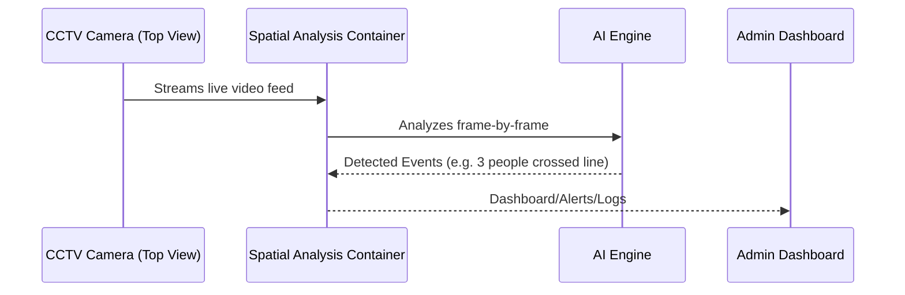

# 🛰️ Azure AI Vision: Spatial Analysis (📍+🧠)

## 🧠 What Is Spatial Analysis?

> **Official-ish Definition**: _Spatial Analysis in Azure AI Vision is a containerized service that uses computer vision to understand people's movements in physical spaces (like stores, offices, or stations) — including presence, entry/exit, line-crossing, and social distancing — based on real-time video feeds._

In simpler words:

> You give it a live camera feed (like CCTV), and it tells you:
>
> - How many people are **here**?
> - Did someone **enter**?
> - Did anyone **cross this line**?
> - Are people keeping a safe **distance**?
> - Is that person wearing a **face mask**?

---

## 🎯 What Makes It Unique?

- 🧩 It’s a **composite vision AI** like Video Indexer, but **real-time**.
- 🧱 It runs as a **Docker container** — NOT as a simple REST API.
- 🎥 It requires **depth-aware camera angles** (like overhead CCTV).
- 🧠 It understands **3D spatial movement** (not just pixel detection).
- 🚀 It's great for **smart buildings**, **retail analytics**, **crowd control**, and even **law enforcement**.

---

## 🛠️ What Can It Detect?

| Feature                 | Description                                                          |
| ----------------------- | -------------------------------------------------------------------- |
| 👥 People Count         | Count people in a defined region (e.g. aisle, room)                  |
| 🚪 Entry/Exit Detection | Detect people entering or exiting a defined area                     |
| 🚧 Line Crossing        | Track people crossing a virtual line                                 |
| 📏 Social Distancing    | Measure distance between individuals in real time                    |
| 😷 Face Mask Detection  | (Optional) Detect mask usage during pandemic scenarios               |
| 🚗 Vehicle Detection    | (Separate container) Analyze and count vehicles for tolls or parking |

---

## 🎬 Examples in Action

Let’s visualize how the system works:

<div align="center">



</div>

### 🎥 Sample Scenarios:

- **Supermarket entrance** → How many people entered?
- **Train station gate** → Did someone cross the no-entry zone?
- **Office floor** → How many people are in Room A?
- **Airport security** → Are people crowding? Is social distance maintained?

---

## 📦 How to Use It

### Step-by-Step Deployment

1. 📦 **Download Docker Container**

   - From Microsoft Container Registry
   - Requires NVIDIA GPU-enabled host

2. 🛠️ **Configure Zones and Lines**

   - Define **regions** (e.g. entrance area)
   - Draw **virtual lines** (e.g. front door)
   - Set **3D perspective** and camera height

3. 📤 **Feed CCTV Footage**

   - Connect RTSP or local file source
   - Ideal: Overhead camera (30-60° angle)

4. 🧠 **Real-Time Analysis**

   - Events generated in JSON
   - Use WebSocket or REST endpoints for alerting

---

## 🖼️ Use Case Visuals

### 📍 Counting People in a Zone


- Every person in the rectangle is counted
- Count updates as people enter/exit

---

### 🚶 Line-Crossing Detection


- Virtual line drawn at store entrance
- System logs every cross event (enter/exit)

---

### 📏 Social Distancing Monitor


- Pairs of people too close = violation
- Alerts based on distance thresholds

---

## 💻 Output Sample (JSON)

```json
{
  "event": "lineCrossed",
  "timestamp": "2024-06-17T10:45:00Z",
  "zoneId": "entry-door",
  "personId": "abc123",
  "direction": "IN",
  "confidence": 0.92
}
```

You can plug this into:

- 🔔 Azure Event Grid → Alerting System
- 📊 Power BI → Real-time Dashboards
- 🧠 ML System → Behavioral Pattern Analysis

---

## ⚙️ Requirements

| Requirement          | Description                                   |
| -------------------- | --------------------------------------------- |
| 🖥️ Hardware          | NVIDIA GPU-enabled VM (e.g., Azure NC Series) |
| 📡 Camera            | Fixed CCTV with **overhead view**             |
| 🐳 Container Runtime | Docker + NVIDIA Runtime                       |
| 🌐 Internet or LAN   | For dashboard/API connectivity                |
| 🧭 Calibration       | Accurate zone/line geometry + 3D awareness    |

---

## 🤹 Pros vs Cons

| ✅ Pros                             | ⚠️ Cons                                       |
| ----------------------------------- | --------------------------------------------- |
| Real-time, edge-ready AI            | Requires container deployment (not REST-only) |
| Privacy-friendly (no face storage)  | Camera angle + calibration critical           |
| Offline-friendly (runs on-premises) | Needs GPU hardware                            |
| Useful for compliance & safety      | Complex initial setup                         |

---

## 🧪 Video Retrieval vs Spatial Analysis

| Feature            | Spatial Analysis (This)  | Video Indexer / Retrieval |
| ------------------ | ------------------------ | ------------------------- |
| Deployment Style   | On-Prem (Docker)         | Cloud SaaS                |
| Input Type         | Real-time video          | Uploaded video            |
| 3D Depth Awareness | ✅ Yes                   | ❌ No                     |
| Real-Time Events   | ✅ Yes                   | ❌ No                     |
| Ideal Use Case     | CCTV / Toll / Entry Logs | Meeting Records / Search  |
| Custom Vocabulary  | ❌ No                    | ✅ Yes                    |

---

## 🧠 AI-102 Key Takeaways

- 📌 Spatial Analysis is used for **live video monitoring** — not just analysis after upload.
- 📦 It runs in a **Docker container**, not as a managed Azure resource.
- 🎥 Designed for **overhead CCTV-style footage**.
- 🧠 Supports **real-time event generation**: entry, exit, social distancing, etc.
- 🧮 Can be integrated with Event Grid, Azure Functions, or dashboards.
- 💡 Best suited for **law enforcement, retail, safety compliance**.
