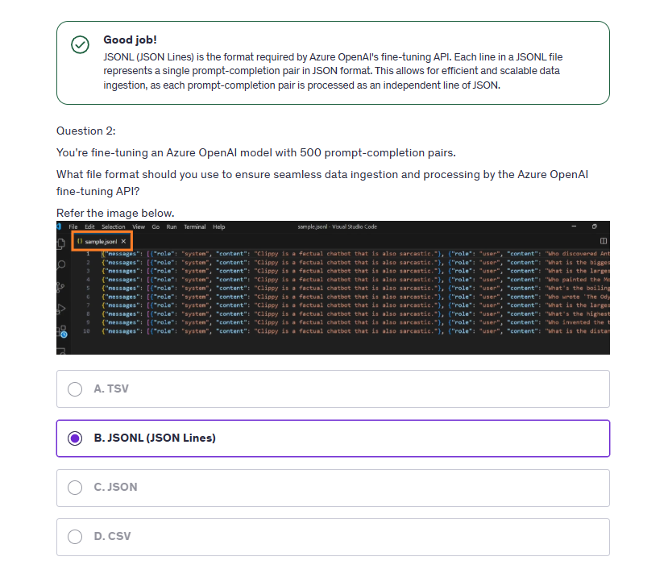

# 👟 Azure OpenAI: Fine-Tuning GPT Models with Your Own Data

_Train ChatGPT on Private Knowledge for Tailored Behavior!_

---

## 🎯 Why Fine-Tune at All?

Azure OpenAI already provides powerful pre-trained LLMs like **GPT-3.5 Turbo**, **GPT-4**, and **GPT-4o**. But what if your AI assistant needs to understand your company’s:

- 📁 Private HR policies
- 🧾 Custom support ticket formats
- 🧠 Internal jargon or tone (like sarcastic-but-friendly replies)
- 📊 Domain-specific knowledge (like banking, telecom, or law)

**That’s where fine-tuning comes in**: You teach the model your _specific data_, so its responses better reflect your organization's tone, intent, and information.

---

## 🧰 Fine-Tuning vs. Prompt Engineering vs. RAG

| Strategy                             | Description                                                  | When to Use                      |
| ------------------------------------ | ------------------------------------------------------------ | -------------------------------- |
| Prompt Engineering                   | Give detailed prompts to shape replies                       | For quick testing, no-code       |
| RAG (Retrieval-Augmented Generation) | LLM + private data from vector database like Azure AI Search | For dynamic real-time retrieval  |
| **Fine-Tuning**                      | Train the base model on new data (Q\&A or behavior)          | When behavior needs to _persist_ |

✅ **Fine-tuning is ideal when you want the model to “remember” how to behave, even without adding extra context each time.**

---

## 🛠️ Step-by-Step: How to Fine-Tune in Azure OpenAI

### 🔹 1. Prepare Your JSONL Training File

Each line = one conversation:

```json
{
  "messages": [
    { "role": "system", "content": "You are a sarcastic but helpful AI assistant." },
    { "role": "user", "content": "How do I reset my password?" },
    {
      "role": "assistant",
      "content": "Oh sure, because forgetting it again wasn't embarrassing enough? Just click 'Forgot Password'!"
    }
  ]
}
```

---

<div style="text-align: center;">
    
</div>

---

🧠 **Pro Tips**:

- Use consistent formatting.
- Include varied questions to help generalization.
- Use **internal knowledge or tone** the model doesn’t already know.

### 🔹 2. Go to Azure OpenAI Studio > Fine-Tuning

1. Choose a **supported region** like `East US 2` or `Sweden Central`.
2. Choose a fine-tunable base model (e.g., `gpt-3.5-turbo`).
3. Upload your `.jsonl` file.
4. Skip validation (optional).
5. Leave training parameters (`learning rate`, `epoch`, `batch size`) as default or adjust:

   - Epochs: Increase to memorize more
   - Batch Size: Default is 0.2% of rows
   - Learning Rate: Between 0.1 to 2

🎯 Use `1-3 epochs` for small datasets, `5+` for larger sets.

---

## ⚙️ Behind the Scenes: What Happens During Fine-Tuning?

You're **not** re-training the full GPT model (which is TBs in size).

Instead, fine-tuning:

- Adds **adapter layers** that modify the output behavior.
- Adjusts **weights and biases** slightly for patterns in your data.
- Keeps the core LLM intact while nudging its tone and recall.

---

## 💸 Important Cost Considerations

⚠️ _Fine-tuning costs a lot more than chatting with the base model._

| Cost Type              | Description                          | Typical Price    |
| ---------------------- | ------------------------------------ | ---------------- |
| 🏋️ Training            | Based on tokens in training data     | \$3-\$10/hour    |
| 💾 Hosting (Deploying) | Cost of serving the fine-tuned model | \~\$7–\$15/hour  |
| 💬 Inference           | Same pricing model as GPT usage      | \$ per 1K tokens |

🔴 **Always delete the deployment after testing** if you don’t need it running 24/7.

---

## 🧪 Testing Fine-Tuned Models

### After deployment:

- Open the **Chat Playground**
- Select your **fine-tuned model**
- Use **the same system prompt** as in your training file
- Ask trained and untrained questions

📌 Reminder: Fine-tuning on a small dataset (\~1–2KB) may not show dramatic improvements.

---

## 🧩 Why Fine-Tuning Might Not Work Well

Here’s the truth: LLMs like GPT-3.5 or GPT-4 are trained on **TBs of text**. Giving them **a few KBs of your own data** won’t dramatically shift their behavior.

💡 Think of it like this:

> You're trying to re-train a Harvard professor with 5 sticky notes.

🟡 **When will it work better?**

- Large dataset (GBs of training)
- Consistent tone across samples
- Higher number of epochs
- Niche, internal, or domain-specific facts not found on the public web

---

## ✅ When Should You Fine-Tune?

| Use Case                                  | Should Fine-Tune? |
| ----------------------------------------- | ----------------- |
| Internal tone (e.g., sarcastic replies)   | ✅ Yes            |
| Company product FAQ                       | ✅ Yes            |
| Private employee info (e.g., salary data) | ✅ Yes            |
| Public news summarization                 | ❌ Use RAG        |
| Long documents with dynamic updates       | ❌ Use RAG        |
| Create a poetry-writing assistant         | ✅ Yes            |

---

## 📌 Best Practices

1. 🔒 **Use private and secure data only**
2. 🧪 Always compare fine-tuned vs. non-tuned behavior
3. 💰 Delete deployments to avoid charges
4. 🧠 Combine with RAG when needed for large corpuses
5. ⚙️ Use system prompt to **reinforce** behavior
