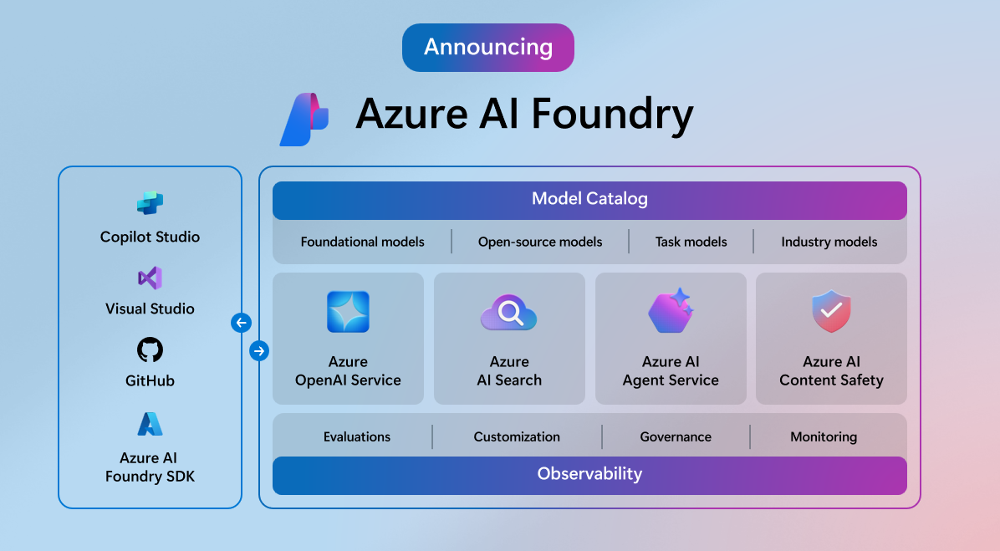
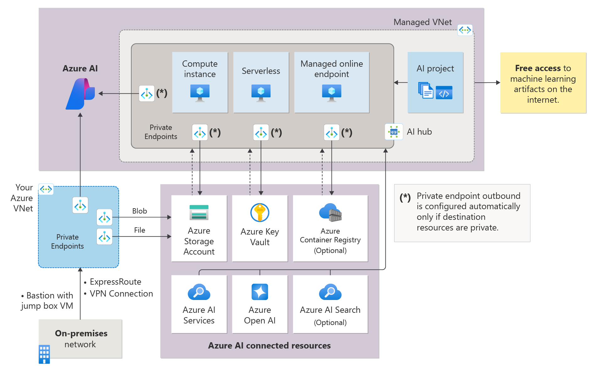
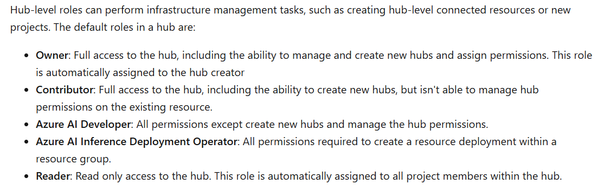
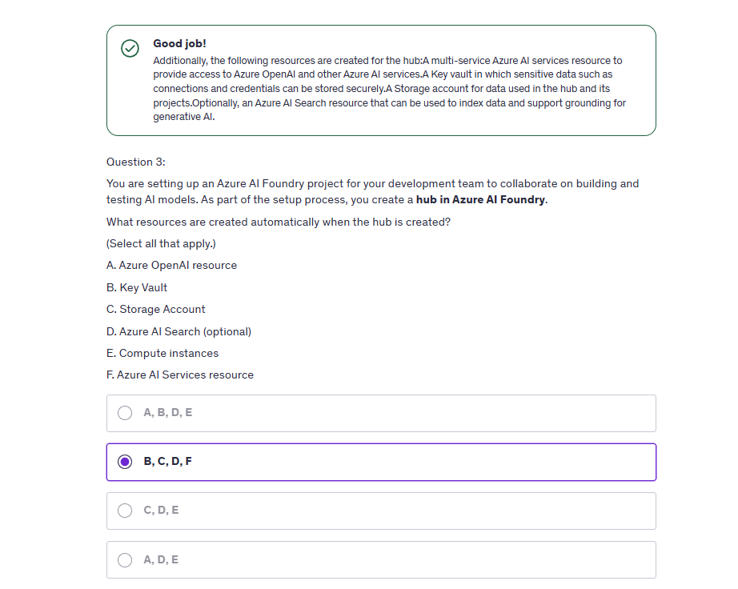

# 🧠 Azure AI Foundry

## 📖 What is Azure AI Foundry?

Azure AI Foundry is **Microsoft’s unified platform** for building, managing, and deploying AI models at scale — using **your own data**, **multiple environments**, and **a collaborative workspace**.

Think of it like:

> **“VS Code + GitHub + Azure ML + AI Studio + Project Governance = Azure AI Foundry”**

---

    

---

## ⁉️ Why Was It Built?

AI is messy. People use:

- Notebooks on local machines
- Azure ML here
- Hugging Face over there
- OneDrive for files (😩)
- Zero tracking of what model was used in production

### 🤔 So Microsoft said:

Let’s build **one opinionated platform** for:

- Data prep
- Training
- Fine-tuning
- Deployment
- Governance
- Team collaboration

🎯 **That’s Azure AI Foundry.**

---

## 🏗️ Key Concepts in Azure AI Foundry

    

---

### 🧩 1. **AI Hubs**

The **hub** is the top-level logical grouping.

Think of it like a **GitHub Org** or an **ML Department**.

Each hub can contain:

- Environments (compute + data)
- Projects
- Model registries
- Security settings
- Connected resources (Key Vaults, Storage, Search, etc.)

---

### 🧩 2. **Projects**

A project inside a hub contains:

- Notebooks / pipelines
- Datasets
- Models
- Deployments (API endpoints)
- Experiments

✅ This is where your actual ML/AI development happens  
🔄 Projects are version-controlled and support team collaboration

---

### 🧩 3. **Environments**

Pre-configured compute + container setups to run your jobs.

E.g.:

- CPU-only for data cleaning
- GPU (like A100) for training
- Container with PyTorch 2.0 + HF Transformers

You don’t have to worry about VMs or Dockerfiles — it’s **auto-managed**.

---

### 🧩 4. **Connections (Linked Services)**

Foundry allows you to connect:

- Azure Blob Storage
- Azure Key Vault
- Azure AI Search (for RAG)
- Azure OpenAI
- Azure Container Registries

Everything your project needs — securely linked once, reused everywhere.

---

### 🧩 5. **Registry (Model Registry)**

Just like MLflow or Azure ML’s registry, you can:

- Register models (LLMs, Scikit, ONNX, PyTorch)
- Add metadata (version, metrics, tags)
- Deploy them via endpoints
- Track lineage (what data + code made the model)

---

## 🛡️ Hub-Level Roles and Permissions

These roles control what a user can do **within an AI Foundry Hub**.

---

    

---

| Role                                          | Permissions                                                                                                            |
| --------------------------------------------- | ---------------------------------------------------------------------------------------------------------------------- |
| 🧙‍♂️ **Owner**                                  | Full access. Can create hubs, assign roles, manage infrastructure. Auto-assigned to hub creator.                       |
| 🛠️ **Contributor**                            | Full access to hub content. Can create new **projects** and use resources, but **can’t manage hub-level permissions**. |
| 👨‍💻 **Azure AI Developer**                     | Can use all project-level features but **cannot create hubs or manage hub roles**. Great for engineers.                |
| 🚀 **Azure AI Inference Deployment Operator** | Can create deployments in resource groups. Useful for DevOps or Infra teams handling endpoint releases.                |
| 📖 **Reader**                                 | View-only access. Cannot run or modify anything. Auto-assigned to all project members.                                 |

> 🔐 You can mix and match roles across projects and teams — just like RBAC in Azure.

---

## 🔄 How It Works in Real Life (Scenario)

Let’s say your company is building a **Chatbot for HR documents** using OpenAI + vector search.

Here’s how it maps to Azure AI Foundry:

1. **Create a Hub**
   ➤ Company-wide AI initiatives

2. **Create a Project inside the Hub**
   ➤ “HR Chatbot with RAG”

3. **Connect resources**
   ➤ Link Blob (for PDF data), AI Search (for vector DB), Azure OpenAI

4. **Use Foundry notebook environments**
   ➤ Fine-tune embeddings, use LangChain

5. **Register the RAG model**
   ➤ Track metadata, evaluation, who trained it

6. **Deploy endpoint**
   ➤ Let frontend call it securely from website

7. **Assign Roles**

   - Developer: Prepares the code and runs training
   - Inference Operator: Deploys endpoint
   - Reader: Management can audit results

---

## 🧠 When to Use Azure AI Foundry?

- ✅ You're building multiple AI solutions with shared resources
- ✅ You need governance, traceability, audit trails
- ✅ You want to use Azure + OSS stack together
- ✅ You care about model versioning, reproducibility
- ✅ You're working in a team

---

## 🛠️ Foundry vs Azure ML vs AI Studio

| Feature              | Azure AI Foundry       | Azure ML (classic)     | AI Studio (new)     |
| -------------------- | ---------------------- | ---------------------- | ------------------- |
| Purpose              | End-to-end AI platform | ML lifecycle platform  | LLM + AI experience |
| Team collaboration   | ✅ Built-in            | ⚠️ Manual              | ⚠️ Basic            |
| Role management      | ✅ Granular hub roles  | ✅ RBAC                | ❌ None (currently) |
| LLM Support          | ✅ RAG + OpenAI        | ⚠️ Requires SDKs       | ✅ Native           |
| Registry, deployment | ✅ Integrated          | ✅ Full stack          | ⚠️ Limited (new)    |
| Best for             | Enterprise teams       | Data science workflows | LLM prototyping     |

---

## 💡 Summary Table

| Concept         | Description                                                    |
| --------------- | -------------------------------------------------------------- |
| **Hub**         | Logical container for AI environments, projects, and resources |
| **Project**     | Workspaces where AI workflows live                             |
| **Environment** | Configured compute + tools to run your jobs                    |
| **Connection**  | Securely linked Azure services                                 |
| **Registry**    | Tracks models, versions, metrics                               |
| **Roles**       | Permission boundaries for collaboration                        |

---

## 🧠 Final Thoughts

Azure AI Foundry is Microsoft’s answer to **enterprise-scale AI workflows** with **real governance, roles, and reproducibility** — across LLMs, data science, and deployment.

It’s perfect for:

- AI/ML teams in big orgs
- RAG pipelines
- Multiple people managing the same data + models
- Needing CI/CD for AI

💬 Want a full Foundry → RAG → OpenAI end-to-end diagram? I can make you one next.

---

## 📑 Quiz?

    

