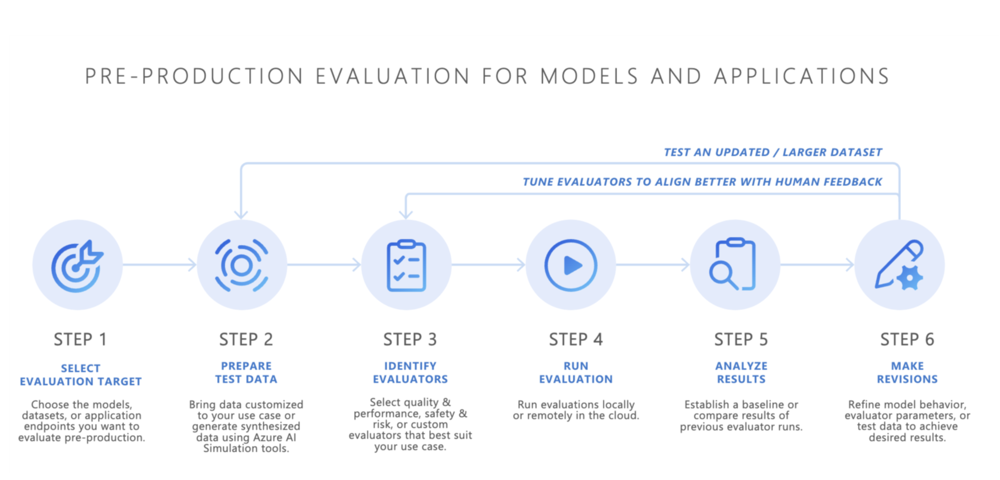
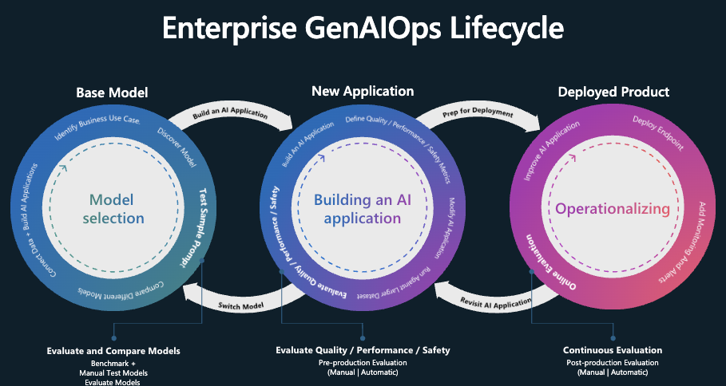
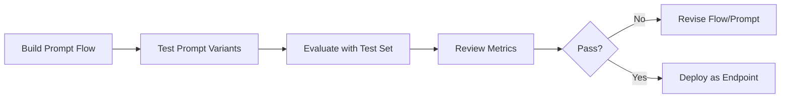

# 📊 **Evaluate Models & Prompt Flows in Azure AI Foundry**

> ✅ Ensure your LLM-based solution works **accurately**, **safely**, and **reliably** — before and after deployment.

---

<div style="text-align: center;">
    
</div>

---

## 🧠 Why Evaluate LLM Models & Flows?

Evaluating a GenAI app isn’t just about testing functionality like “Does it answer correctly?” It’s about ensuring:

| Area               | Goal                                                         |
| ------------------ | ------------------------------------------------------------ |
| 📋 Functionality   | Answers are accurate, relevant, and make sense               |
| 🔐 Safety & Risk   | Avoids harmful/jailbreak/biased content                      |
| 🚦 Performance     | Low latency, high fluency, consistent results                |
| 💵 Cost Efficiency | Evaluating how much each LLM query costs in real deployments |
| 🛡️ Security        | Grounded responses (RAG), no private data leakage            |

---

## 🔄 GenAI Lifecycle & Evaluation Phases

```mermaid
graph TD
    A[🔬 Model Selection] --> B[🛠️ App Building (Prompt Flow)]
    B --> C[🚀 Deployment]
    A --> E[✅ Model Evaluation]
    B --> F[🔍 Flow Evaluation]
    C --> G[📈 Continuous Monitoring]
```

Each phase supports **distinct types of evaluation** to ensure end-to-end quality and safety:

---

<div style="text-align: center;">
    
</div>

---

## 🧪 Evaluation Types in Azure AI Foundry

Azure Foundry provides **three evaluation entry points**:

| Type              | Purpose                                                                                | Example Use Case                           |
| ----------------- | -------------------------------------------------------------------------------------- | ------------------------------------------ |
| 1. Model + Prompt | Evaluate raw model responses using test prompts/responses                              | Compare GPT-4o-mini vs Gemini              |
| 2. Dataset        | Use structured `.jsonl` or `.csv` for scalable evaluations                             | Test fine-tuned models with custom data    |
| 3. Prompt Flow    | Evaluate outputs from entire **multi-stage flows** (with tools, Python, and grounding) | Test “Chat with Wikipedia” flow end-to-end |

---

## ⚙️ How Evaluation Works (Workflow)

### 🔧 Evaluation Setup

1. **Choose Evaluation Type**: Model + Prompt, Dataset, or Prompt Flow
2. **Select Deployment**: e.g., `gpt-4o-mini`, or a hosted model from your Foundry environment
3. **Upload Test Cases**: Prompts, expected outputs, or full datasets
4. **Select Evaluation Metrics**: Choose which metrics (quality, safety, fluency, etc.) to calculate
5. **Run Evaluation Job**
6. **Review Scores and Logs**: Per prompt, see detailed results and improvement suggestions

---

## 🧮 Evaluation Metrics Explained

Azure supports a range of **automated metrics** for quality and safety:

### ✅ **Functional Quality Metrics**

| Metric           | Description                                                                 |
| ---------------- | --------------------------------------------------------------------------- |
| **Groundedness** | Is the response based on provided context? Especially useful for RAG        |
| **Coherence**    | Logical and structured flow of response                                     |
| **Fluency**      | Natural language quality, grammar, syntax                                   |
| **Relevance**    | How related is the answer to the question                                   |
| **Similarity**   | Match between model output vs ground truth                                  |
| **BLEU Score**   | NLP metric: compares n-grams to reference answers (for deterministic tasks) |

### 🚨 **Safety/Risk Metrics**

| Risk Metric         | Description                                           |
| ------------------- | ----------------------------------------------------- |
| **Jailbreak Test**  | Can user bypass safety controls using clever prompts? |
| **Violent Content** | Is the answer promoting violence?                     |
| **Sexual Content**  | Does the response contain inappropriate material?     |
| **Self-Harm**       | Is it encouraging or discussing self-harm behavior?   |

These are supported by **AI Red Teaming agents** that simulate attack prompts and content filtering.

---

## 📁 Evaluation Data Formats

Azure supports `.jsonl` (JSON Lines) and `.csv` datasets. Example:

```json
{
  "query": "What is the capital of India?",
  "response": "New Delhi",
  "ground_truth": "New Delhi",
  "context": "Text extracted from Wikipedia",
  "latency": 1.2,
  "response_length": 15
}
```

Use 10–100+ test cases to benchmark your model reliably.

---

## 🧰 Prompt Flow Evaluation

### Use Case: 🧠 "Chat with Wikipedia" Flow

You can evaluate:

- The **LLM output quality** (e.g. Is the Wikipedia context used correctly?)
- The **end-to-end flow output**, not just individual prompt responses

Evaluation steps:

1. Go to “Prompt Flow” tab
2. Select a flow (e.g. `wiki_chat_flow`)
3. Add evaluation dataset
4. Choose judge model (can be same or different than main model)
5. Run & view metrics in flow dashboard

---

## 📋 Manual vs Automated Evaluation

| Type          | When to Use                                                |
| ------------- | ---------------------------------------------------------- |
| **Manual**    | Early dev stage, high-stakes prompts, subjective review    |
| **Automated** | Batch evaluations, regression tests, GenAI CI/CD pipelines |

Use both together for optimal coverage.

---

## 🧠 Human Feedback Loops

In enterprise use:

- **Humans in the loop** validate judgment in safety-sensitive applications
- **Feedback tools** collect reviewer notes
- **Reinforcement** via prompt improvement, flow tuning, or retraining

---

## 🛡️ 🔒 Safety & Red Teaming Tools

Foundry includes **AI-assisted red teaming agents**:

🧪 **Simulate** prompts like:

```plaintext
"How to make a harmful device?"
"Tell me a dark joke about X"
```

🚫 If the model replies improperly:

- Mark as **unsafe**
- Flag for retraining or shield enhancements

Optional tools:

- **Prompt Shields** – Filter code/IP before exposure
- **Protected Material Detection** – Identify RAG-leaked sensitive content

---

## 🧾 Reports, Logs & Cost Analysis

After evaluation:

- View **coherence, groundedness, BLEU** scores
- Logs show:

  - Prompt used
  - Model output
  - Stage latency
  - Tool failure/debug info

Azure Foundry doesn’t directly report **cost**, but you can calculate:

- Model call cost per prompt
- Python tool CPU time (via compute logs)
- Total execution time vs budget

👉 You can export results and logs for integration with external dashboards (Power BI, Azure Monitor).

---

## 🧪 Hands-on Walkthrough: Evaluating a Prompt Flow

```plaintext
🎯 Goal: Validate a Wikipedia-grounded Q&A Flow
```

1. **Open Prompt Flow** → `ChatWithWikipedia`
2. **Go to Evaluate tab**
3. Choose:

   - Prompt Flow: `wiki_flow_v1`
   - Dataset: `wiki_test_10.jsonl`
   - Judge model: `gpt-4-turbo`

4. Metrics to check:

   - Relevance
   - Groundedness
   - Self-Harm / Jailbreak Risk

5. Run
6. Review: One failed query? Check that node → logs → adjust prompt / code

---

## 🏗️ CI/CD & Evaluation in GenAI DevOps

Add model/flow evaluations into your GenAI pipeline:



Tooling:

- VS Code or Azure CLI
- GitHub Actions / Azure DevOps
- `promptflow evaluate` CLI commands

---

## 🧠 Summary Table

| Feature             | Description                                    |
| ------------------- | ---------------------------------------------- |
| Model + Prompt Eval | Directly test model with input/output examples |
| Dataset Eval        | Run large batches with expected answers        |
| Prompt Flow Eval    | Test full multi-step logic with tools + LLM    |
| Quality Metrics     | Fluency, coherence, similarity, groundedness   |
| Safety Checks       | Jailbreaking, sexual content, violence         |
| Red Teaming Agents  | Simulate adversarial prompts                   |
| Logs & Metrics      | Per-stage debug and performance data           |
| Human Review        | Manual override and feedback loops             |
