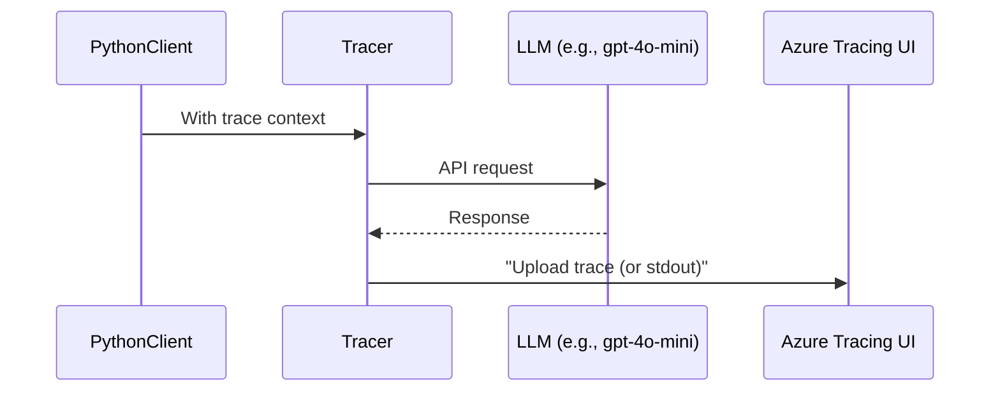

# 🔍 Tracing in Azure AI Foundry (LLM Call Debugging & Monitoring)

**Tracing** in Azure AI Foundry is the backbone of **LLM debugging**, **performance diagnostics**, and **workflow validation**. It allows you to **observe**, **record**, and **analyze** how data and prompts flow between your client, agent, and LLM (Large Language Model) — all in real-time or via stored traces.

---

## 🧠 What is Tracing?

> **Tracing = Debugging for GenAI Apps**

It’s like Wireshark or Fiddler but **LLM-aware**, integrated into Azure AI Foundry Studio, enabling:

- Inspecting **agent → LLM** and **LLM → agent** calls
- Logging full **prompt, response, function calls**, and even performance metrics
- Optional upload to **Azure Monitor (Application Insights)** or **stdout**

🎯 You use tracing to:

- Debug complex agentic workflows
- Identify why a prompt failed or returned poor output
- Validate execution flow across Python + LLM + function tool chains

---

## 🧩 Core Architecture of Tracing

<div align="center">



</div>

> **Tracer** is powered by OpenTelemetry  
> Data is uploaded to **Azure Monitor Logs** (via App Insights) or printed in **JSON format**  
> The **Tracing UI** in Azure AI Foundry decodes and displays all interactions between LLM, tools, and agents

---

## 🛠️ How to Enable Tracing (Setup)

### ✅ Prerequisites

- Azure AI Foundry project setup
- Proper authentication (`az login`, or Azure credentials)
- Required Python packages:

  ```bash
  pip install azure-ai-projects opentelemetry-sdk azure-monitor-opentelemetry
  ```

### 📦 Required Environment Variables

Set these in your `.env` or shell:

```bash
AZURE_OPENAI_DEPLOYMENT_NAME=gpt-4o-mini
AZURE_AI_PROJECT_CONNECTION_STRING=<your-project-conn-string>
AZURE_MONITOR_ENABLE_TRACING=true
AZURE_TRACING_RECORD_CONVERSATION=true
```

---

## 🧪 Tracing Modes

### 🌐 1. Azure Monitor (Application Insights)

- Default and production-ready
- Uploads trace to Azure Monitor
- Viewable in the **Tracing tab** of the Azure AI Foundry Studio
- Includes full request/response logs, timestamps, and trace IDs

```python
from azure.ai.projects import AIProjectClient

project_client = AIProjectClient.from_connection_string(...)
project_client.telemetry.configure_azure_monitor(...)
project_client.telemetry.enable()
```

---

### 🖥️ 2. Console (stdout)

- Local/dev testing
- Outputs raw JSON of LLM interactions to console
- Useful when cloud access is unavailable

```python
project_client.telemetry.enable(destination="sys.stdout")
```

---

## 💡 How Tracing Works

### 📍 Code Changes Required

#### 1. Get tracer object:

```python
from azure.ai.projects.telemetry import trace

with trace.get_tracer("my_trace_file.py").start_as_current_span("my_run"):
    # your agent interaction logic
```

#### 2. Optional decorator (for tool functions):

```python
from azure.ai.projects.telemetry import trace_function

@trace_function
def fetch_weather(...): ...
```

---

## 🧼 Real-Life Example

```python
with trace.get_tracer(__file__).start_as_current_span("weather_agent_run"):
    message = project_client.agents.create_message(...)
    run = project_client.agents.create_and_process_run(...)
    # LLM triggers fetch_weather(), which is traced
    print(run.status)
```

💬 The result:

- You’ll see the **complete thread** of events:

  - Message content: _"What is the weather in New York?"_
  - Function call: `fetch_weather(location='New York')`
  - Response: _"Sunny, 25°C"_
  - LLM reply: _"The weather in New York is sunny with 25°C"_

---

## 👓 Tracing View in Azure AI Foundry

Once the trace is uploaded, go to:

🔹 **Azure AI Foundry Studio → Tracing Tab**

- Each **trace** shows:

  - Scenario/file name
  - API calls: `create_agent`, `create_message`, `get_run`, `delete_agent`, etc.
  - Full request/response bodies in JSON
  - Timestamps, call durations, return values

📁 Uses Application Insights as backend:

```plaintext
Storage type: Application Insights (Logs)
```

---

## ⏱️ Common Pitfalls

| Issue                | Explanation                                                    |
| -------------------- | -------------------------------------------------------------- |
| No trace appears     | Check environment variables and Azure login                    |
| No error but no logs | Missed `AZURE_MONITOR_ENABLE_TRACING` or wrong deployment name |
| Delay in portal      | Traces may take **5-10 minutes** to appear                     |
| Missing call logs    | Only wrapped or explicitly traced functions get logged         |
| Overhead             | Tracing adds slight latency, especially with complex tools     |

---

## 📊 Tracing vs Other Tools

| Feature                         | Tracing in AI Foundry | Wireshark | Fiddler | LangTrace |
| ------------------------------- | --------------------- | --------- | ------- | --------- |
| LLM-Aware                       | ✅                    | ❌        | ❌      | ✅        |
| Prompt/Response view            | ✅                    | ❌        | ❌      | ✅        |
| Visual studio                   | ✅                    | ❌        | ❌      | ✅        |
| OpenTelemetry support           | ✅                    | ❌        | ❌      | ❌        |
| Application Insight Integration | ✅                    | ❌        | ❌      | ❌        |

---

## 📌 Summary

| Concept            | Value                                                            |
| ------------------ | ---------------------------------------------------------------- |
| What is Tracing?   | Debugging LLM/agent traffic in your workflows                    |
| Setup Requirements | Azure AI Foundry project, OpenTelemetry SDK, env vars            |
| UI Location        | Azure AI Foundry Studio → “Tracing” tab                          |
| Best Use Cases     | Agent debugging, prompt validation, performance tuning           |
| Modes              | Azure Monitor (prod) or Console output (dev)                     |
| Exam Tip           | Know how to enable tracing, read logs, and common failure points |
