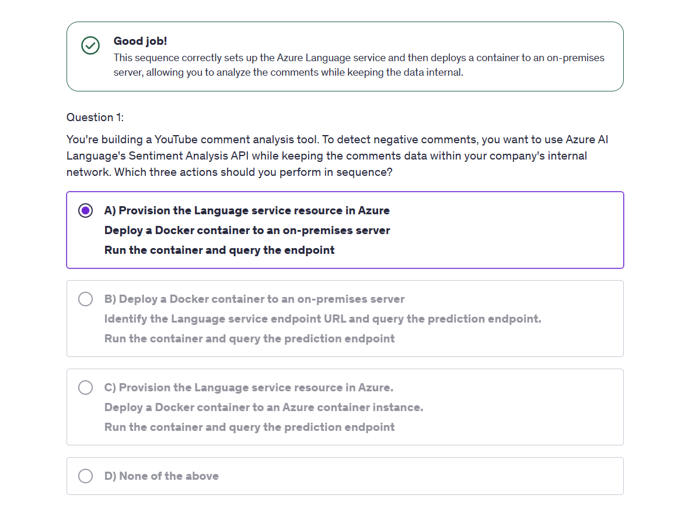
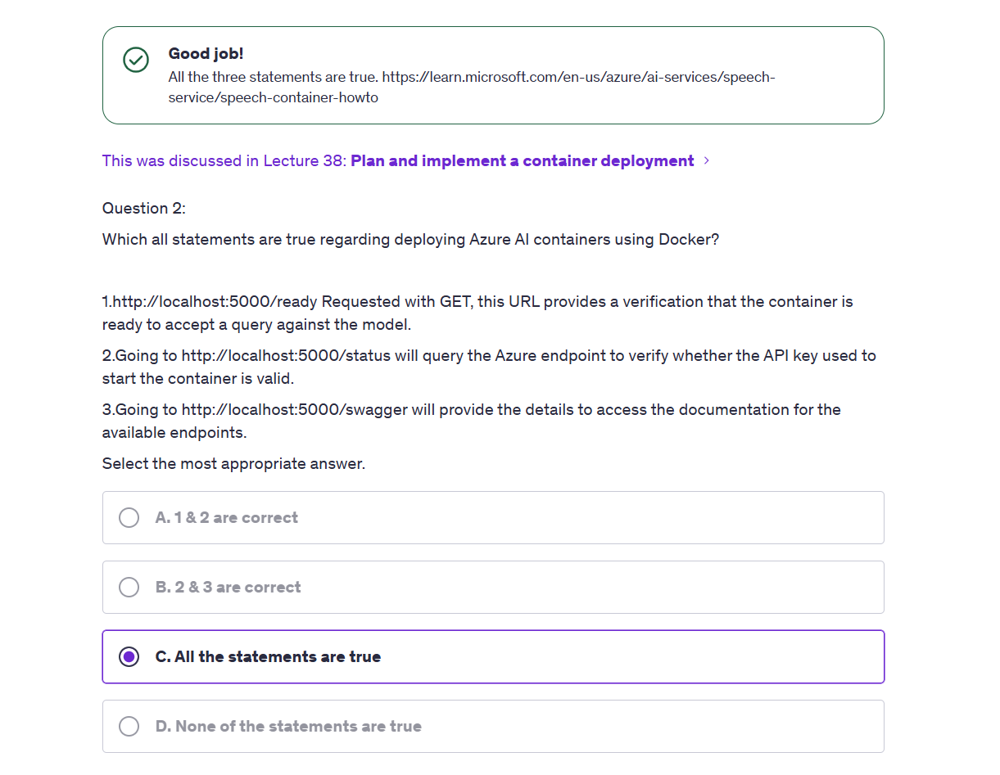

# 📦 Plan and Implement a Container Deployment in Azure AI Services

Running AI models in containers is critical for **low-latency**, **high-security**, or **offline** scenarios. Azure AI Services allow you to deploy models as Docker containers locally or in your own infrastructure, while still tracking usage for billing.

This is especially useful for scenarios like:

- 🔐 Military or defense systems (no internet allowed)
- ⚡ Real-time systems (e.g., missile tracking, CCTV analytics)
- 🧠 Custom GPU acceleration (using more powerful GPUs than Azure provides)

---

## 🔍 #1 Why Use Azure AI Containers Instead of Cloud API?

### ✅ Use Azure AI Containers When:

| Scenario                                            | Why It Matters                                                           |
| --------------------------------------------------- | ------------------------------------------------------------------------ |
| 🧠 You need **data privacy**                        | Data stays inside your private network; no Internet needed for inference |
| ⚡ You need **low latency**                         | No round trip to Azure cloud = faster real-time performance              |
| 🎮 You want **hardware control**                    | Use your own high-performance GPUs (e.g., RTX 4090, H100, Jetson)        |
| 🛰️ You're in an **offline** or isolated environment | Defense, medical, industrial edge, etc.                                  |

---

## 💰 #2 How Does Azure Bill You for Local Container Usage?

Even though the **model runs locally**, **Azure still bills you** based on the number of API calls (inference requests).

### 📦 Here's How:

- You must **provision a Language/Speech/Vision resource in Azure**
- Then pass its **Billing Endpoint + API Key** to the Docker container
- The container **calls home to Azure** _only for billing/accounting_, not for inference

```bash
docker run \
  Billing="https://<region>.api.cognitive.microsoft.com" \
  ApiKey="abc123..."
```

⛔ **If the machine is fully offline**, you'd need a **special offline licensing agreement** with Microsoft.

---

## 🤔 #3 Why Not Just Use Cloud API with Private Endpoint?

Azure also allows you to access AI Services over **Private Link**, which exposes a **private IP** inside your VNet.

### 🔁 Container vs. Private Link:

| Feature                     | Azure AI Container                        | Azure AI with Private Link               |
| --------------------------- | ----------------------------------------- | ---------------------------------------- |
| 📍 Location                 | Your server / edge device / on-prem       | Azure-hosted, accessed via private IP    |
| 📶 Internet Required        | ❌ (only billing required)                | ❌ Fully internal using Azure networking |
| 💾 Model Execution          | Locally inside Docker                     | Runs in Azure cloud                      |
| 🎮 GPU Control              | ✅ Use your own GPUs                      | ❌ GPU choice is managed by Azure        |
| ⚙️ Infrastructure Ownership | Yours                                     | Azure-managed                            |
| 📦 Use Case                 | Real-time, edge, defense, custom hardware | Secure enterprise integration            |

🧠 Use Private Link when:

- You want **secure access to Azure AI**, but don’t need custom GPUs or offline processing
- You're okay with Azure managing infrastructure, but want no public internet exposure

🧠 Use Containers when:

- You need **100% local execution**, **custom performance**, or **compliance isolation**

---

## 🧰 #4 Requirements

- Docker installed on Linux (recommended)
- Azure Subscription and Speech resource created
- Billing endpoint + API key from Azure

---

## 🛠️ #5 Step-by-Step: Container Deployment Walkthrough

### 🧲 Step 1: Pull the Official Azure Cognitive Services Container Image

```bash
docker pull mcr.microsoft.com/azure-cognitive-services/speechservices/neural-text-to-speech
```

This image includes the TTS model and all dependencies.

---

### 🧪 Step 2: Run the Container

```bash
docker run --rm -it -d -p 5000:5000 \
  mcr.microsoft.com/azure-cognitive-services/speechservices/neural-text-to-speech \
  Eula=accept \
  Billing="https://<your-region>.api.cognitive.microsoft.com/" \
  ApiKey="<your-api-key>" \
  Logging:Console:LogLevel:Default=Information
```

- `-d` runs it in the background
- Port `5000` is exposed
- Billing info is still required even though execution is local

---

### ✅ Step 3: Confirm Container is Running

```bash
curl http://localhost:5000/          # Returns welcome message
curl http://localhost:5000/status    # Returns running status
curl http://localhost:5000/ready     # Confirms API key and readiness
```

---

### 🧠 Step 4: Send a Local API Request (Text-to-Speech)

```bash
curl -v -X POST "http://localhost:5000/cognitiveservices/v1" \
     -H "Content-Type: application/ssml+xml" \
     -H "X-MICROSOFT-OutputFormat: riff-48khz-16bit-mono-pcm" \
     --data @speech.xml --output output.wav
```

- Use `SSML` (Speech Synthesis Markup Language) in `speech.xml`
- Output is saved to `output.wav`

---

### 🧪 Bonus: Call Container with Python SDK

```python
import azure.cognitiveservices.speech as speechsdk

speech_config = speechsdk.SpeechConfig(host="http://localhost:5000")
audio_config = speechsdk.audio.AudioOutputConfig(filename="bbg.wav")
speech_synthesizer = speechsdk.SpeechSynthesizer(speech_config=speech_config, audio_config=audio_config)

ssml = open("/home/jo/speech.xml").read()
speech_synthesizer.speak_ssml_async(ssml).get()
```

Use your local endpoint in the SDK instead of Azure.

---

## 📦 #6 Common Use Cases

### 🛰️ Real-Time Object Detection

Run Azure Spatial Analysis containers for instant webcam-based analytics with no cloud latency.

### 🧬 Medical Devices

Run Form Recognizer locally on radiology reports inside hospital networks.

### 🧠 LLMs + Edge Devices

Deploy language understanding locally using high-end GPUs like RTX 4090.

---

## 💡 #7 Notes & Tips

- Containers require billing endpoints even when run offline.
- You can scale them manually or orchestrate with Kubernetes.
- Use ACR (Azure Container Registry) for your own image hosting.
- Performance is hardware-dependent: use GPU VMs or edge boxes for best results.

---

## 🔒 #8 Security Considerations

| Concern             | Mitigation                           |
| ------------------- | ------------------------------------ |
| Data Privacy        | Keep all inference in local network  |
| Unauthorized Access | Bind container to internal IP only   |
| Network Egress      | Block internet if billing is prepaid |

---

## 📚 #9 References

- [Text to Speech Container Docs](https://learn.microsoft.com/en-us/azure/ai-services/speech-service/speech-container-howto)
- [REST TTS API](https://learn.microsoft.com/en-us/azure/ai-services/speech-service/rest-text-to-speech?tabs=streaming)
- [Azure Container Instances](https://learn.microsoft.com/en-us/azure/container-instances/)
- [Azure Container Registry (ACR)](https://learn.microsoft.com/en-us/azure/container-registry/)

## 📒 Notes

### ⁉️ Question 1

<div style="text-align: center;">
    
</div>

---

**Scenario**:

- You want to do **Sentiment Analysis**
- Data must stay **on-premises**
- But you still want to use Azure's pretrained Language model

**✅ Option A is correct:**

- **Provision the Language service in Azure** > **Deploy Docker container to an on-premises server** > **Run container and query the endpoint**

**❌ Why Others Are Wrong:**

- **B**: It skips provisioning the Language service (needed for billing)
- **C**: Deploys to Azure — but the **requirement** is to keep data internal!
- **D**: Incorrect — Option A satisfies everything

---

### ⁉️ Question 2

<div style="text-align: center;">
    
</div>

---

The correct answer is ✅ **C. All the statements are true** — and here’s **why**, with a breakdown of each statement:

Each of the three endpoints plays a different role:

| Endpoint   | Purpose                                       |
| ---------- | --------------------------------------------- |
| `/ready`   | Confirm container is live and model is loaded |
| `/status`  | Verify billing API key with Azure             |
| `/swagger` | Developer UI and API reference                |

These are all part of Azure’s [official container guidance](https://learn.microsoft.com/en-us/azure/ai-services/speech-service/speech-container-howto).
