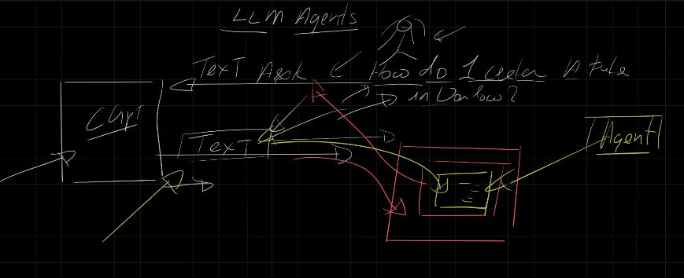
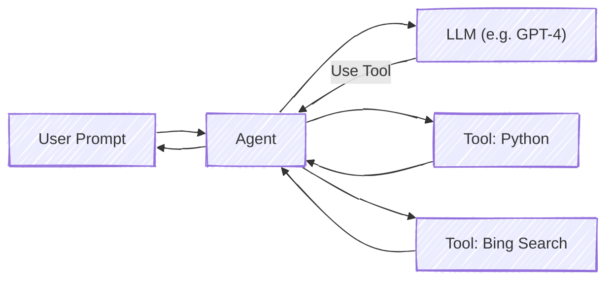

# 🤖 AI Agents Explained (LLM Agents with Real-World Power)

**AI agents (a.k.a. LLM Agents)** are the most powerful evolution in the AI universe. We're not talking about fancy terms. We're talking about:

> Giving LLMs the ability to **act** in the real world — not just talk.  
> llm doesn't do things, but agent can

Let’s dive in and unpack the full story: what agents are, how they work, why they matter, and what your AI systems can do with them.

---

    

---

## ⚛️ What Is an AI Agent?

A regular LLM (like GPT-4) is like a **smart librarian**:

- You ask it a question
- It responds with information

But an **AI Agent** is like a **smart assistant**:

- You ask it to do something
- It actually gets it done

> 🔎 "How do I create a file on Windows?"  
> ✅ GPT gives you a command.  
> ❌ But YOU have to copy it, open terminal, run it.  
> ✨ With an agent? It **executes it for you**.

**That’s the leap.** Agents transform LLMs from responders to actors.

---

## ⚙️ The Agent Architecture (Concept Diagram)

---

### ⚡ What Happens Internally:

1. User asks a question
2. Agent sends it to LLM
3. LLM decides: "I need to call a tool"
4. Agent picks the right tool (Python, Search, API)
5. Executes it
6. Returns **real** result back to user

This is called the **ReAct loop** (Reason + Act).

---

## 🥒 Real-World Agent Examples

### ✏️ Example 1: Creating a File in Windows

- You ask: "How do I create a file in Windows?"
- LLM says: `echo Hello > myfile.txt`
- Agent runs it in your terminal
- ✨ File is actually created — without you lifting a finger

---

### 🔢 Example 2: Solving a Hard Logic Problem

> “How many R’s are in the word strawberry?”

Most LLMs hallucinate: **"2"**, **"4"**, even **"5"**

🪩 Why? Because LLMs don't "see" characters — they see **tokens**.

✅ But with an agent:

- LLM generates a Python script to count R's
- Agent runs it
- ✔️ Gets the correct answer: **3**

> LLM = Brain.  
> Agent = Hands.

---

### 🌎 Example 3: Current Events

- You ask: "Who is the President of the U.S.?"
- LLM was trained on 2023 data. Might say: "Biden"
- But it’s 2025. Agent uses **Bing Search tool**.
- Result: correct, real-time, up-to-date info.

---

## 💡 Agent Capabilities in Practice

### ⚙ Tools AI Agents Can Use:

- 🔢 Python interpreter (Code Interpreter)
- 🔍 Bing / Google Search (for real-time facts)
- ✉️ REST APIs (via OpenAPI spec)
- 🏠 Azure Functions
- 📦 File Access (CSV, PDF, etc.)
- ⚖️ Azure AI Search (RAG)

You can configure **custom agents** that:

- Have access to **specific data sources**
- Can call **external APIs**
- Are scoped to **secure environments**

---

## 🏠 Creating an Agent (Conceptually)

When you build an agent (e.g. in Azure OpenAI Studio or LangChain), you define:

- ✏️ **Instructions**: What kind of assistant is it?
- ⚖️ **Tools**: What tools it can use
- 📖 **Knowledge**: What files, links, or search indices it can access
- 🦯 **Model Settings**: Temperature, Top-p, etc.

Once deployed, you interact with it via:

- Chat (web interface)
- API endpoint
- Embedded iframe on your site

---

## 🚧 Agents vs Plain LLM vs RAG vs Fine-Tuning

| Feature        | Plain LLM | RAG     | Fine-Tuned Model | Agent                |
| -------------- | --------- | ------- | ---------------- | -------------------- |
| Output only    | ✅ Yes    | ✅ Yes  | ✅ Yes           | ❌ No (it **acts**)  |
| Real-time data | ❌ No     | ✅ Yes  | ❌ No            | ✅ Yes (search tool) |
| Code execution | ❌ No     | ❌ No   | ✅ Maybe         | ✅ Yes (Code tool)   |
| Uses APIs      | ❌ No     | ✅ Yes  | ✅ Maybe         | ✅ Yes               |
| Autonomy       | ❌ None   | ❌ None | ✅ Patterned     | ✅ Dynamic actions   |

---

## 📈 Implications

Agents are going to **change the game** for:

- 🎓 Education: Create content, grade papers, tutor live
- 💼 White-Collar Work: Click buttons, generate reports, answer emails
- ♻️ Automation: Run end-to-end business tasks
- ⚖️ Government: Automate license checks, case reviews
- 🚀 DevOps: Deploy infra, fix bugs, run tests

> They are not just smart assistants. They are **digital workers**.

---

## ✅ Final Thought

AI agents give the LLM **eyes, hands, and memory**.

- LLM knows what to do.
- Agents know **how to do it**.

The age of passive LLMs is ending.
The age of **agents** is just beginning.
