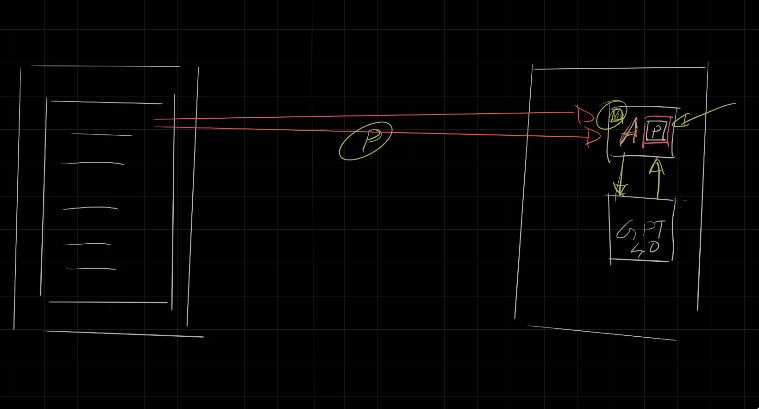
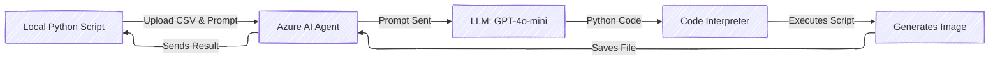

# 🤖 Build a Smart AI Agent to Generate Charts from CSV in Azure

Welcome to the **hands-on lab** of modern AI! In this demo, we're going to teach an AI agent how to read a CSV 📑, create a filtered bar chart 📈, and send it back to us — all in **Azure AI Studio** using **Azure OpenAI + Agents**.

It’s not just a demo — it’s a **mind-shift** into how AI agents can do real-world work like analysts, coders, and artists. But without coffee ☕ or complaints.

---

<div style="text-align: center;">
    
</div>

---

## 🧠 What This Demo Proves

This agent solution is an applied version of the “agent” concept — where **LLMs don’t just answer your prompts**, but actually **do stuff for you**.

In this case, it:

1. Reads a .csv file (uploaded to Azure)
2. Filters the data for the “TRANSPORTATION” sector
3. Plots a bar chart for operating profit
4. Sends you back the resulting `.png` image

And it does all this by:

- Writing a Python script 🐍 (by itself!)
- Executing it using the Code Interpreter 🧰
- Returning the image 🎨 as a downloadable file

Let’s dive into how this works!

---

## 🚀 Step-by-Step: Agent-Powered Data Visualization

### 🏗️ 1. Create the AI Project in Azure AI Foundry

Before anything, you need to **log in to Azure** using:

```bash
az login
```

Then, get the **project connection string** from Azure AI Foundry > Hub > Project > Overview.

Example format:

```env
<HostName>;<AzureSubscriptionId>;<ResourceGroupName>;<HubName>
```

We use this connection string to create an `AIProjectClient` in Python, which lets you talk to your Azure AI services.

```python
project_client = AIProjectClient.from_connection_string(
    credential=DefaultAzureCredential(),
    conn_str="your_connection_string_here"
)
```

---

### 📂 2. Upload the CSV File

The `.csv` file is uploaded as a resource **inside the Agent container**:

```python
file = project_client.agents.upload_file_and_poll(
    file_path="nifty_500_quarterly_results.csv",
    purpose=FilePurpose.AGENTS
)
```

This is like giving the Agent a "memory stick" 💾 to work with.

---

### 🧰 3. Create the Code Interpreter Tool

This is the **real magic wand** 🪄. You’re giving your Agent the power to not just think — but to code and execute that code.

```python
code_interpreter = CodeInterpreterTool(file_ids=[file.id])
```

> Think of this like installing Python on the Agent's brain and pointing it to your `.csv`.

---

### 🧑‍💼 4. Create the Agent (aka "The Analyst")

Now we create the Agent using GPT-4o-mini and bind it with the Code Interpreter tool:

```python
agent = project_client.agents.create_agent(
    model="gpt-4o-mini",
    name="my-agent",
    instructions="You are a helpful agent",
    tools=code_interpreter.definitions,
    tool_resources=code_interpreter.resources
)
```

✔️ You’ve just created a **custom AI analyst** that understands your orders and has the power to act.

---

### 🧵 5. Create a Thread and Send a Message (Prompt)

This is like opening a chat window with the Agent.

```python
thread = project_client.agents.create_thread()
message = project_client.agents.create_message(
    thread_id=thread.id,
    role="user",
    content="Could you please create a bar chart in the TRANSPORTATION sector for the operating profit from the uploaded CSV file and provide the file to me?"
)
```

The Agent takes this message, figures out the task, and writes Python to solve it.

---

### 🧠 6. Run the Agent Workflow

This is where all the work happens — internally, Azure spins up the LLM, runs the Python code on the Code Interpreter tool, and returns results.

```python
run = project_client.agents.create_and_process_run(
    thread_id=thread.id,
    agent_id=agent.id
)
```

If everything goes well:

```python
Run finished with status: succeeded
```

---

### 🖼️ 7. Receive and Save the Image

The generated chart is now ready! Let’s save it:

```python
for image_content in messages.image_contents:
  project_client.agents.save_file(file_id=image_content.image_file.file_id, file_name="chart.png")
```

> 🎉 Now you have a beautifully filtered bar chart ready for presentation or reporting.

---

### 🧹 8. Cleanup: Delete File, Thread, Agent

Don’t forget to clean up and save your Azure credits:

```python
project_client.agents.delete_file(file.id)
project_client.agents.delete_agent(agent.id)
project_client.agents.delete_thread(thread.id)
```

---

## 🎯 What’s Really Happening Behind the Scenes?

Here’s a visual breakdown:

---



---

🤖 **LLM** writes code (like a developer)  
🧰 **Code Interpreter** runs it (like a terminal)  
📦 **Agent** orchestrates everything

---

## 💥 Why This Is Awesome

- ⛔ Agent != LLM.
- 👉 Agent = LLM + Tools + Memory + Autonomy.
- ✅ Zero hallucination — image is created from actual CSV data
- 🔍 Grounded — 100% factual, not "guessed"
- 🧑‍🏫 Replaces repetitive analyst tasks (Excel → chart)

---

## 🛑 Key Insight

> **LLMs don’t “do” — they “think.”**
>
> **Agents do.**

That’s the philosophical separation. Agents are **the hands and legs of LLMs** — the bridge between ideas and action.

In this case, you didn’t have to:

- Write a single line of data parsing code
- Plot anything with matplotlib
- Even open Excel

💡 The agent did it all from your intent.

---

## 💬 Final Word

This is only the beginning. Imagine building:

- 💼 Executive assistants that file reports
- 🧪 Research bots that analyze scientific papers
- 🎥 Media agents that edit video clips
- 📚 Tutors that teach students with diagrams

...all from text prompts and tools.

Welcome to the **Agentic Future™** 😈.
