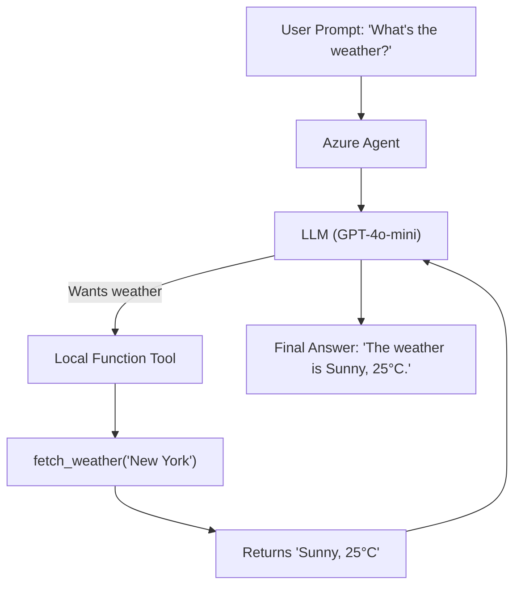

# 🧠⚙️ Building a Local Agent That Executes Functions in Your Laptop Using Azure OpenAI Agents

Welcome to the next exciting installment of **LLM Agents in Action™**. Last time, we asked the agent to create a chart from CSV using Python **on Azure's remote compute** (fancy!). This time, we are flipping the table:

> “Let’s keep it **local**. Laptop-local. Like ramen and sweatpants.”

In this demo, you’ll build an Azure AI Agent that talks to **LLMs in the cloud** but runs **your own Python functions right on your laptop**, in your Python runtime.

Sounds small?

🧠 Think again — this is the very foundation of integrating **LLMs with local environments, devices, or apps**. It’s how ChatGPT could one day launch your game, shut down your PC, or even schedule your laundry robot.

---

## 🎯 What This Demo Shows

Instead of asking the model to generate code or produce results with its inbuilt tools like a code interpreter, we’re **connecting it to a real Python function**:

```python
fetch_weather("New York")
```

This function is:

- Locally defined 🧑‍💻
- Locally executed ⚙️
- Dynamically called by the LLM 🤖
- Handled via an **Agent** in Azure AI Foundry 🛠️

In short: we create a bot that _thinks_ in the cloud but _acts_ on your machine.

---

## 📋 Use Case Example: Weather Bot 🌤️

Let’s say you want a bot that responds like:

> "The weather in New York is Sunny, 25°C."

Instead of the model hallucinating the weather, we **delegate this job** to a real local function, which returns reliable (mocked) data.

This is how agents create magic — pairing **smart LLMs** with **actual capabilities**.

---

## 🏗️ Full Workflow Overview



---

## 🧱 Full Breakdown of the Demo

### 🔐 1. Connect to Azure AI Foundry Project

We start by logging into Azure and retrieving your Foundry Project connection string:

```python
project_client = AIProjectClient.from_connection_string(
    credential=DefaultAzureCredential(),
    conn_str="xxxxxxxxxxxxxxxx"
)
```

This lets your code authenticate and create agents, threads, and messages in the Foundry.

---

### 🧰 2. Define Local Function (Your Tool)

This is your **tool** that the agent will use:

```python
def fetch_weather(location: str) -> str:
    mock_weather_data = {
        "New York": "Sunny, 25°C",
        "London": "Cloudy, 18°C",
        "Tokyo": "Rainy, 22°C"
    }
    return json.dumps({"weather": mock_weather_data.get(location, "Not available")})
```

You can plug in **real APIs** (e.g., OpenWeatherMap) if you want, but here it’s mocked for simplicity.

Wrap it inside a Tool:

```python
from azure.ai.projects.models import FunctionTool
functions = FunctionTool(user_functions)
```

And group the tools using:

```python
from azure.ai.projects.models import ToolSet
toolset = ToolSet()
toolset.add(functions)
```

---

### 🤖 3. Create the Agent (LLM + Local Power)

Now, create an **agent** that combines:

- The LLM (GPT-4o-mini)
- The toolset (with your local functions)

```python
agent = project_client.agents.create_agent(
    model="gpt-4o-mini",
    name="weather-agent",
    instructions="You are a helpful weather bot. Use the provided function to answer weather questions.",
    toolset=toolset
)
```

🔥 Boom! You now have an LLM that can reach into your Python code and call real functions.

---

### 🧵 4. Create the Thread and Message

Send a prompt to the agent like:

```python
message = project_client.agents.create_message(
    thread_id=thread.id,
    role="user",
    content="Hello, send an email with the datetime and weather information in New York?",
)
```

> Behind the scenes, the LLM will realize it needs weather data, and call your `fetch_weather()` function locally.

---

### 🏃‍♂️ 5. Run the Agent Workflow

Trigger the agent:

```python
run = project_client.agents.create_and_process_run(thread_id=thread.id, agent_id=agent.id)
```

You’ll see in your debugger (with a breakpoint!) that the function gets hit:

```bash
>>> BREAKPOINT HIT: fetch_weather()
```

LLM called your Python function — without any hardcoded `if prompt == “weather”:` logic. It inferred intent from the user prompt!

---

### 📤 6. View the Final Response

The message from the agent:

```json
"The weather in New York is sunny with a temperature of 25°C."
```

> Auto-magically created, formatted, and returned. No templates. No APIs. Pure agent-driven power.

---

## 💡 Agent Local Function Use Cases

This pattern is insanely useful:

| 🧩 Use Case        | What Agent Can Call                 |
| ------------------ | ----------------------------------- |
| Smart Home Control | `turn_on_lights()`, `lock_doors()`  |
| System Monitoring  | `check_cpu_usage()`, `disk_space()` |
| Email Automation   | `send_email()`, `generate_report()` |
| File Automation    | `rename_files()`, `zip_logs()`      |
| App Scripting      | `launch_game()`, `shutdown_pc()`    |

It’s the **foundation** for personal assistants like Jarvis. 💡

---

## 🧨 Debugging: The Library Trap

You might have done everything right... but suddenly:

> ❌ Boom. Error. Nothing works. Agent fails silently or errors out.

Here’s what happened in our case:

### 🪲 Root Cause:

The latest version of the `azure-ai-projects` Python package was **broken** (`b9`). Our code only worked on `b8`.

### 🛠️ Fix:

```bash
pip uninstall azure-ai-projects
pip install azure-ai-projects==1.0.0b8
```

> 👿 Welcome to the "DLL Hell" of AI — now with more tokens.

LLMs couldn’t help debug this. The only solution: manual comparison of working vs non-working environments.

---

## 💡 Key Differences from Code Interpreter Agent

| Feature               | Code Interpreter Agent   | Local Function Agent             |
| --------------------- | ------------------------ | -------------------------------- |
| Execution Environment | Azure Compute (Remote)   | Local Laptop (Your Python Env)   |
| Tool Type             | Code Interpreter         | User-defined Functions           |
| Use Case              | Data Analysis, Plots     | Custom Actions, APIs, Automation |
| Setup Complexity      | Medium                   | Medium–Low                       |
| Debug Flexibility     | Medium (Cloud logs only) | High (Use breakpoints, logs)     |

---

## 🏁 Conclusion

You just built an **AI-powered bot** that:

- Talks to a hosted LLM in Azure
- Understands user intent
- Dynamically calls a real Python function on your machine
- Responds intelligently — combining AI smarts with local context

This architecture is perfect for:

- ✉️ Smart email agents
- 🏠 Home automation
- 🎮 Game script assistants
- 🔐 Local system control

And best of all — it's all real. No hallucination, no made-up answers. Just grounded, reliable **agentic intelligence**.
