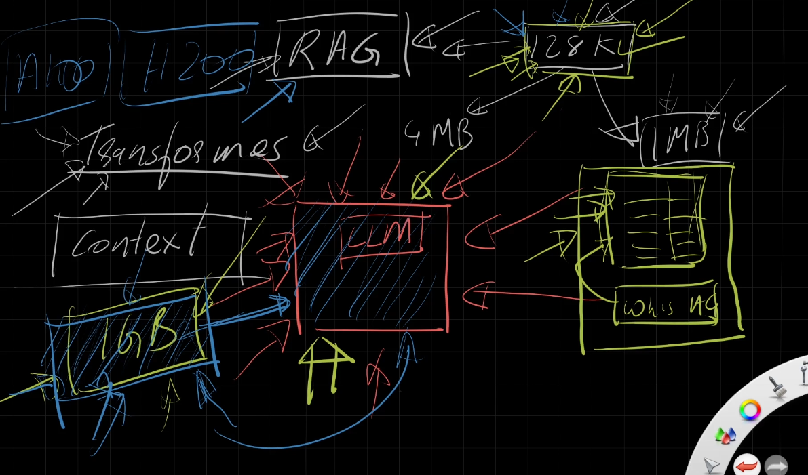
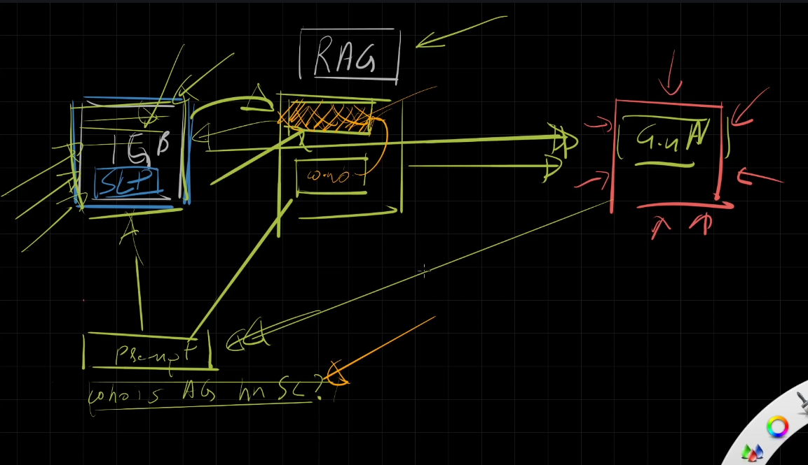
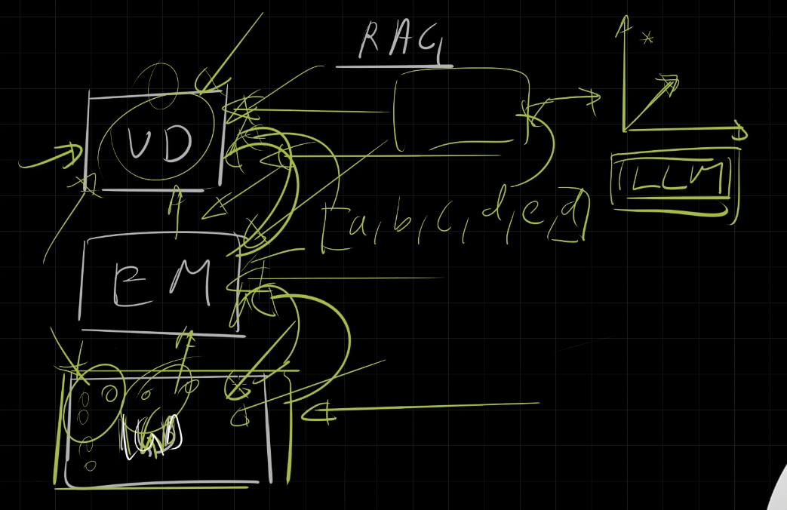
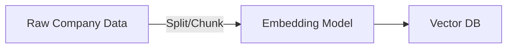
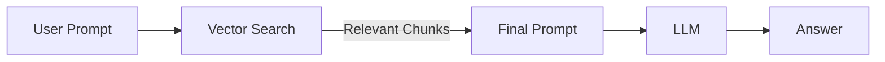

# 🧠 Retrieval-Augmented Generation (RAG) – The LLM Superpower

> “Your LLM doesn’t know everything. Especially not your private data. So… how do you make it look smart on things it has never seen? That’s where RAG comes in.”

---

## 🧨 1. The Real Problem with LLMs

<div style="text-align: center;">
    
</div>

---

### ❌ LLMs don’t _remember anything_

LLMs (like ChatGPT, GPT-4, Gemini) are **stateless**. Every time you talk to them, they forget what you said before unless you explicitly **feed it back**.

> They are like brilliant goldfish. Smart, but forgetful.

### 🧱 Context Window is Small

Even if you give it past data manually, it can **only remember so much** at once.

| Model  | Max Tokens | Approx Size |
| ------ | ---------- | ----------- |
| GPT-4  | 128K       | \~300 pages |
| Gemini | 1M tokens  | \~2.5 MB    |

> 🚨 But real-world data — books, PDFs, enterprise reports — are easily **100s of MBs or even GBs**.

### 🧾 Example:

You ask:
**“What is the job title of Anand George at SourceLens?”**

But the LLM doesn’t know Anand or SourceLens. It’s **not in its training data**.

So you try:

```txt
Context:
Anand George is a Solutions Architect at SourceLens.
Question:
What is the job title of Anand George?
```

Boom. 💥 It works!
But this is **manual**, and you can only shove so much into 128K tokens.

---

## 🧠 2. Options to Make LLMs “Smarter” on Private Data

### Option 1: 🧪 Fine-Tuning

> Train the LLM on your private data.

---

<div style="text-align: center;">
    
</div>

---

**BUT:**

- ❌ Needs GPUs (A100, H100 — \$\$\$)
- ❌ Hard to validate results
- ❌ Risky with private data
- ❌ Not all LLMs (like OpenAI) allow full fine-tuning

### Option 2: ✅ Retrieval-Augmented Generation (RAG)

> ✨ Feed relevant chunks of knowledge dynamically into the LLM’s short-term memory.

---

<div style="text-align: center;">
    
</div>

---

## 🔄 3. What is RAG?

> **RAG = Retrieval-Augmented Generation**
> Instead of shoving your entire database into the prompt (which would break the context limit), RAG…

- 🔍 **Retrieves only the relevant parts** of your knowledge base
- ➕ **Augments the prompt** with those relevant bits
- 💬 Sends it to the LLM
- 🧠 The LLM answers using that data (not just its pretraining)

---

### 📚 Scenario:

You have 1GB of private company data (employee records, policy documents, internal wiki).
You ask:

> "What is the job title of Anand George at SourceLens?"

RAG will:

1. Use embeddings to search and fetch only the 2–3 lines related to Anand George.
2. Attach that to your question.
3. Ask the LLM using:

   ```txt
   Context: Anand George is a Solutions Architect...
   Question: What is Anand’s title?
   ```

4. LLM answers:

   > "Anand George is a Solutions Architect at SourceLens."

🎯 And you didn’t overload the context window or fine-tune anything.

---

## 🧠 4. How Does RAG Work? (Step-by-Step)

### 🔧 Step 1: Index the Knowledge (Preprocessing)

| Component          | Description                                                                            |
| ------------------ | -------------------------------------------------------------------------------------- |
| 📂 Private Data    | PDFs, Docs, JSON, text from internal systems                                           |
| 🧠 Embedding Model | Converts text into vector format (e.g. OpenAI `text-embedding-3-small`)                |
| 🗃️ Vector DB       | Stores the vectors with searchable metadata (e.g. Azure AI Search, Pinecone, Weaviate) |



---

### 🤖 Step 2: Runtime (Query Time)

| Component        | Description                                    |
| ---------------- | ---------------------------------------------- |
| 📝 User Prompt   | Natural language question                      |
| 🔍 Vector Search | Search Vector DB to find relevant chunks       |
| 🧵 Final Prompt  | Prompt = original question + retrieved context |
| 🤖 LLM Response  | The LLM generates answer based on context      |



---

## 🛠️ 5. Tools Used in Azure for RAG

| Component         | Azure Service                          |
| ----------------- | -------------------------------------- |
| Embedding Model   | Azure OpenAI Embeddings                |
| Vector Database   | Azure AI Search (vector store enabled) |
| Prompt Management | Azure AI Foundry / Prompt Flow         |
| LLM               | Azure OpenAI GPT-4, GPT-4o             |

---

## 🧩 6. RAG = Retrieval + Prompt Engineering

- ✅ Dynamic
- ✅ Cheap
- ✅ Secure (you keep your data private)
- ✅ No fine-tuning or retraining
- ✅ Supports complex pipelines (multi-hop, multi-doc)

---

## ⚠️ 7. Limitations of RAG

| Problem               | Description                                            |
| --------------------- | ------------------------------------------------------ |
| 🔎 Poor embeddings    | If your embeddings are low quality → bad retrieval     |
| 📉 Chunking matters   | If your chunks are too small/large → retrieval suffers |
| 💬 Prompting matters  | Bad prompts won’t help even with good data             |
| 🤖 Hallucination risk | LLM might still hallucinate if context is unclear      |

---

## 📌 Summary: Why RAG is a Game-Changer

| Feature               | Benefit                           |
| --------------------- | --------------------------------- |
| 🔍 Smart Search       | Pulls only what’s needed          |
| 💡 Context-Aware      | Answers are grounded in real data |
| ⚡ Fast & Dynamic     | No need to retrain models         |
| 🛡️ Private by Default | Keeps your internal data safe     |
