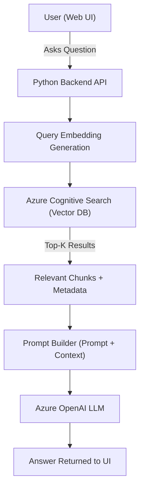

# 📚 **RAG in Action: Azure Search + OpenAI Demo**

Welcome to the most production-ready Retrieval Augmented Generation (RAG) demo using Azure Search and Azure OpenAI. This hands-on example isn't just a toy project—it's enterprise-ready, scalable, and tightly integrated with Azure services. If you ever wondered how to implement RAG in the real world, this is your golden reference.

---

## 🧠 What Is This Demo?

This project is a complete **end-to-end RAG application** powered by:

- 🧾 **Private documents** (PDF, TXT, Word, etc.)
- 📦 **Vector embeddings** using OpenAI embeddings API
- 🧠 **LLMs** via Azure OpenAI
- 🔍 **Azure AI Search** as the vector database
- 💻 **Web app** frontend + Python backend
- 🔧 **Azure Developer CLI (azd)** for full deployment

✅ It supports **multi-modal documents**, works well with **large datasets**, and helps you build **ChatGPT-like UI** for your own content.

---

## 🛠️ Why Is It Important?

This isn’t just a sample app—it solves real-world LLM problems:

| Problem                              | Solution from this Demo                         |
| ------------------------------------ | ----------------------------------------------- |
| ❌ LLMs don't know your private data | ✅ RAG augments prompts with real company data  |
| ❌ Context limit (e.g., 128K tokens) | ✅ Retrieve only relevant chunk per query       |
| ❌ Hallucination risk                | ✅ Ground answers using vector-based retrieval  |
| ❌ Fine-tuning cost/effort           | ✅ No fine-tuning—keep your model static + safe |

---

## 🧱 Architecture Breakdown

<div align="center">



</div>

---

- ✅ **Embedding**: The question is embedded using OpenAI’s embedding model
- ✅ **Search**: Query embedding is compared with indexed vector embeddings in Azure AI Search
- ✅ **Prompt Augmentation**: Top relevant chunks are injected into a prompt
- ✅ **LLM**: The prompt is sent to Azure OpenAI’s model (e.g., GPT-35, GPT-4)
- ✅ **Answer**: Final grounded answer shown in the chat UI

---

## 📂 Project Structure

```bash
azure-search-openai-demo/
├── app/                  # Frontend (TypeScript / React)
├── backend/              # Python FastAPI app (main LLM logic)
├── data/                 # Folder for your private files (PDFs etc.)
├── embeddings/           # Embedding & document parser logic
├── infra/                # Bicep templates for Azure resources
├── scripts/              # Helpers to prep docs, index them
└── azure.yaml            # Main entry point for azd up
```

---

## 🏁 Step-by-Step: From Zero to RAG

### 📥 Step 1: Clone the Repo

```bash
git clone https://github.com/Azure-Samples/azure-search-openai-demo
cd azure-search-openai-demo
```

### 🔧 Step 2: Prerequisites

Install:

- Azure CLI + Bicep
- Azure Developer CLI (`azd`)
- Python 3.10+
- Node.js 18+
- VS Code (optional but useful)

Login:

```bash
azd auth login
```

### 🚀 Step 3: One Command Deployment

```bash
azd up
```

⏱ This command does **everything**:

- Provisions: Azure OpenAI, Azure AI Search, App Services, Blob Storage, Document Intelligence, Log Analytics
- Deploys: Frontend + Backend
- Uploads: Sample data from `/data/` folder
- Indexes: Converts documents into embeddings and loads into Azure Search

🧾 Example Docs:

```bash
/data/contoso-electronics/
├── faq.pdf
├── company-policies.txt
├── user-manual.docx
```

---

## 🧠 Behind the Scenes

### 📌 Embedding Phase

When you upload files:

1. They are parsed using [Azure Document Intelligence](https://learn.microsoft.com/en-us/azure/ai-services/document-intelligence/overview)
2. Each text chunk (e.g., 500 tokens) is passed to OpenAI Embedding model (`text-embedding-ada-002`)
3. The resulting vectors are stored in Azure AI Search as vector fields

📦 This is done using this code in `backend/ingest.py`:

```python
response = openai_client.embeddings.create(input=text_chunk, model="text-embedding-ada-002")
vector = response.data[0].embedding
```

---

### 🔍 Query Phase

When a user asks:

1. Query is embedded using the same model
2. Azure AI Search uses **vector similarity** (cosine similarity) to retrieve top-k relevant chunks
3. These chunks are combined with the query in a **custom prompt template**
4. LLM is called with that augmented prompt

✅ **No fine-tuning needed**  
✅ **Fully grounded on your data**  
✅ **Prevents hallucination**

---

## 🖼️ Real Chat UI Preview

You get a browser UI like ChatGPT with:

- 📝 Chat interface
- 📎 File source for each answer
- 🔍 Settings: Search mode, temperature, top-k results
- ✅ Grounded answers from your own documents!

---

## 🔬 Search Modes Supported

The app supports 4 query methods:

| Mode                   | Description                                         |
| ---------------------- | --------------------------------------------------- |
| 🔍 **Semantic Search** | Uses Azure Cognitive Search's deep meaning matching |
| 🧠 **Vector + Text**   | Hybrid of keyword and embedding match               |
| 🔎 **Vector Only**     | Pure vector similarity                              |
| 🧾 **Text Only**       | Traditional keyword search                          |

Set this in UI or config.

---

## 📉 Cost Considerations

| Resource                 | Comment                                |
| ------------------------ | -------------------------------------- |
| 💸 Azure Search          | Most expensive (use S tier carefully)  |
| 🔤 Embeddings            | Charged per token                      |
| 💬 OpenAI Model          | Charged per prompt + completion tokens |
| ☁️ App Service           | Minor                                  |
| 📄 Document Intelligence | Cost if parsing complex docs           |

🧼 Shut down with:

```bash
azd down
```

---

## 💡 Examples

### 🗂️ Example 1: Query From Private PDF

- You upload `employee-handbook.pdf`
- User asks: _"What is the policy for medical leave?"_
- RAG extracts only that section
- Prompt is:

```text
Context:
<Medical Leave policy chunk>

Question:
What is the policy for medical leave?
```

- LLM responds with the exact answer, citing the PDF!

---

### 🧪 Example 2: Grounded Chat With Multiple Sources

Uploaded:

- `faq.pdf`
- `training-guide.txt`

Query:

> “What’s the process for setting up new IoT devices?”

Response:

- Combines relevant paragraphs from both docs
- Shows references below the answer
- Prevents hallucinating instructions

---

## ⚠️ Known Gotchas

| Problem                          | Fix                             |
| -------------------------------- | ------------------------------- |
| 🔁 Old .md5 files not cleaned    | Manually delete `/data/*.md5`   |
| 🧠 Embedding not triggered       | `azd down` then `azd up` again  |
| ⛔️ “I don't know” response      | Means no chunk passed threshold |
| 💸 Cost spikes from Azure Search | Use Free or Basic SKU for dev   |

---

## 🔐 Security & Governance

✅ Your data is:

- Stored in Azure Blob Storage
- Indexed securely via Azure AI Search
- Embedded using OpenAI embedding model (no fine-tuning)
- Never sent to model hosts unless you explicitly call it

🔒 Enable:

- Private networking (VNET + Private Link)
- Role-based access (RBAC)
- Logging & alerting via Azure Monitor

---

## 🧵 Summary: Why This RAG Demo Rocks

| Feature              | Value                          |
| -------------------- | ------------------------------ |
| 🔧 Turnkey Setup     | Deploy with `azd up`           |
| 🧠 Custom Knowledge  | Works with your PDFs, docs     |
| 🔍 Smart Retrieval   | Vector + semantic ranking      |
| 📱 Beautiful UI      | ChatGPT-style interface        |
| 🔒 Secure & Scalable | Azure-native, enterprise-ready |
