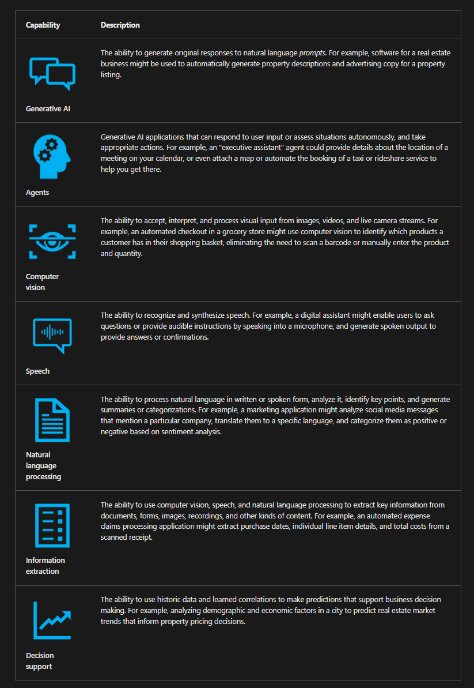
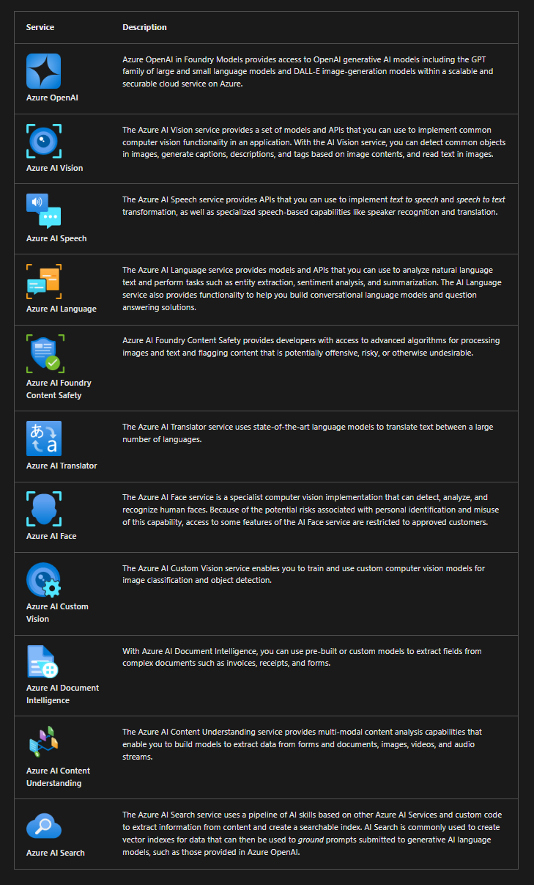
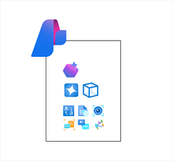
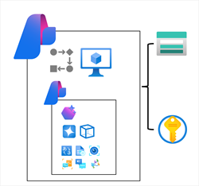

# Prepare Azure Ai Development

## What is ai

    

## Azure AI services

    

## Azure AI services resources

To use Azure AI services, you create one or more Azure AI resources in an Azure subscription and implement code in client applications to consume them. In some cases, AI services include web-based visual interfaces that you can use to configure and test your resources - for example to train a custom image classification model using the Custom Vision service you can use the visual interface to upload training images, manage training jobs, and deploy the resulting model.

> 👉 Note
>
> You can provision Azure AI services resources in the Azure portal (or by using BICEP or ARM templates or the Azure command-line interface) and build applications that use them directly through various service-specific APIs and SDKs. However, as we'll discuss later in this module, in most medium to large-scale development scenarios it's better to provision Azure AI services resources as part of an Azure Foundry hub - enabling you to centralize access control and cost management, and making it easier to manage shared resource usage based on AI development projects.

## Single service or multi-service resource?

Most Azure AI services, such as Azure AI Vision, Azure AI Language, and so on, can be provisioned as standalone resources, enabling you to create only the Azure resources you specifically need. Additionally, standalone Azure AI services often include a free-tier SKU with limited functionality, enabling you to evaluate and develop with the service at no cost. Each standalone Azure AI resource provides an endpoint and authorization keys that you can use to access it securely from a client application.

Alternatively, you can provision a multi-service Azure AI services resource that encapsulates the following services in a single Azure resource:

- Azure OpenAI
- Azure AI Speech
- Azure AI Vision
- Azure AI Language
- Azure AI Foundry Content Safety
- Azure AI Translator
- Azure AI Document Intelligence
- Azure AI Content Understanding

## Regional availability

Some services and models are available in only a subset of Azure regions. Consider service availability and any regional quota restrictions for your subscription when provisioning Azure AI services. Use the [product availability table](https://azure.microsoft.com/en-gb/explore/global-infrastructure/products-by-region/table) to check regional availability of Azure services. Use the [model availability table](https://learn.microsoft.com/en-us/azure/ai-services/openai/concepts/models?tabs=global-standard%2Cstandard-chat-completions#model-summary-table-and-region-availability?azure-portal=true) in the Azure OpenAI documentation to determine regional availability for Azure OpenAI models.

## Cost

Azure AI services are charged based on usage, with different pricing schemes available depending on the specific services being used. As you plan an AI solution on Azure, use the [Azure AI services pricing](https://azure.microsoft.com/en-gb/pricing/details/cognitive-services) documentation to understand pricing for the AI services you intend to incorporate into your application. You can use the [Azure pricing calculator](https://azure.microsoft.com/en-gb/pricing/calculator) to estimate the costs your expected usage will incur.

## Azure AI Foundry

Azure AI Foundry is a platform for AI development on Microsoft Azure. While you can provision individual Azure AI services resources and build applications that consume them without it, the project organization, resource management, and AI development capabilities of Azure AI Foundry makes it the recommended way to build all but the most simple solutions.

Azure AI Foundry provides the Azure AI Foundry portal, a web-based visual interface for working with AI projects. It also provides the Azure AI Foundry SDK, which you can use to build AI solutions programmatically.

In Azure AI Foundry, you manage the resource connections, data, code, and other elements of the AI solution in projects. There are two kinds of project:

### 1.Foundry projects

    

Foundry projects are associated with an Azure AI Foundry resource in an Azure subscription. Foundry projects provide support for Azure AI Foundry models (including OpenAI models), Azure AI Foundry Agent Service, Azure AI services, and tools for evaluation and responsible AI development.

An Azure AI Foundry resource supports the most common AI development tasks to develop generative AI chat apps and agents. In most cases, using a Foundry project provides the right level of resource centralization and capabilities with a minimal amount of administrative resource management. You can use Azure AI Foundry portal to work in projects that are based in Azure AI Foundry resources, making it easy to add connected resources and manage model and agent deployments.

### 2.Hub-based projects

    

Hub-based projects are associated with an Azure AI hub resource in an Azure subscription. Hub-based projects include an Azure AI Foundry resource, as well as managed compute, support for prompt Flow development, and connected Azure storage and Azure key vault resources for secure data storage.

Azure AI hub resources support advanced AI development scenarios, like developing Prompt Flow based applications or fine-tuning models. You can also use Azure AI hub resources in both Azure AI Foundry portal and Azure Machine learning portal, making it easier to work on collaborative projects that involve data scientists and machine learning specialists as well as developers and AI software engineers

## Developer tools and SDKs

You can develop AI applications using many common programming languages and frameworks, including Microsoft C#, Python, Node, TypeScript, Java, and others. When building AI solutions on Azure, some common SDKs you should plan to install and use include:

- The `Azure AI Foundry SDK`, which enables you to write code to connect to Azure AI Foundry projects and access resource connections, which you can then work with using service-specific SDKs.
- `Azure AI Services SDKs` - AI service-specific libraries for multiple programming languages and frameworks that enable you to consume Azure AI Services resources in your subscription. You can also use Azure AI Services through their `REST APIs`.
- The `Azure AI Foundry Agent Service`, which is accessed through the Azure AI Foundry SDK and can be integrated with frameworks like `AutoGen` and `Semantic Kernel` to build comprehensive AI agent solutions.
- The `Prompt Flow` SDK, which you can use to implement orchestration logic to manage prompt interactions with generative AI models.

## Responsible AI

It's important for software engineers to consider the impact of their software on users, and society in general; including considerations for its responsible use. When the application is imbued with artificial intelligence, these considerations are particularly important due to the nature of how AI systems work and inform decisions; often based on probabilistic models, which are in turn dependent on the data with which they were trained.

### 1. Fairness

AI systems should treat all people fairly. For example, suppose you create a machine learning model to support a loan approval application for a bank. The model should make predictions of whether or not the loan should be approved without incorporating any bias based on gender, ethnicity, or other factors that might result in an unfair advantage or disadvantage to specific groups of applicants.

Fairness of machine learned systems is a highly active area of ongoing research, and some software solutions exist for evaluating, quantifying, and mitigating unfairness in machine learned models. However, tooling alone isn't sufficient to ensure fairness. Consider fairness from the beginning of the application development process; carefully reviewing training data to ensure it's representative of all potentially affected subjects, and evaluating predictive performance for subsections of your user population throughout the development lifecycle.

### 2. Reliability and safety

AI systems should perform reliably and safely. For example, consider an AI-based software system for an autonomous vehicle; or a machine learning model that diagnoses patient symptoms and recommends prescriptions. Unreliability in these kinds of system can result in substantial risk to human life.

As with any software, AI-based software application development must be subjected to rigorous testing and deployment management processes to ensure that they work as expected before release. Additionally, software engineers need to take into account the probabilistic nature of machine learning models, and apply appropriate thresholds when evaluating confidence scores for predictions.

### 3. Privacy and security

AI systems should be secure and respect privacy. The machine learning models on which AI systems are based rely on large volumes of data, which may contain personal details that must be kept private. Even after models are trained and the system is in production, they use new data to make predictions or take action that may be subject to privacy or security concerns; so appropriate safeguards to protect data and customer content must be implemented.

### 4. Inclusiveness

AI systems should empower everyone and engage people. AI should bring benefits to all parts of society, regardless of physical ability, gender, sexual orientation, ethnicity, or other factors.

One way to optimize for inclusiveness is to ensure that the design, development, and testing of your application includes input from as diverse a group of people as possible.

### 5. Transparency

AI systems should be understandable. Users should be made fully aware of the purpose of the system, how it works, and what limitations may be expected.

For example, when an AI system is based on a machine learning model, you should generally make users aware of factors that may affect the accuracy of its predictions, such as the number of cases used to train the model, or the specific features that have the most influence over its predictions. You should also share information about the confidence score for predictions.

When an AI application relies on personal data, such as a facial recognition system that takes images of people to recognize them; you should make it clear to the user how their data is used and retained, and who has access to it.

### 6. Accountability

People should be accountable for AI systems. Although many AI systems seem to operate autonomously, ultimately it's the responsibility of the developers who trained and validated the models they use, and defined the logic that bases decisions on model predictions to ensure that the overall system meets responsibility requirements. To help meet this goal, designers and developers of AI-based solution should work within a framework of governance and organizational principles that ensure the solution meets responsible and legal standards that are clearly defined.
