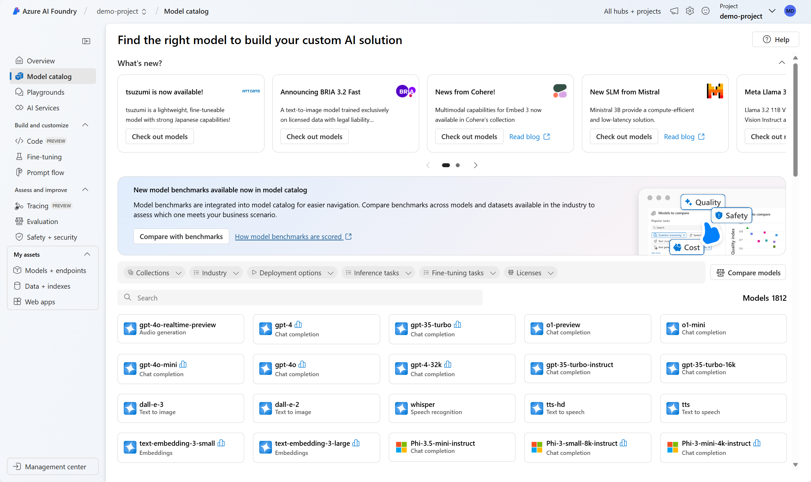
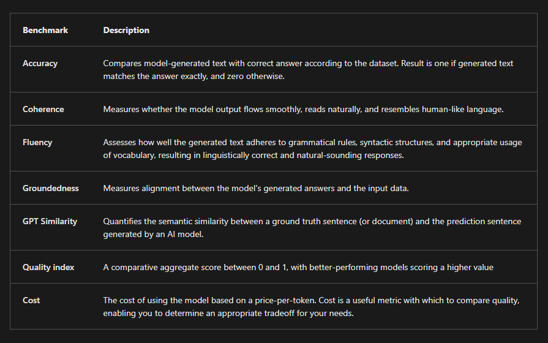

# Choose models from the model catalog in Azure AI Foundry portal

The model catalog in Azure AI Foundry provides a central repository of models that you can browse to find the right language model for your particular generative AI use case.

## language models Types

Beyond text-based AI, some models are multi-modal, meaning they can process images, audio, and other data types alongside text. Models like GPT-4o and Phi3-vision are capable of analyzing and generating both text and images. Multi-modal models are useful when your application needs to process and understand images, such as in computer vision or document analysis. Or when you want to build an AI app that interacts with visual content, such as a digital tutor explaining images or charts.

If your use case involves generating images, tools like DALL·E 3 and Stability AI can create realistic visuals from text prompts. Image generation models are great for designing marketing materials, illustrations, or digital art.

Another group of task-specific models are embedding models like Ada and Cohere. Embeddings models convert text into numerical representations and are used to improve search relevance by understanding semantic meaning. These models are often implemented in Retrieval Augmented Generation (RAG) scenarios to enhance recommendation engines by linking similar content.

## Specialize with regional and domain-specific models

Certain models are designed for specific languages, regions, or industries. These models can outperform general-purpose generative AI in their respective domains. For example:

Core42 JAIS is an Arabic language LLM, making it the best choice for applications targeting Arabic-speaking users.
Mistral Large has a strong focus on European languages, ensuring better linguistic accuracy for multilingual applications.
Nixtla TimeGEN-1 specializes in time-series forecasting, making it ideal for financial predictions, supply chain optimization, and demand forecasting.
If your project has regional, linguistic, or industry-specific needs, these models can provide more relevant results than general-purpose AI.

## How do I select the best model for my use case?

To select the best language model for you use case, you need to decide on what criteria you're using to filter the models. The criteria are the necessary characteristics you identify for a model. Four characteristics you can consider are:

- **Task type**: What type of task do you need the model to perform? Does it include the understanding of only text, or also audio, or video, or multiple modalities?
- **Precision**: Is the base model good enough or do you need a fine-tuned model that is trained on a specific skill or dataset?
- **Openness**: Do you want to be able to fine-tune the model yourself?
- **Deployment**: Do you want to deploy the model locally, on a serverless endpoint, or do you want to manage the deployment infrastructure?

## Filter models for performance

You can evaluate your model performance at different phases, using various evaluation approaches.

When you're exploring models through the Azure AI Foundry model catalog, you can use model benchmarks to compare publicly available metrics like coherence and accuracy across models and datasets. These benchmarks can help you in the initial exploration phase, but give little information on how the model would perform in your specific use case.

To evaluate how a selected model performs regarding your specific requirements, you can consider manual or automated evaluations. Manual evaluations allow you to rate your model's responses. Automated evaluations include traditional machine learning metrics and AI-assisted metrics that are calculated and generated for you.

When you evaluate a model’s performance, it's common to start with manual evaluations, as they quickly assess the quality of the model’s responses. For more systematic comparisons, automated evaluations using metrics like `precision`, `recall`, and `F1 score` based on your own ground truth offer a faster, scalable, and more objective approach.
