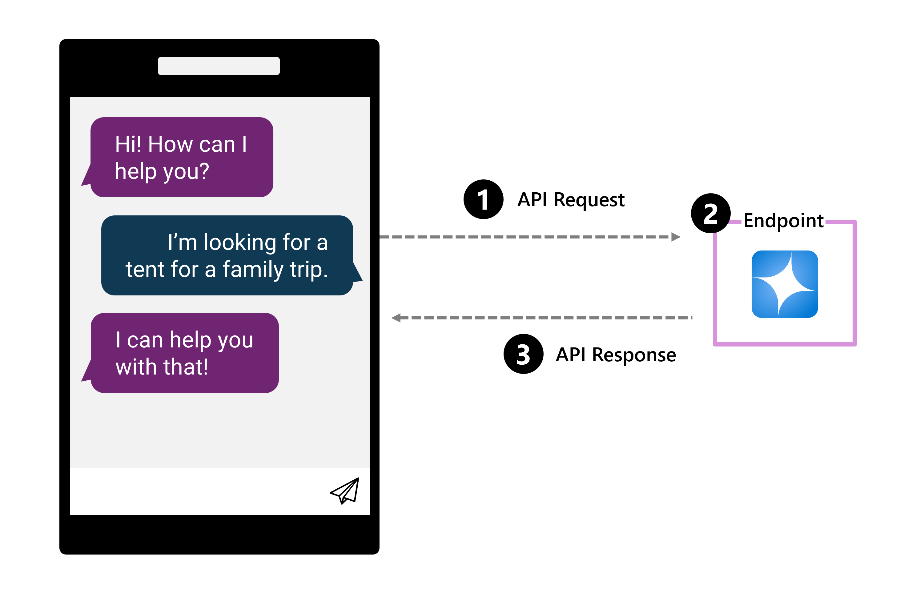
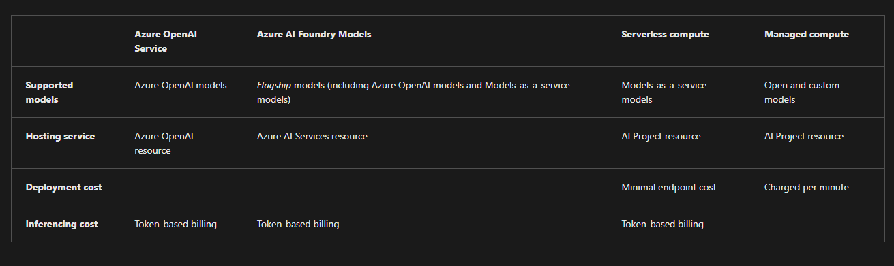

# Deploy a model to an endpoint

When you develop a generative AI app, you need to integrate language models into your application. To be able to use a language model, you need to deploy the model. Let's explore how to deploy language models in the Azure AI Foundry, after first understanding why to deploy a model.

## Why deploy a model?

You train a model to generate output based on some input. To get value out of your model, you need a solution that allows you to send input to the model, which the model processes, after which the output is visualized for you.

With generative AI apps, the most common type of solution is a chat application that expects a user question, which the model processes, to generate an adequate response. The response is then visualized to the user as a response to their question.



When you deploy a language model from the model catalog with the Azure AI Foundry, you get an endpoint, which consists of a target URI (Uniform Resource Identifier) and a unique key. For example, a target URI for a deployed GPT-3.5 model can be:

```link
https://ai-aihubdevdemo.openai.azure.com/openai/deployments/gpt-35-turbo/chat/completions?api-version=2023-03-15-preview
```

**The URI includes:**

- Your AI hub name, for example ai-aihubdevdemo.
- Your deployed model name, for example gpt-35-turbo.
- The task for the model, for example chat/completion.

To protect your deployed models, each deployment comes with a key. You're only authorized to send and receive requests to and from the target URI, if you also provide the key to authenticate.

## Deploy a language model with Azure AI Foundry

When you deploy a language model with Azure AI Foundry, you have several types available, which depend on the model you want to deploy.

You can deploy:

1. [`Azure OpenAI models`](https://learn.microsoft.com/en-us/azure/ai-services/openai/concepts/models?tabs=global-standard%2Cstandard-chat-completions) like GPT-3.5 and GPT-4 with Azure OpenAI service and Azure AI model inference.
1. Third-party models like DeepSeek-R1 as [`Models as a Service`](https://learn.microsoft.com/en-us/azure/ai-foundry/model-inference/concepts/models) as part of Azure AI model inference or with [serverless APIs](https://learn.microsoft.com/en-us/azure/ai-foundry/concepts/foundry-models-overview#content-safety-for-models-deployed-via-serverless-apis?azure-portal=true).
1. Open and custom models like models from Hugging Face with your own [`user-managed compute`](https://learn.microsoft.com/en-us/azure/ai-foundry/concepts/foundry-models-overview#availability-of-models-for-deployment-as-managed-compute?azure-portal=true).

---


