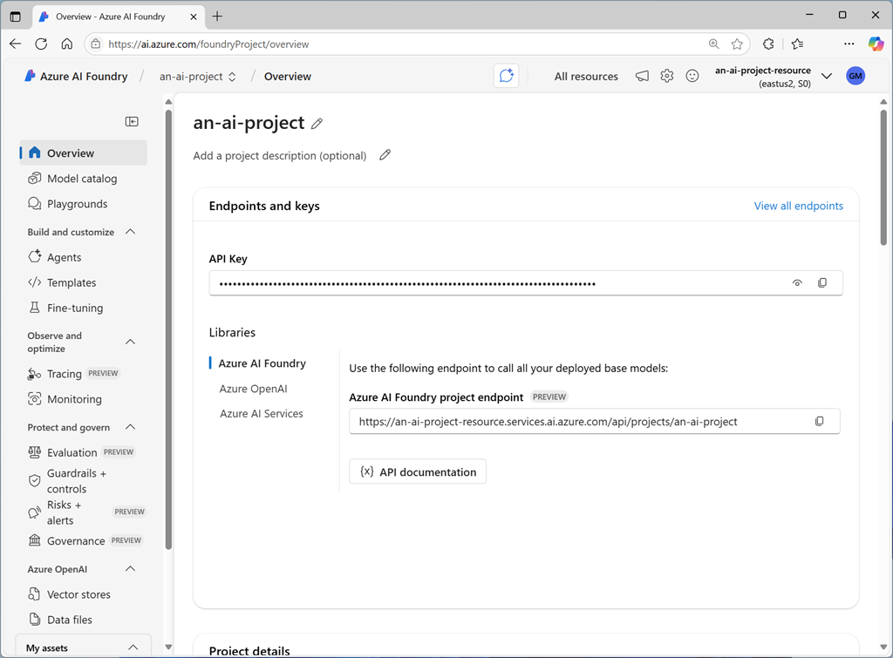
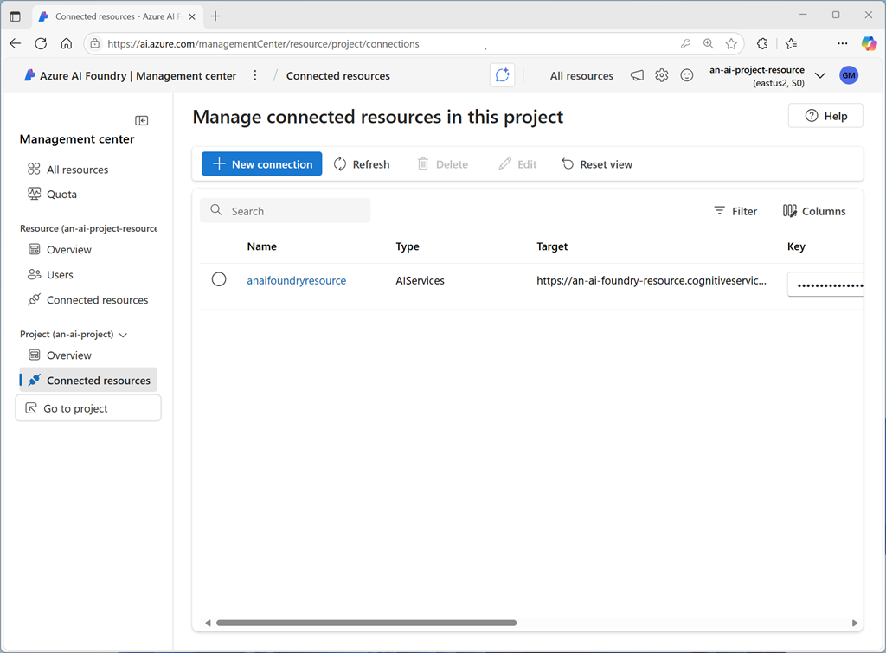

# What is the Azure AI Foundry SDK?

The Azure AI Foundry SDK is a set of packages and services designed to work together to enable developers to write code that uses resources in an Azure AI Foundry project. With the Azure AI Foundry SDK, developers can create applications that connect to a project, access the resource connections and models in that project, and use them to perform AI operations, such as sending prompts to a generative AI model and processing the responses

## Installing SDK packages

The core package for working with projects in the Azure AI Foundry SDK is the Azure AI Projects library, which enables you to connect to an Azure AI Foundry project and access the resources defined within it.

To use the Azure AI Projects library in Python, you can use the pip package installation utility to install the azure-ai-projects package from PyPi:

```bash
pip install azure-ai-projects
```

## Using the SDK to connect to a project

The first task in most Azure AI Foundry SDK code is to connect to an Azure AI Foundry project. Each project has a unique endpoint, which you can find on the project's Overview page in the Azure AI Foundry portal.



You can use the project endpoint in your code to create an AIProjectClient object, which provides a programmatic proxy for the project.

```python
from azure.identity import DefaultAzureCredential
from azure.ai.projects import AIProjectClient
...

project_endpoint = "https://......"
project_client = AIProjectClient(
    credential=DefaultAzureCredential(),
    endpoint=project_endpoint)
```

> 📒 Note: The code uses the default Azure credentials to authenticate when accessing the project. To enable this authentication, in addition to the azure-ai-projects package, you need to install the azure-identity package:

```bash
pip install azure-identity
```

## project connections

Each Azure AI Foundry project includes connected resources, which are defined both at the parent (Azure AI Foundry resource or hub) level, and at the project level. Each resource is a connection to an external service, such as Azure storage, Azure AI Search, Azure OpenAI, or another Azure AI Foundry resource.



With the Azure AI Foundry SDK, you can connect to a project and retrieve connections; which you can then use to consume the connected services.

### `AIProjectClient` object in Python

The AIProjectClient object in Python has a connections property, which you can use to access the resource connections in the project. Methods of the connections object include:

- `connections.list()`: Returns a collection of connection objects, each representing a connection in the project. You can filter the results by specifying an optional connection_type parameter with a valid enumeration, such as `ConnectionType.AZURE_OPEN_AI`.
- `connections.get(connection_name, include_credentials)`: Returns a connection object for the connection with the name specified. If the include_credentials parameter is True (the default value), the credentials required to connect to the connection are returned - for example, in the form of an API key for an Azure AI services resource.
