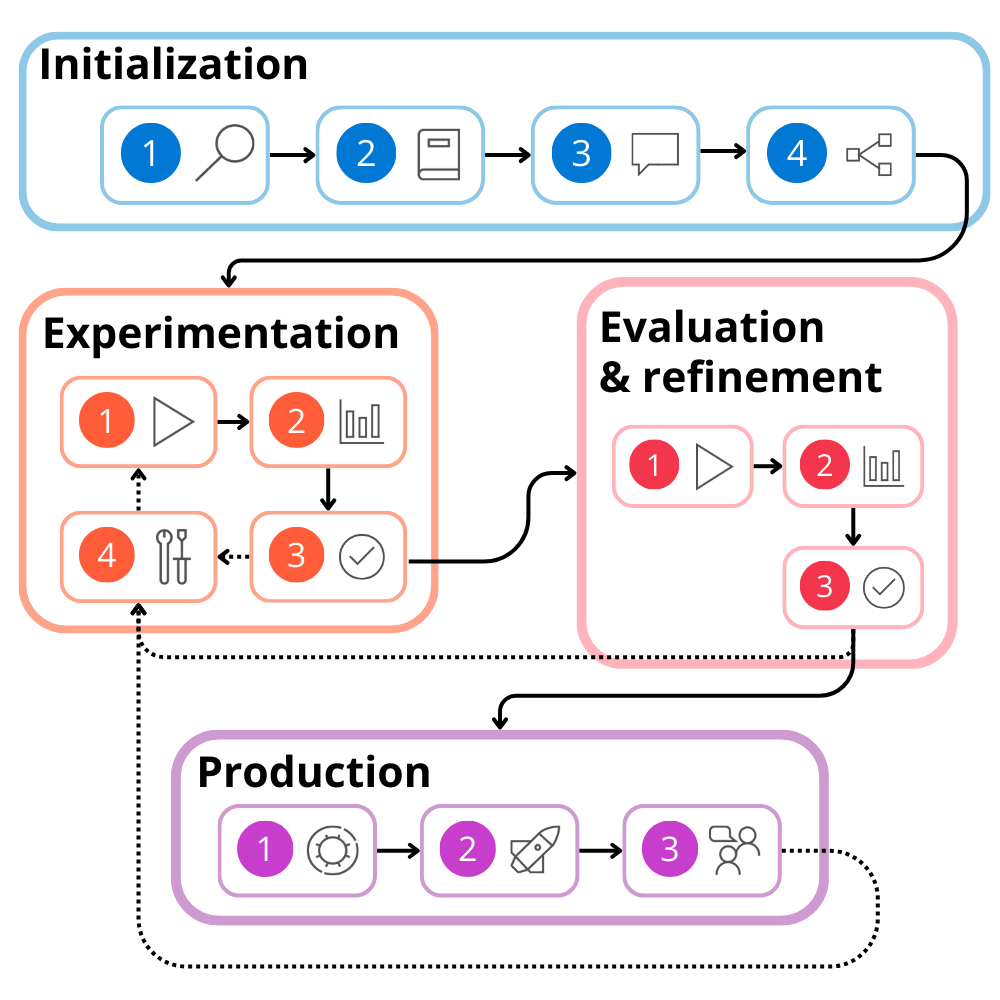

# Development lifecycle of a large language model (LLM) app

The lifecycle consists of the following stages:

## 1. Initialization

1. Define the objective
1. Collect a sample dataset
1. Build a basic prompt
1. Design the flow

## 2. Experimentation

The experimentation phase is an iterative process during which you

- (1) run the flow against a sample dataset. You then
- (2) evaluate the prompt's performance. If you're
- (3) satisfied with the result, you can move on to evaluation and refinement. If you think there's room for improvement, you can
- (4) modify the flow by changing the prompt or flow itself.

## 3. Evaluation and refinement

When you're satisfied with the output of the flow that classifies news articles, based on the sample dataset, you can assess the flow's performance against a larger dataset.

Once your LLM application appears to be robust and reliable in handling various scenarios, you can decide to move the LLM application to production.

## 4. Production

1. **Optimize** the flow that classifies incoming articles for efficiency and effectiveness.
1. **Deploy** your flow to an endpoint. When you call the endpoint, the flow is triggered to run and the desired output is generated.
1. **Monitor** the performance of your solution by collecting usage data and end-user feedback. By understanding how the application performs, you can improve the flow whenever necessary.
