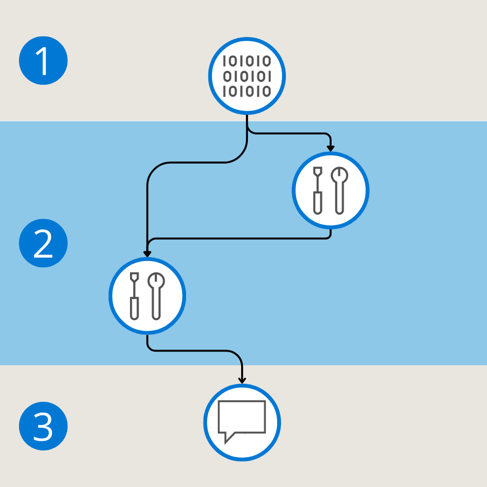
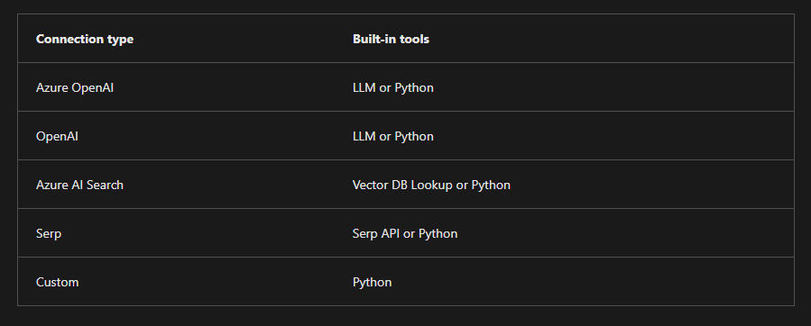

# Prompt flow

Prompt flow takes a prompt as input, which in the context of LLMs, refers to the query provided to the LLM application to generate a response. It's the text or set of instructions given to the LLM application, prompting it to generate output or perform a specific task.

For example, when you want to use a text generation model, the prompt might be a sentence or a paragraph that initiates the generation process. In the context of a question-answering model, the prompt could be a query asking for information on a particular topic. The effectiveness of the prompt often depends on how well it conveys the user's intent and the desired outcome.

Prompt flow allows you to create flows, which refers to the sequence of actions or steps that are taken to achieve a specific task or functionality. A flow represents the overall process or pipeline that incorporates the interaction with the LLM to address a particular use case. The flow encapsulates the entire journey from receiving input to generating output or performing a desired action.

## Prompt flow Components

Prompt flow is a feature within Azure AI Foundry that allows you to author flows.

Flows are executable workflows often consist of three parts:

1. **Inputs:** Represent data passed into the flow. Can be different data types like strings, integers, or boolean.
1. **Nodes:** Represent tools that perform data processing, task execution, or algorithmic operations.
1. **Outputs:** Represent the data produced by the flow.

> Similar to a pipeline, a flow can consist of multiple nodes that can use the flow's inputs or any output generated by another node. You can add a node to a flow by choosing one of the available types of tools.

## Prompt flow tools

Three common tools are:

1. **LLM tool:** Enables custom prompt creation utilizing Large Language Models.
1. **Python tool:** Allows the execution of custom Python scripts.
1. **Prompt tool:** Prepares prompts as strings for complex scenarios or integration with other tools.

Each tool is an executable unit with a specific function. You can use a tool to perform tasks like summarizing text, or making an API call. You can use multiple tools within one flow and use a tool multiple times.

## Prompt flows types

There are three different types of flows you can create with prompt flow:

1. **Standard flow:** Ideal for general LLM-based application development, offering a range of versatile tools.
1. **Chat flow:** Designed for conversational applications, with enhanced support for chat-related functionalities.
1. **Evaluation flow:** Focused on performance evaluation, allowing the analysis and improvement of models or applications through feedback on previous runs.

## Prompt flow connections

Whenever you want your flow to connect to external data source, service, or API, you need your flow to be authorized to communicate with that external service. When you create a connection, you configure a secure link between prompt flow and external services, ensuring seamless and safe data communication.

Certain built-in tools require you to have a connection configured:

Depending on the type of connection you create, the connection securely stores the endpoint, API key, or credentials necessary for prompt flow to communicate with the external service. Any necessary secrets aren't exposed to users, but instead are stored in an Azure Key Vault.

> By setting up connections, users can easily reuse external services necessary for tools in their flows.

--
