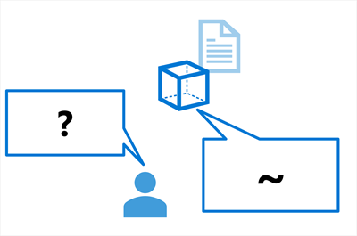
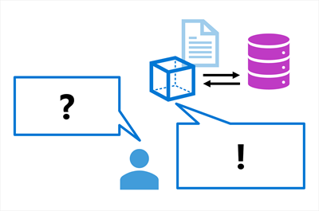
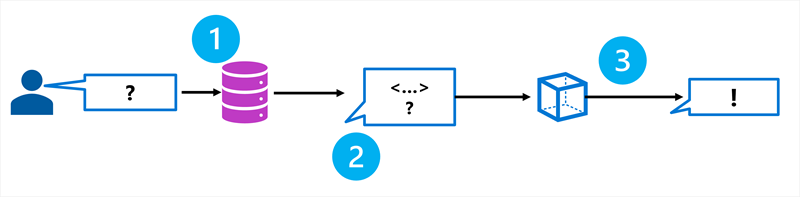

# Intro to RAG

To ensure that an agent is grounded on specific data to provide accurate and domain-specific responses, you can use Retrieval Augmented Generation (RAG).

## What is Grounded prompts

One prevalent challenge when implementing language models through chat is the so-called `groundedness`, which refers to whether a response is rooted, connected, or anchored in reality or a specific context. In other words, groundedness refers to whether the response of a language model is based on factual information.

In contrast, you can use a data source to ground the prompt with some relevant, factual context. The prompt can then be submitted to a language model, including the grounding data, to generate a contextualized, relevant, and accurate response.

The data source can be any repository of relevant data. For example, you could use data from a product catalog database to ground the prompt "Which product should I use to do X?" so that the response includes relevant details of products that exist in the catalog.

- Ungrounded prompts and responses  
  

- Grounded prompts and responses  
  

## Understanding RAG

RAG is a technique that you can use to ground a language model. In other words, it's a process for retrieving information that is relevant to the user's initial prompt. In general terms, the RAG pattern incorporates the following steps:

1️⃣ Retrieve grounding data based on the initial user-entered prompt.  
2️⃣ Augment the prompt with grounding data.  
3️⃣ Use a language model to generate a grounded response.

---

---

## Adding grounding data to an Azure AI project

You can use Azure AI Foundry to build a custom age that uses your own data to ground prompts. Azure AI Foundry supports a range of data connections that you can use to add data to a project, including:

- Azure Blob Storage
- Azure Data Lake Storage Gen2
- Microsoft OneLake

> 💡 You can also upload files or folders to the storage used by your AI Foundry project.  
> 🎯 Your data will be ingested into and index, which allows the genai model to quickly and accurately find information for your specific use case.
