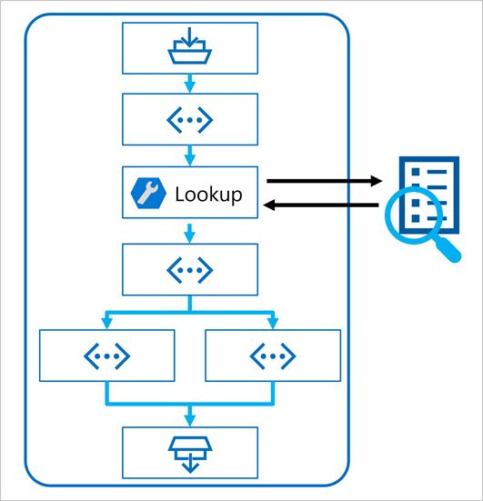
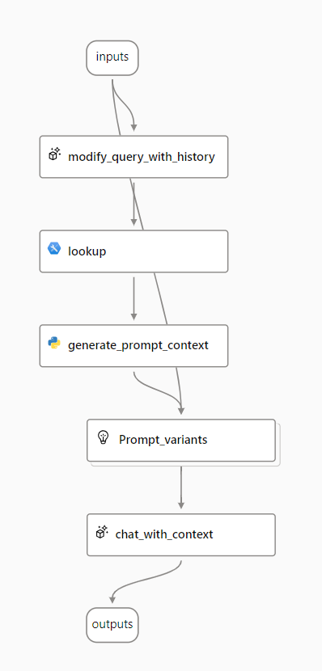

# Implement RAG in a prompt flow

> Prompt Flow is a development framework for defining flows that orchestrate interactions with an LLM.

After uploading data to Azure AI Foundry and creating an index on your data using the integration with Azure AI Search, you can implement the RAG pattern with Prompt Flow to build a generative AI application.

A flow begins with one or more inputs, usually a question or prompt entered by a user, and in the case of iterative conversations the chat history to this point.

The flow is then defined as a series of connected tools, each of which performs a specific operation on the inputs and other environmental variables. There are multiple types of tool that you can include in a prompt flow to perform tasks such as:

- Running custom Python code
- Looking up data values in an index
- Creating prompt variants - enabling you to define multiple versions of a prompt for a large language model (LLM), varying system messages or prompt wording, and compare and evaluate the results from each variant.
- Submitting a prompt to an LLM to generate results.

Finally, the flow has one or more outputs, typically to return the generated results from an LLM.

## Using the RAG pattern in a prompt flow

The key to using the RAG pattern in a prompt flow is to use an Index Lookup tool to retrieve data from an index so that subsequent tools in the flow can use the results to augment the prompt used to generate output from an LLM.

## Use a sample to create a chat flow

Prompt flow provides various samples you can use as a starting point to create an application. When you want to combine RAG and a language model in your application, you can clone the `Multi-round Q&A on your data sample`.

The sample contains the necessary elements to include RAG and a language model:

1. Append the history to the chat input to define a prompt in the form of a contextualized form of a question.
1. Look up relevant information from your data using your search index.
1. Generate the prompt context by using the retrieved data from the index to augment the question.
1. Create prompt variants by adding a system message and structuring the chat history.
1. Submit the prompt to a language model that generates a natural language response.
