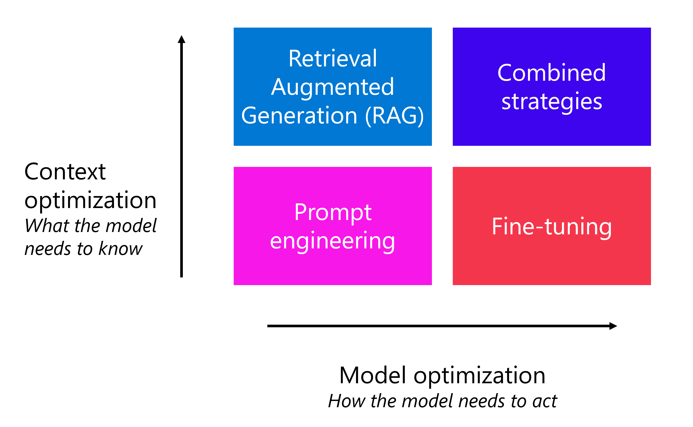

# Understand when to fine-tune a language model

When you want to develop a chat application with Azure AI Foundry, you can use prompt flow to create a chat application that is integrated with a language model to generate responses. To improve the quality of the responses the model generates, you can try various strategies. The easiest strategy is to apply prompt engineering. You can change the way you format your question, but you can also update the system message that is sent along with the prompt to the language model.

1. **Prompt engineering** is a quick and easy way to improve how the model acts, and what the model needs to know. When you want to improve the quality of the model even further, there are two common techniques that are used:
1. **Retrieval Augmented** Generation (RAG): Ground your data by first retrieving context from a data source before generating a response.
1. **Fine-tuning**: Train a base language model on a dataset before integrating it in your application.
1. **Combined strategies**: You can combine these techniques to get the best results.
