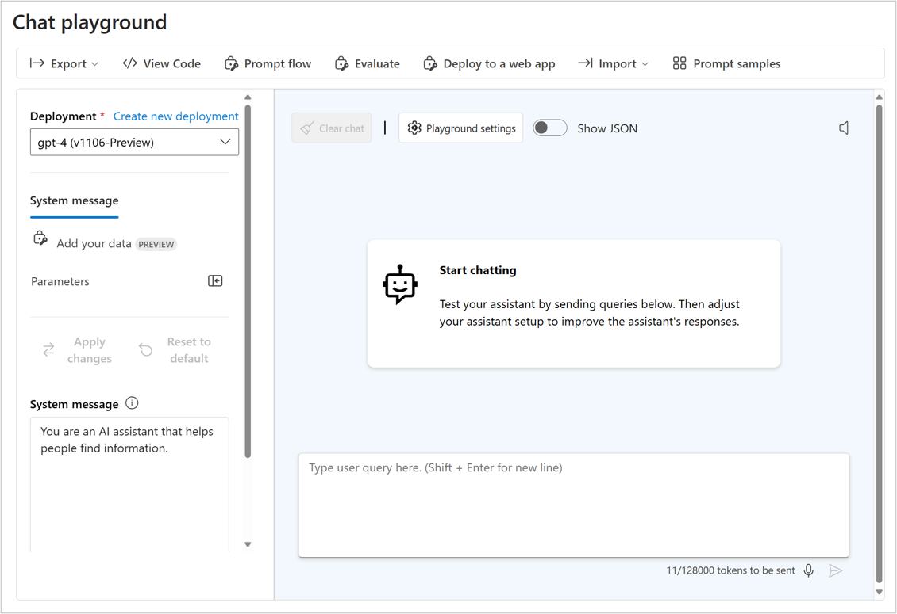
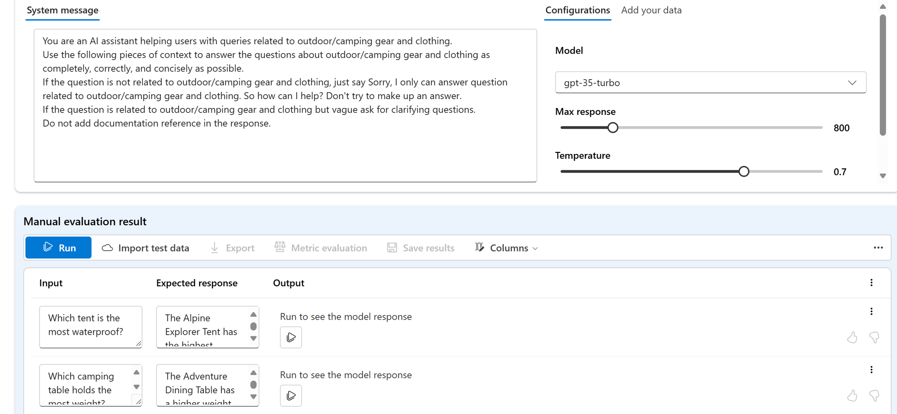

# ✅ Manually Evaluate Your Model in Azure AI Foundry

---

## 🤔 Why Do Manual Evaluation?

Even with all the automation, **human feedback is still key**!
Manual evaluation helps you check:

- Is the model answering clearly?
- Is it giving helpful or confusing answers?
- Is it handling edge cases properly?

This is useful:

- ✅ Early in development (when you're testing)
- ✅ Even after deploying (for quality checks)

---

## 🧪 Step 1: Prepare Your Test Prompts

Before testing anything, you need a good **set of example questions**.

Make sure your test prompts include:

- 🟢 Common user questions (ex: "What is Azure?")
- 🟡 Edge cases (ex: "What if I lose my key?")
- 🔴 Trick/failure cases (ex: vague, unclear prompts)

📌 These help test the model from all angles.

---

## 💬 Step 2: Use the Chat Playground

Want to test one prompt quickly? Use the **Chat Playground** in Azure AI Foundry.

Here’s what you can do:

- Type a question and see the model's answer.
- Adjust your prompt or system message if needed.
- Try again and see if it improves!

🛠️ This is great for **prompt tuning** and small experiments.

---

---

## 📄 Step 3: Evaluate Multiple Prompts with Manual Evaluation

When you’re ready to test **many prompts at once**:

1. Upload a dataset (like a table or CSV) with:

   - Test questions
   - (Optional) Expected answers

2. Azure runs all those prompts through the model.

3. You can review and **rate each response** (👍 / 👎).

🎯 This helps you spot patterns — like what the model gets wrong often.

---

---

## 🧠 What Can You Improve Based on Results?

If the model fails or underperforms, try adjusting:

| What to Change      | Why                                   |
| ------------------- | ------------------------------------- |
| 🔧 The prompt       | Maybe your wording is unclear         |
| 🧾 System message   | Set better instructions for the model |
| 🤖 Model type       | Try GPT-4 instead of GPT-3.5          |
| 🎚️ Model parameters | Adjust temperature, max tokens, etc.  |

---

## 🔁 Final Step: Evaluate Prompt Flows Too

Once you’ve integrated the model into a **prompt flow** (the full logic of your app), you can **manually evaluate the flow** as well — not just the model.

This helps make sure your **whole app** is behaving correctly, not just one model.

---

## 📝 Summary

| Step                    | What You Do                        |
| ----------------------- | ---------------------------------- |
| 1️⃣ Prepare test prompts | Include various types of questions |
| 2️⃣ Test single prompt   | Use the Chat Playground            |
| 3️⃣ Test many prompts    | Use the Manual Evaluation feature  |
| 4️⃣ Improve model        | Based on ratings, tweak your setup |
| 5️⃣ Evaluate flows       | Test full app behavior too         |
